<div style="display: flex; flex-direction:column; justify-content:center; align-items:center; text-align:center;">
    <strong>Universidad Peruana de Ciencias Aplicadas</strong><br>
    </img><br>
    <strong>INGENIERÍA DE SISTEMAS DE SOFTWARE</strong><br>
    <strong> 1ASI0732 - Diseño de Experimentos de Ingeniería de Software 2510 </strong><br>
    <strong>Profesor: Lennin Percy Cenas Vasquez </strong><br>
    <br>INFORME <br>
    "TechConnect Solutions" | "OfficeTech"


### Integrantes:
- Zavala Quedena, Gonzalo Andre - U202113656
- Del Castillo Bueno, Daniel Mateo - U202211212
- Ramirez Ramirez,Marcelo Sebastian - U202210582
- Sanchez Montero, Carlos - U202015274
- Morales Quispe, Brayan Smith - U20211f984
</div>

---
# Registro de Versiones del Informe

<table>
  <tr>
    <th>Version</th>
    <th>Fecha</th>
    <th>Autor</th>
    <th>Descripcion de Modificacion</th>
  </tr>
  <tr>
    <td>0.0</td>
    <td>07/04/2025</td>
    <td>Marcelo Ramirez</td>
    <td>Se crea el repositorio</td>
  </tr>
  <tr>
    <td>1.0</td>
    <td>07/04/2025</td>
    <td>Marcelo Ramirez</td>
    <td>Se pasa todo lo antiguo a nuevo repositorio y creacion del app movil</td>
  </tr>
  <tr>
    <td>1.1</td>
    <td>14/04/2025</td>
    <td>Gonzalo Andre Zavala Quedena</td>
    <td>Agregar información de integrante & refactorización de tabla Outcome e Integrantes de equipo</td>
  </tr>
  <tr>
    <td>1.2</td>
    <td>15/04/2025</td>
    <td>Gonzalo Andre Zavala Quedena</td>
    <td>Agregar descripción a wireframes y mockups del landing page</td>
  </tr>
  <tr>
    <td>1.3</td>
    <td>15/04/2025</td>
    <td>Gonzalo Andre Zavala Quedena</td>
    <td>Agregar pruebas unitarias.</td>
  </tr>
  <tr>
    <td>1.4</td>
    <td>22/04/2025</td>
    <td>Brayan Smith Morales Quispe</td>
    <td>Agregar descripción a wireframes, mockups y wireflow para app web.</td>
  </tr>
  <tr>
    <td>1.5</td>
    <td>01/05/2025</td>
    <td>Marcelo Ramirez</td>
    <td>Correcion de tb1.</td>
  </tr>
  <tr>
    <td>1.6</td>
    <td>03/05/2025</td>
    <td>Brayan Smith Morales Quispe</td>
    <td>Creacion de pruebas unitarias e integrales al appmovil.</td>
  </tr>
  <tr>
    <td>1.7</td>
    <td>10/05/2025</td>
    <td>Brayan Smith Morales Quispe</td>
    <td>Agregar descripción a wireframes, mockups y wireflow para app web.</td>
  </tr>
  <tr>
    <td>1.6</td>
    <td>10/05/2025</td>
    <td>Daniel Mateo Del Castillo Bueno</td>
    <td>Implementacion de jenkins.</td>
  </tr>
</table>

# Project Report Collaboration Insights
El presente informe se encuentra guardado en la organización de OfficeTech: [URL del repositorio de la Landing Page](https://github.com/Diseno-ExperimentosIngSoft-1ASI0732/upc-pre-202501-1asi0732-2510-officetech-report)

Se consideró la Landing Page en otro repositorio de la misma organización: [URL Landing page](https://github.com/OpenSourceSW53/officetech-landing-page)

Se consideró la Aplicación Web (FrontEnd) en un tercer repositorio de la misma organización: [URL de la Aplicación Web](https://github.com/Diseno-ExperimentosIngSoft-1ASI0732/DE-officetech-frontend)

Se consideró la lógica de la aplicación (BackEnd) en un cuarto repositorio de la misma organización: [URL de la Aplicación Web](https://github.com/Diseno-ExperimentosIngSoft-1ASI0732/DE-officetech-backend)  

Se consideró la lógica de la aplicación Movil en un quinto repositorio de la misma organización: [URL de la Aplicación Web](https://github.com/Diseno-ExperimentosIngSoft-1ASI0732/DE-officetech-AppMovil)  

## Contenido

[Registro de Versiones del Informe](#registro-de-versiones-del-informe)  
[Project Report Collaboration Insights](#project-report-collaboration-insights)  
[Student Outcome 3](#student-outcome-3) 

[Part I: As-Is Software Project](#part-i-as-is-software-project)

[Capítulo I: Introducción](#capítulo-i-introducción)

[1.1 Startup Profile](#11-startup-profile)  
[1.1.1. Descripción de la Startup](#111-descripción-de-la-startup)  
[1.1.2. Perfiles de integrantes del equipo](#112-perfiles-de-integrantes-del-equipo)  

[1.2. Solution Profile](#12-solution-profile)  
[1.2.1 Antecedentes y problemática](#121-antecedentes-y-problemática)  
[1.2.2 Lean UX Process.](#122-lean-ux-process)  
[1.2.2.1. Lean UX Problem Statements.](#1221-lean-ux-problem-statements)  
[1.2.2.2. Lean UX Assumptions.](#1222-lean-ux-assumptions)  
[1.2.2.3. Lean UX Hypothesis Statements.](#1223-lean-ux-hypothesis-statements)  
[1.2.2.4. Lean UX Canvas.](#1224-lean-ux-canvas)  

[1.3. Segmentos objetivo.](#13-segmentos-objetivo)  

[Capítulo II: Requirements Elicitation & Analysis](#capítulo-ii-requirements-elicitation--analysis)  

[2.1. Competidores](#21-competidores)  
[2.1.1. Análisis competitivo](#211-análisis-competitivo)  
[2.1.2. Estrategias y tácticas frente a competidores](#211-análisis-competitivo)  

[2.2. Entrevistas](#22-entrevistas)  
[2.2.1. Diseño de entrevistas](#221-diseño-de-entrevistas)  
[2.2.2. Registro de entrevistas](#222-registro-de-entrevistas)  
[2.2.3. Análisis de entrevistas](#223-análisis-de-entrevistas)  

[2.3. Needfinding](#23-needfinding)  
[2.3.1. User Personas](#231-user-personas)  
[2.3.2. User Task Matrix](#232-user-task-matrix)  
[2.3.3. User Journey Mapping](#233-user-journey-mapping)  
[2.3.4. Empathy Mapping](#234-empathy-mapping)  
[2.3.5. As-is Scenario Mapping](#235-as-is-scenario-mapping) 

[2.4. Ubiquitous Language](#24-ubiquitous-language)  

[Capítulo III: Requirements Specification](#capítulo-iii-requirements-specification)  

[3.1. To-Be Scenario Mapping](#31-to-be-scenario-mapping)    
[3.2. User Stories](#32-user-stories)  
[3.3. Impact Mapping](#33-impact-mapping)  
[3.4. Product Backlog](#34-product-backlog)  

[Capítulo IV: Product Design](#capitulo-iv-product-design)

[4.1. Style Guidelines](#41-style-guidelines)  
[4.1.1. General Style Guidelines](#411-general-style-guidelines)  
[4.1.2. Web Style Guidelines](#412-web-style-guidelines)  
[4.1.3. Mobile Style Guidelines](#413-mobile-style-guidelines)  
[4.1.3.1. iOS Mobile Style Guidelines](#4131-ios-mobile-style-guidelines)  
[4.1.3.2. Android Mobile Style Guidelines](#4132-android-mobile-style-guidelines)

[4.2. Information Architecture](#42-information-architecture)  
[4.2.1. Organization Systems](#421-organization-systems)  
[4.2.2. Labeling Systems](#422-labeling-systems)  
[4.2.3. SEO Tags and Meta Tags](#423-seo-tags-and-meta-tags)  
[4.2.4. Searching Systems](#424-searching-systems)  
[4.2.5. Navigation Systems](#425-navigation-systems)

[4.3. Landing Page UI Design](#43-landing-page-ui-design)  
[4.3.1. Landing Page Wireframe](#431-landing-page-wireframe)  
[4.3.2. Landing Page Mock-up](#432-landing-page-mock-up)

[4.4. Mobile Applications UX/UI Design](#44-mobile-applications-uxui-design)  
[4.4.1. Mobile Applications Wireframes](#441-mobile-applications-wireframes)  
[4.4.2. Mobile Applications Wireflow Diagrams](#442-mobile-applications-wireflow-diagrams)  
[4.4.3. Mobile Applications Mock-ups](#443-mobile-applications-mock-ups)  
[4.4.4. Mobile Applications User Flow Diagrams](#444-mobile-applications-user-flow-diagrams)

[4.5. Mobile Applications Prototyping](#45-mobile-applications-prototyping)  
[4.5.1. Android Mobile Applications Prototyping](#451-android-mobile-applications-prototyping)  
[4.5.2. iOS Mobile Applications Prototyping](#452-ios-mobile-applications-prototyping)

[4.6. Web Applications UX/UI Design](#46-web-applications-uxui-design)  
[4.6.1. Web Applications Wireframes](#461-web-applications-wireframes)  
[4.6.2. Web Applications Wireflow Diagrams](#462-web-applications-wireflow-diagrams)  
[4.6.3. Web Applications Mock-ups](#463-web-applications-mock-ups)  
[4.6.4. Web Applications User Flow Diagrams](#464-web-applications-user-flow-diagrams)

[4.7. Web Applications Prototyping](#47-web-applications-prototyping)

[4.8. Domain-Driven Software Architecture](#48-domain-driven-software-architecture)  
[4.8.1. Software Architecture Context Diagram](#481-software-architecture-context-diagram)  
[4.8.2. Software Architecture Container Diagrams](#482-software-architecture-container-diagrams)  
[4.8.3. Software Architecture Components Diagrams](#483-software-architecture-components-diagrams)

[4.9. Software Object-Oriented Design](#49-software-object-oriented-design)  
[4.9.1. Class Diagrams](#491-class-diagrams)  
[4.9.2. Class Dictionary](#492-class-dictionary)

[4.10. Database Design](#410-database-design)  
[4.10.1. Relational/Non-Relational Database Diagram](#4101-relationalnon-relational-database-diagram)

[Capítulo V: Product Implementation](#capitulo-v-product-implementation)

[5.1. Software Configuration Management](#51-software-configuration-management)  
[5.1.1. Software Development Environment Configuration](#511-software-development-environment-configuration)  
[5.1.2. Source Code Management](#512-source-code-management)  
[5.1.3. Source Code Style Guide & Conventions](#513-source-code-style-guide--conventions)  
[5.1.4. Software Deployment Configuration](#514-software-deployment-configuration)

[5.2. Product Implementation & Deployment](#52-product-implementation--deployment)  
[5.2.1. Sprint Backlogs](#521-sprint-backlogs)  
[5.2.2. Implemented Landing Page Evidence](#522-implemented-landing-page-evidence)  
[5.2.3. Implemented Frontend-Web Application Evidence](#523-implemented-frontend-web-application-evidence)  
Acuerdo de Servicio - SaaA
[5.2.4. Acuerdo de Servicio - SaaA](#524-acuerdo-de-servicio-saaA)  
[5.2.4. Implemented Native-Mobile Application Evidence](#524-implemented-native-mobile-application-evidence)  
[5.2.5. Implemented RESTful API and/or Serverless Backend Evidence](#525-implemented-restful-api-andor-serverless-backend-evidence)  
[5.2.6. RESTful API documentation](#526-restful-api-documentation)  
[5.2.7. Team Collaboration Insights](#527-team-collaboration-insights)

[5.3. Video About-the-Product](#53-video-about-the-product)

[Part II: Verification, Validation & Pipeline](#part-ii-verification-validation-y-pipeline)

[Capítulo VI: Product Verification & Validation](#capitulo-vi-product-verification--validation)

[6.1. Testing Suites & Validation](#61-testing-suites--validation)  
[6.1.1. Core Entities Unit Tests](#611-core-entities-unit-tests)  
[6.1.2. Core Integration Tests](#612-core-integration-tests)  
[6.1.3. Core Behavior-Driven Development](#613-core-behavior-driven-development)  
[6.1.4. Core System Tests](#614-core-system-tests)

[6.2. Static testing & Verification](#62-static-testing--verification)  
[6.2.1. Static Code Analysis](#621-static-code-analysis)  
[6.2.1.1. Coding standard & Code conventions](#6211-coding-standard--code-conventions)  
[6.2.1.2. Code Quality & Code Security](#6212-code-quality--code-security)  
[6.2.2. Reviews](#622-reviews)

[6.3. Validation Interviews](#63-validation-interviews)  
[6.3.1. Diseño de Entrevistas](#631-diseño-de-entrevistas)  
[6.3.2. Registro de Entrevistas](#632-registro-de-entrevistas)  
[6.3.3. Evaluaciones según heurísticas](#633-evaluaciones-según-heurísticas)

[6.4. Auditoría de Experiencias de Usuario](#64-auditoría-de-experiencias-de-usuario)  
[6.4.1. Auditoría realizada](#641-auditoría-realizada)  
[6.4.1.1. Información del grupo auditado](#6411-información-del-grupo-auditado)  
[6.4.1.2. Cronograma de auditoría realizada](#6412-cronograma-de-auditoría-realizada)  
[6.4.1.3. Contenido de auditoría realizada](#6413-contenido-de-auditoría-realizada)  
[6.4.2. Auditoría recibida](#642-auditoría-recibida)  
[6.4.2.1. Información del grupo auditor](#6421-información-del-grupo-auditor)  x|
[6.4.2.2. Cronograma de auditoría recibida](#6422-cronograma-de-auditoría-recibida)  
[6.4.2.3. Contenido de auditoría recibida](#6423-contenido-de-auditoría-recibida)  
[6.4.2.4. Resumen de modificaciones para subsanar hallazgos](#6424-resumen-de-modificaciones-para-subsanar-hallazgos)

[Capítulo VII: DevOps Practices](#capitulo-vii-devops-practices)

[7.1. Continuous Integration](#71-continuous-integration)  
[7.1.1. Tools and Practices](#711-tools-and-practices)  
[7.1.2. Build & Test Suite Pipeline Components](#712-build--test-suite-pipeline-components)

[7.2. Continuous Delivery](#72-continuous-delivery)  
[7.2.1. Tools and Practices](#721-tools-and-practices)  
[7.2.2. Stages Deployment Pipeline Components](#722-stages-deployment-pipeline-components)

[7.3. Continuous Deployment](#73-continuous-deployment)  
[7.3.1. Tools and Practices](#731-tools-and-practices)  
[7.3.2. Production Deployment Pipeline Components](#732-production-deployment-pipeline-components)

[7.4. Continuous Monitoring](#74-continuous-monitoring)  
[7.4.1. Tools and Practices](#741-tools-and-practices)  
[7.4.2. Monitoring Pipeline Components](#742-monitoring-pipeline-components)  
[7.4.3. Alerting Pipeline Components](#743-alerting-pipeline-components)  
[7.4.4. Notification Pipeline Components](#744-notification-pipeline-components)

[Part III: Experiment-Driven Lifecycle](#part-iii-experiment-driven-lifecycle)

[Capítulo VIII: Experiment-Driven Development](#capitulo-viii-experiment-driven-development)

[8.1. Experiment Planning](#81-experiment-planning)  
[8.1.1. As-Is Summary](#811-as-is-summary)  
[8.1.2. Raw Material: Assumptions, Knowledge Gaps, Ideas, Claims](#812-raw-material-assumptions-knowledge-gaps-ideas-claims)  
[8.1.3. Experiment-Ready Questions](#813-experiment-ready-questions)  
[8.1.4. Question Backlog](#814-question-backlog)  
[8.1.5. Experiment Cards](#815-experiment-cards)

[8.2. Experiment Design](#82-experiment-design)  
[8.2.1. Hypotheses](#821-hypotheses)  
[8.2.2. Measures](#822-measures)  
[8.2.3. Conditions](#823-conditions)  
[8.2.4. Scale Calculations and Decisions](#824-scale-calculations-and-decisions)  
[8.2.5. Methods Selection](#825-methods-selection)  
[8.2.6. Data Analytics: Goals, KPIs and Metrics Selection](#826-data-analytics-goals-kpis-and-metrics-selection)  
[8.2.7. Web and Mobile Tracking Plan](#827-web-and-mobile-tracking-plan)

[8.3. Experimentation](#83-experimentation)  
[8.3.1. To-Be User Stories](#831-to-be-user-stories)  
[8.3.2. To-Be Product Backlog](#832-to-be-product-backlog)  
[8.3.3. Pipeline-supported, Experiment-Driven To-Be Software Platform Lifecycle](#833-pipeline-supported-experiment-driven-to-be-software-platform-lifecycle)  
[8.3.3.1. To-Be Sprint Backlogs](#8331-to-be-sprint-backlogs)  
[8.3.3.2. Implemented To-Be Landing Page Evidence](#8332-implemented-to-be-landing-page-evidence)  
[8.3.3.3. Implemented To-Be Frontend-Web Application Evidence](#8333-implemented-to-be-frontend-web-application-evidence)  
[8.3.3.4. Implemented To-Be Native-Mobile Application Evidence](#8334-implemented-to-be-native-mobile-application-evidence)  
[8.3.3.5. Implemented To-Be RESTful API and/or Serverless Backend Evidence](#8335-implemented-to-be-restful-api-andor-serverless-backend-evidence)  
[8.3.3.6. Team Collaboration Insights](#8336-team-collaboration-insights)  
[8.3.4. To-Be Validation Interviews](#834-to-be-validation-interviews)  
[8.3.4.1. Diseño de Entrevistas](#8341-diseño-de-entrevistas)  
[8.3.4.2. Registro de Entrevistas](#8342-registro-de-entrevistas)

[8.4. Experiment Aftermath & Analysis](#84-experiment-aftermath--analysis)  
[8.4.1. Analysis and Interpretation of Results](#841-analysis-and-interpretation-of-results)  
[8.4.2. Re-scored and Re-prioritized Question Backlog](#842-re-scored-and-re-prioritized-question-backlog)

[8.5. Continuous Learning](#85-continuous-learning)  
[8.5.1. Shareback Session Artifacts: Learning Workflow](#851-shareback-session-artifacts-learning-workflow)

[8.6. To-Be Software Platform Pre-launch](#86-to-be-software-platform-pre-launch)  
[8.6.1. About-the-Product Intro Video](#861-about-the-product-intro-video)

[Conclusiones](#conclusiones)  
[Conclusiones y recomendaciones](#conclusiones-y-recomendaciones)  
[Video About-the-Team](#video-about-the-team)  
[Bibliografía](#bibliografía)  
[Anexos](#anexos) 

# Student Outcome 3

<table>
  <tr>
    <th>Criterio Específico</th>
    <th>Acciones Realizadas</th>
    <th>Conclusiones</th>
  </tr>
  <tr>
    <td>
      Reconoce responsabilidad ética y profesional en situaciones de ingeniería de software.
    </td>
    <td>
      <div>
        <span style="font-weight: 700;">Marcelo Ramirez:</span>
        <p>
          TB1: Durante el proyecto, aprendí a asumir con responsabilidad mis tareas, especialmente al iniciar las pruebas de los componentes desarrollados. Comprendí la importancia de mantener la integridad y profesionalismo en cada fase del proyecto, desde el diseño de la solución hasta su validación, respetando siempre los tiempos de entrega y las normas acordadas por el equipo.
        </p>
        <p>
          TP: Durante esta entrega, asumí con responsabilidad ética y profesional la realización de pruebas unitarias e integrales como parte fundamental del proceso de validación del sistema. Estas pruebas no solo aseguraron la funcionalidad de los componentes desarrollados, sino que también reflejaron mi compromiso con la calidad del producto y con el cumplimiento de los estándares técnicos acordados por el equipo. Reconocí la importancia de validar rigurosamente cada parte del sistema para entregar una solución confiable y alineada con los principios profesionales del desarrollo de software.
        </p>
      </div>
      <div>
        <span style="font-weight: 700;">Gonzalo Andre Zavala Quedena</span>
        <p>
          TB1: Durante el proyecto, aprendí la importancia de actuar de manera profesional frente a los desafíos del desarrollo. Me comprometí a comunicarme de forma clara y respetuosa con el equipo, mantener la transparencia en mis avances y errores, y tomar decisiones que favorezcan al proyecto, no solo a nivel técnico, sino también humano-
        </p>
        <p>
          TP: Para este proyecto desarrollé un conjunto completo de pruebas unitarias, de integración y automatizadas utilizando Selenium y Appium, asegurando que cada criterio y funcionalidad del sistema fuera validado exhaustivamente, lo que garantizó la calidad y robustez de la solución.
        </p>
      </div>
      <div>
        <span style="font-weight: 700;">Brayan Smith Morales Quispe</span>
        <p>
        TB1: Durante el desarrollo aprendi la importancia de un analisis QA en el desarrollo mis projectos realizando pruebas unitarias, integrales y end-to-end que me permiten detectar errores, prevenir fallos en producción y garantizar que el sistema responda correctamente en distintos escenarios. Reflejando mi interes en entregar software de calidad y funcional.
        </p>
        <p>
        TP: Durante el desarrollo aprendi la importancia de los test unitarios, integrales y el despliege continuo en un proyecto de software y el impacto que genera en la calidad de los proyectos.
        </p>
      </div>
      <div>
        <span style="font-weight: 700;">Carlos Sanchez Montero:</span>
        <p>
          TB1:Durante el desarrollo del proyecto, asumí con responsabilidad mis funciones dentro del equipo, cumpliendo los acuerdos y entregas con puntualidad. Reconocí que una actitud profesional no solo se refleja en cumplir con lo asignado, sino en ser proactivo para apoyar al grupo en momentos críticos. Aprendí que la ética profesional implica también cuidar la calidad del trabajo entregado y respetar las decisiones colectivas.
        </p>
         <p>
        TP: En esta etapa del proyecto me enfoqué en la realización de pruebas unitarias con el fin de testear correctamente cada apartado de la aplicación, esto me hizo reflexionar sobre la importancia de el uso de pruebas unitarias en los proyectos.
        </p>
      </div>
    <div>
        <span style="font-weight: 700;">Daniel Mateo del Castillo Bueno:</span>
        <p>
          TB1: Durante el desarrollo del proyecto, entendí que ser responsable éticamente en ingeniería de software implica mucho más que cumplir con tareas técnicas. Mantuve una actitud de respeto hacia el trabajo de los demás y procuré seguir buenas prácticas de documentación y control de versiones, entendiendo que cualquier descuido puede afectar al equipo y al producto final. Esta experiencia reforzó mi compromiso con el trabajo profesional y colaborativo.
        </p>
        <p>
        TP: Durante esta entrega tuve que realizar pruebas unitarias y estructurar el pipeline de nuestro proyecto, dicha tarea me hizo reflexionar sobre la conducta etica de ser un ingeniero de software, nuestra labor de entregar un producto confiable y probado previamente es la parte mas fundamental de la profesión.
        </p>
      </div>
    </td>
    <td>
      <div>
        **TB1: ** Durante el desarrollo del proyecto, como grupo reconocimos la importancia de mantener una conducta ética y profesional al enfrentar situaciones reales en la ingeniería de software. Nos comprometimos con el cumplimiento de nuestras responsabilidades, respetando los roles y tiempos asignados, y buscando siempre la calidad del producto. Aprendimos que la ética no solo se refleja en el código, sino también en la forma en que colaboramos, nos comunicamos y respondemos ante los desafíos del proyecto. <br>
          **TP1: ** Como grupo, asumimos con responsabilidad ética y profesional cada una de nuestras tareas durante el proyecto. En especial, nos comprometimos con la validación del sistema a través de pruebas unitarias e integrales, entendiendo que garantizar la calidad del software es una parte esencial del ejercicio profesional. Respetamos los acuerdos, tiempos de entrega y estándares definidos, lo cual fortaleció nuestro compromiso con un trabajo íntegro y bien hecho.
      </div>
    </td>
  </tr>
    <tr>
    <td>
      Emite juicios informados considerando el impacto de las soluciones de ingeniería de software en contextos globales, económicos, ambientales y sociales.
    </td>
    <td>
      <div>
        <span style="font-weight: 700;">Marcelo Ramirez:</span>
        <p>
          TB1:  Durante el proyecto, aprendí a analizar cómo nuestras decisiones en el diseño y desarrollo del sistema (landing page, backend y app móvil) podrían afectar a los usuarios finales. Consideré la eficiencia del sistema, la accesibilidad y el impacto de ofrecer una plataforma funcional.
        </p>
        <p>
          TP: En esta entrega, emití juicios informados al evaluar cómo las decisiones técnicas tomadas durante el desarrollo —incluyendo la implementación de pruebas unitarias e integrales— impactaban directamente en la calidad y sostenibilidad de la solución. Consideré factores como la eficiencia del sistema, la accesibilidad para distintos usuarios y la escalabilidad del producto, entendiendo que un software bien probado no solo mejora la experiencia del usuario, sino que también reduce costos futuros de mantenimiento y tiene un impacto positivo en su entorno social y económico.
        </p>
      </div>
      <div>
        <span style="font-weight: 700;">Gonzalo Andre Zavala Quedena</span>
         <p>
            TB1: Durante la implementación de la solución, tomé conciencia de que incluso decisiones como la elección de herramientas o frameworks pueden afectar el rendimiento y la accesibilidad del producto final. Esto             me llevó a priorizar soluciones equilibradas, que además de cumplir objetivos funcionales, aporten valor social y económico en el contexto enque se implementarán.
        </p>
        <p>
            TP: Para este proyecto elaboré las pruebas unitarias y las pruebas automatizadas con Selenium, asegurando que cada criterio fuera validado de forma exhaustiva.
        </p>
      </div>
      <div>
        <span style="font-weight: 700;">Daniel Mateo del Castillo Bueno</span>
        <p>
        TB1: Durante esta entrega del proyecto pude darme cuenta de las decisiones que nosotros tomamos como desarrolladores tienen un alto impacto en nuestros usuarios, saber cuales son sus necesidades es parte escencial de poder satisfacer de mejor manera sus necesidades.
        </p>
        <p>
        TP: Para el desarrollo de esta entrega tuve que informarme sobre la entrega continua, tuve que decidir utilizar una heramienta en especifico como lo es jenkins, nuestra solución busca ayudar constantemente a ambos segmentos objetivos, por lo que necesitabamos brindar un producto constantemente actualizado.
        </p>
      </div>
      <div>
        <span style="font-weight: 700;">Brayan Smith Morales Quispe</span>
        <p>
        TB1: Durante el desarrollo aprendi q las decisiones que tomemos, por mas pequeñas que sean tienen un alto impacto en los usuarios que consumiran nuestros projectos.
        </p>
        <p>
        TP: Durante el desarrollo aprendí que la continua mejora y las pruebas rigurosas son fundamentales para asegurar la calidad del software. A medida que fui trabajando en la implementación de pruebas unitarias, pude ver el valor de anticiparse a los posibles errores y evitar que estos llegaran a producción. Estas pruebas no solo ayudaron a mejorar la estabilidad del software, sino que también proporcionaron confianza al equipo de desarrollo y a los usuarios finales.
        </p>
      </div>
         <div>
        <span style="font-weight: 700;">Carlos Sanchez Montero</span>
        <p>
        TB1: Reflexioné sobre cómo el desarrollo de software puede generar cambios significativos a nivel económico y social. A lo largo del proyecto, me aseguré de que nuestras decisiones técnicas consideraran la facilidad de uso para distintos perfiles de usuario, así como un diseño sostenible que no dependa de recursos costosos o limitados.
        </p>
         <p>
        TP: Durante esta etapa del proyecto aprendi que es necesario el uso de pruebas unitarias e integrales, ademas del uso de softwares especializados para hacer uso estas mismas, de tal forma que contribuyen al buen desarrollo del proyecto.
        </p>
      </div>
    </td>
    <td>
      <div>
        **TB1: ** El proyecto nos permitió reflexionar sobre cómo nuestras decisiones técnicas pueden tener repercusiones más allá del funcionamiento del software. Al diseñar e implementar una plataforma para el sector turístico, consideramos aspectos como la accesibilidad, la sostenibilidad y el valor que puede generar para las comunidades. Esto nos ayudó a emitir juicios más informados, teniendo en cuenta no solo los aspectos tecnológicos, sino también el impacto económico y social que puede tener nuestra solución en contextos reales. <br>
          **TP1: ** Como equipo, comprendimos la importancia de actuar con responsabilidad ética y profesional en cada etapa del desarrollo de software. Nos comprometimos con la calidad del proyecto mediante la ejecución de pruebas unitarias e integrales, asegurando la funcionalidad y confiabilidad del sistema. Además, reflexionamos sobre el impacto de nuestras decisiones técnicas en contextos reales, considerando aspectos globales, sociales y económicos. Este enfoque nos permitió desarrollar una solución tecnológica consciente, sostenible y centrada en el usuario.
      </div>
    </td>
  </tr>
</table>

# Capítulo I: Introducción
## 1.1. Startup Profile
### 1.1.1. Descripción de la Startup
#### TechConnect Solutions
Somos un equipo de desarrolladores especializados en plataformas web, con sólida experiencia en servicio técnico. Nuestro principal objetivo es ofrecer soporte y soluciones efectivas que respondan a las necesidades de nuestros clientes, asegurando su plena satisfacción.
Nos apoyamos en métodos innovadores para resolver los desafíos que enfrentan, priorizando siempre la calidad y eficiencia en cada uno de nuestros servicios. Este enfoque nos permite brindar una experiencia excepcional y orientada al cliente

- **Misión:** Nuestra misión es garantizar una experiencia óptima y agradable al usar la aplicación, garantizando la seguridad, confianza y preferencia del cliente.
- **Visión:** Nos esforzamos por penetrar, establecernos y diferenciarnos en el mercado de soporte tecnológico dedicado, ganarnos la confianza del cliente y asegurar una posición sólida en el sector.
#### 1.1.2. Perfiles de integrantes del equipo

<table>
  <tr>
    <th>Miembros del equipo</th>
    <th>Código</th>
    <th>Carrera</th>
    <th>Habilidades</th>
  </tr>
  <tr>
    <td>
      
    </td>
    <td>u202113656</td>
    <td>Ingeniería de Software</td>
    <td align="justify">
      Soy estudiante de Ingeniería de Software en la Universidad Peruana de Ciencias Aplicadas (UPC), con una gran pasión por la tecnología y un fuerte compromiso con el aprendizaje continuo. Estoy enfocado en seguir desarrollándome profesionalmente, adquiriendo conocimientos y habilidades que me permitan enfrentar nuevos desafíos en el mundo del desarrollo de software.
    </td>
  </tr>
    <tr>
    <td>
      
    </td>
    <td>u202210582</td>
    <td>Ingeniería de Software</td>
    <td align="justify">
      Estudiante de ingenieria de software que esta aprendiendo el uso de Angular y Vue decidido a dar lo mejor que pueda incluso si las cosas no me salen como esperaba
    </td>
  </tr>
    <tr>
    <td>
      
    </td>
    <td>u202211212</td>
    <td>Ingeniería de Software</td>
    <td>
    Estudiante de ingeniería de software, estoy aprendiendo React y flutter. Estoy decidido a dar lo mejor de mi para resolver las problematicas que se me presenten con las herramientas que ya domino, no rechazo los nuevos desafios.
    </td>
    <td align="justify">
    </td>
  </tr>
  <tr>
    <td>
      
    </td>
    <td>u202015274</td>
    <td>Ingeniería de Software</td>
    <td align="justify">Soy estudiante de la carrera de Ingeniería de Software de 7mo ciclo en la Universidad Peruana de Ciencias Aplicadas, me fascina bastante todo lo relacionado a la programación, además soy una persona comprometida en los proyectos que realiza y contribuye.
    </td>
  </tr>
  <tr>
    <td>
      
    </td>
    <td>u20211f984</td>
    <td>Ingeniería de Software</td>
    <td align="justify">
      Estudiante de Ingenieria de Software comprometido con el estudio de las nuevas tecnologias emergentes como ia y la ciencia de datos. Teniendo conocimientos en el desarrollo de soluciones web app con angular y vue, videojuegos y gestion en google cloud. 
    </td>
  </tr>
</table>

## 1.2. Solution Profile
### 1.2.1 Antecedentes y problemática
Nuestra plataforma ofrecerá un servicio de suscripción dirigido a empresas que comercializan productos electrónicos. A través de esta suscripción, las empresas tendrán acceso a un plan que incluye una cantidad específica de garantías mediante servicios técnicos. El objetivo es proporcionar un acceso confiable y seguro a estos servicios para empresas, tiendas o profesionales independientes que los requieran.

Además, esta iniciativa creará oportunidades laborales para técnicos especializados en dispositivos electrónicos. Al mismo tiempo, las empresas podrán reducir costos al optar por suscribirse a **OfficeTech** en lugar de mantener su propio equipo de soporte técnico, ya que solo pagarán por el plan seleccionado y los servicios utilizados.
- **¿Qué?**
La problematica se presenta cuando los técnicos especializados en dispositivos electrónicos y tecnología enfrentan dificultades para encontrar empleo debido a la falta de medios para promocionarse en el mercado, lo que resulta en una falta de desarrollo económico sostenible.
- **¿Quién?**
Los técnicos que enfrentan desafíos al no tener una presencia efectiva en las redes sociales para atraer nuevos clientes. Además, algunos técnicos carecen de contactos que puedan recomendar su trabajo, lo que puede llevar a la pérdida de clientes potenciales.
- **¿Por qué?**
La falta de publicidad o recomendaciones por parte de los técnicos limita su capacidad para obtener más trabajo. Además, los clientes a menudo intentan resolver sus problemas técnicos por sí mismos, consultando a amigos o buscando información en redes sociales.
- **¿Dónde?**
En sus hogares, esperando una respuesta o contacto telefónico a través de llamadas o mensajes de WhatsApp. El problema radica en que la espera puede ser prolongada.
- **¿Cuándo?**
Este problema suele manifestarse principalmente por la mañana y por la tarde, momentos en los que los técnicos reciben pocas llamadas.
- **¿Cómo?**
La calidad del servicio y el tiempo de respuesta son los aspectos más importantes para los clientes a la hora de evaluar un trabajo. La frecuencia del problema sigue un patrón en el que los clientes prefieren a técnicos o empresas que les brinden mayor seguridad y confianza, lo que puede demostrarse mediante un historial de proyectos o referencias positivas.
- **¿Cuánto?**
Los problemas surgen en días en los que no hay o hay poco contacto con los clientes, lo que afecta los ingresos y el tiempo perdido. Los ingresos de los técnicos varían según las circunstancias de cada cliente, pudiendo limitarse a una simple revisión técnica.
### 1.2.2 Lean UX Process.
#### 1.2.2.1. Lean UX Problem Statements.
##### **Empresa:**
Según una investigación realizada por ManpowerGroup en 2017, se encontró que el 46% de los empleadores enfrentan dificultades para llenar sus vacantes. Esta dificultad radica en la escasez de técnicos de calidad, cuya especialización requiere evaluar tanto habilidades técnicas como habilidades blandas en un corto período de tiempo para satisfacer las demandas de los usuarios.

Nos hemos dado cuenta de las limitaciones de las empresas para ofrecer garantías a sus clientes debido a la falta de técnicos especializados en equipos electrónicos y tecnología, lo cual resulta en dificultades para cubrir vacantes.

Además de la falta de técnicos especializados, las empresas enfrentan desafíos para atraer nuevos clientes, lo que provoca retrasos en sus ingresos y pérdida de tiempo. Se encuentran con obstáculos al intentar destacar en redes sociales que no están específicamente diseñadas para su sector, especialmente cuando existen empresas bien establecidas que transmiten mayor seguridad al cliente en cuanto a la calidad del servicio.

Hemos identificado la necesidad de un intermediario que pueda comunicar el desempeño laboral de los técnicos a sus clientes para aumentar su base de clientes.


¿Cómo podemos mejorar la eficiencia en el proceso de búsqueda de técnicos de equipos electrónicos y tecnología?

##### **Técnico**:
Los profesionales en tecnología enfrentan desafíos para atraer nuevos clientes, lo que provoca retrasos en sus ingresos y pérdida de tiempo. Se encuentran con obstáculos al intentar destacar en redes sociales que no están específicamente diseñadas para su sector, especialmente cuando existen empresas bien establecidas que transmiten mayor seguridad al cliente en cuanto a la calidad del servicio.

##### **Compañía**:
Las empresas enfrentan dificultades para ofrecer garantías a sus clientes debido a la falta de técnicos especializados en equipos electrónicos y tecnología, lo cual resulta en dificultades para cubrir vacantes.

Nuestro producto, **OfficeTech**, busca resolver estos problemas al proporcionar una plataforma que conecta a empresas con técnicos especializados en equipos electrónicos y tecnología, permitiendo a las empresas ofrecer garantías a sus clientes y a los técnicos encontrar empleo de manera eficiente y segura.

Sabremos que tuvimos éxito cuando las empresas puedan ofrecer garantías a sus clientes de manera eficiente y los técnicos puedan encontrar empleo de manera segura y eficiente.

#### 1.2.2.2. Lean UX Assumptions.
**Business Outcome**
En esta seccion vamos a usar las metricas de Montaña que ha conceptualizada por Jeff Gothelf y Josh Seiden en su libro Lean UX. Estas metricas nos ayudaran a entender el comportamiento de los usuarios y a medir el éxito de nuestro producto.

Acquisition: (Base): [1000 visitantes] En esta sección se espera que 1000 visitantes ingresen a nuestra plataforma para buscar un tecnico que pueda solucionar su problema tecnico. De los visitantes esperamos que el 80% de estos se registren en nuestra plataforma.

Activacion: (Plateau):[450 users : 100% users] En esta sección el usuario se registra en nuestra plataforma y comienza a utilizarla para buscar un tecnico que pueda solucionar su problema tecnico. De los usuarios que se registran esperamos que el 45% de estos comiencen a utilizar nuestra plataforma para buscar un tecnico que pueda solucionar su problema tecnico.

Retention: (Plateau + 1 level):[50% users] De los usuarios que se animarán a utilizarlo esperamos que un 50% de estos continuen utilizando nuestra plataforma para buscar un tecnico que pueda solucionar sus diferentes problemas.

Revenue: (Plateau + 2 levels):[20% users] Los usuarios que utilizan nuestro producto esperamos que un 20% de estos decidan pagar por el servicio que ofrecemos para poder solucionar sus problemas técnicos.

Referral:(top) [15% users] Finalmente de los usuarios que retenimos esperamos que un 15% de estos recomienden nuestro producto a otros usuarios que puedan necesitar de nuestro servicio.


**Business Assumptions**
En esta sección se presentan las suposiciones de negocio que se han identificado para el proyecto **OfficeTech**:

- Creemos que nuestros clientes necesitan una aplicacion que les facilite buscar un trabajador capacitado que se encargue adecuadamente de los equipos electrónicos.
- El trabajador recibe una notificación cuando alguien requiere un servicio.
- Mis clientes son capaces de utilizar plataformas móviles
- El cliente es atendido en brevedad
- El cliente puede contactar con los tecnicos mediante una llamada telefonica
- Nuestros clientes inicales son contactados por medio de redes sociales, mientras que las empresas por reuniones pactadas.
- Generamos ingresos mediante suscripciones con las empresas por garantia.
- Nuestra principal competecia son las aplicaiones web que funcionan como intermediarios entre trabajadores y clientes
- Ganaremos a la competencia al contar con la supervicion del rendimiento que dan los tecnicos
- Nuestro mayor riesgo es que los clientes busquen un tecnico por su cuenta


**User Assumptions**
- ¿Quién es el usuario?
  Las empresas que solicitan servicio tecnico mediante nuestra aplicacion y los técnicos que brindan el servicio
- ¿Dónde encaja nuestro producto en su trabajo
  En cualquier momento que tenga dificultad con su equipo y quiera una solucion rapida
- ¿Qué problemas tiene nuestro producto? ¿Resolver?
  El algoritmo para que todos las personas que brindan servicio tecnico puedan generar ingresos. Se podria resolver a traves de filtros y comentarios
- ¿Cuándo y cómo es nuestro producto? ¿Usado?
  El producto es utilizado cuando se tiene una necesidad o deseo de reparar algún equipo
  electrónico para que no le interrumpa su trabajo. Asimismo, establecer comunicaciones
  con las personas que puedan brindar el servicio. Por otro lado, el producto debe verse
  confiable y formal para brindarle seguridad al cliente
- ¿Qué características son importantes?
  La comunicacion sencilla entre cliente y trabajador. Asimisnmo, el acceso a una gran variedad de tecnicos
- ¿Cómo debe verse y comportarse nuestro producto?
  Nuestro producto debe verse confiable y funcional diariamente. Este debe comportarse
  de forma amigable con una funcionalidad ágil, para que los usuarios no tengan
  problemas para usarlo

**User Outcomes & Benefits**
En esta sección se busca el lado más empático con los usuarios para ofrecerles el outcome más correcto


- **Empresa:**
  - **Outcome:** Las empresas podrán encontrar técnicos especializados en equipos electrónicos y tecnología de manera rápida y eficiente.
  - **Beneficio:** Las empresas podrán ofrecer garantías a sus clientes y asegurar la calidad de los servicios técnicos que brindan.

- **Técnico:**
  - **Outcome:** Los técnicos podrán encontrar empleo de manera segura y eficiente.
  - **Beneficio:** Los técnicos podrán aumentar su base de clientes y mejorar su reputación en el mercado.


**Solutions**
Jeff Gothelf menciona en su libro Lean UX que las soluciones son las ideas que se proponen para resolver los problemas de los usuarios. En este caso, las soluciones propuestas para el proyecto **OfficeTech**, tomando en cuenta las restricciones anteriores, son las siguientes:

- Desarrollar una aplicación web que conecte a empresas con técnicos especializados en equipos electrónicos y tecnología.
- Crear un algoritmo que permita a los técnicos recibir notificaciones cuando alguien requiera un servicio.
- Diseñar una interfaz amigable para los usuarios que les permita buscar y contactar a los técnicos de manera rápida y sencilla.
- Implementar un sistema de calificaciones y comentarios para que los usuarios puedan evaluar la calidad del servicio de los técnicos.
- Establecer un modelo de suscripción para las empresas que deseen ofrecer garantías a sus clientes a través de la plataforma.  


#### 1.2.2.3. Lean UX Hypothesis Statements.
**Hipótesis**

| Business Outcome | Persona | User Outcome | Feature/Solution |
|------------------|---------|--------------|------------------|
| Creemos que nuestros clientes necesitan una aplicación que les facilite buscar un trabajador capacitado que se encargue adecuadamente de los equipos electrónicos. | Empresa | Las empresas podrán encontrar técnicos especializados en equipos electrónicos y tecnología de manera rápida y eficiente. | Desarrollar una aplicación web que conecte a empresas con técnicos especializados en equipos electrónicos y tecnología. |
| Creemos que los técnicos necesitan una plataforma que les permita recibir notificaciones cuando alguien requiera un servicio. | Técnico | Los técnicos podrán encontrar empleo de manera segura y eficiente. | Crear un algoritmo que permita a los técnicos recibir notificaciones cuando alguien requiera un servicio. |
| Creemos que nuestros clientes podrán comunicarse con los técnicos de manera rápida y sencilla. | Empresa | Las empresas podrán ofrecer garantías a sus clientes y asegurar la calidad de los servicios técnicos que brindan. | Diseñar una interfaz amigable para los usuarios que les permita buscar y contactar a los técnicos de manera rápida y sencilla. |
| Creemos que los técnicos podrán mejorar su reputación en el mercado. | Técnico | Los técnicos podrán aumentar su base de clientes y mejorar su reputación en el mercado. | Implementar un sistema de calificaciones y comentarios para que los usuarios puedan evaluar la calidad del servicio de los técnicos. |
| Creemos que las empresas podrán ofrecer garantías a sus clientes. | Empresa | Las empresas podrán ofrecer garantías a sus clientes y asegurar la calidad de los servicios técnicos que brindan. | Establecer un modelo de suscripción para las empresas que deseen ofrecer garantías a sus clientes a través de la plataforma. |

#### 1.2.2.4. Lean UX Canvas.
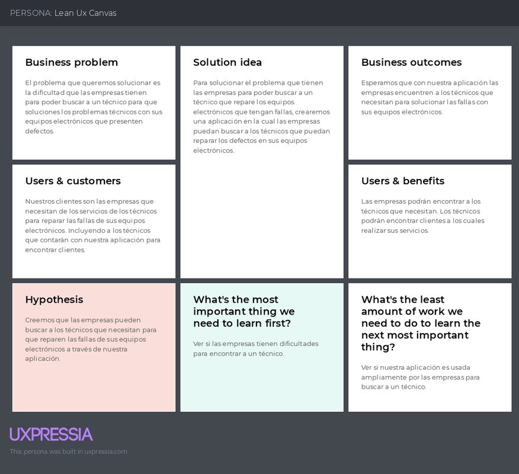

## 1.3. Segmentos objetivo.
| | Segmento 1 | Segmento 2 |
|-----------|--------------------------------------------------------------------------------------|-----------------------------------------------------------------------------------------|
| **Variables** | Empresas, organizaciones, tiendas o vendedores independientes de aparatos electrónicos | Técnicos especializados en el servicio de reparación de distintos artefactos eletrónicos |
| **Geográfica** | Ubicación cercana a tiendas o empresas que requieran soporte técnico | Misma región o ciudad donde se encuentran las empresas o tiendas que requieren soporte técnico |
| **Demográfica** | Edad: 25-50 años<br>Sexo: Ambos<br>Nivel educativo: Universitario | Edad: 20-40 años<br>Sexo: Ambos<br>Nivel educativo: Técnico o universitario |
| **Psicográfica** | Intereses: Tecnología, innovación, calidad de servicio | Intereses: Tecnología, reparación de equipos, calidad de servicio |
| **Función de comportamiento** | Frecuencia de uso: Diario<br>Lealtad: Alta<br>Conocimiento del producto: Medio | Frecuencia de uso: Diario<br>Lealtad: Alta<br>Conocimiento del producto: Medio |


# Capítulo II: Requirements Elicitation & Analysis
## 2.1. Competidores.
### 2.1.1. Análisis competitivo.

| Competitive Analysis Landscape                          |  |
| ------------------------------------------------------- | -|
| ¿Por qué llevar a cabo este análisis?                   | Llevamos a cabo este análisis inicial para comprender el mercado en el que ingresamos, lo que nos permite evaluar las estrategias implementadas por plataformas ya establecidas. De esta manera, buscamos aprender tanto de sus éxitos como de sus fracasos. |


| |  | OfficeTech | JustAnswer  | Compupalace |
|-|-|-|-|-|
| PERFIL| Overview | OfficeTech proporciona acceso rápido y confiable a servicios técnicos, permitiendo a las empresas reducir costos al evitar la necesidad de mantener un equipo interno de soporte. | Plataforma en línea que conecta a usuarios con expertos verificados en una variedad de campos, incluyendo tecnología y electrónica. | Empresa peruana que ofrece servicios integrales de soporte técnico y soluciones informáticas para empresas y usuarios individuales. |
|| Ventaja competitiva ¿Qué valor ofrece a los clientes? |  - Reducción de costos para las empresas que contraten nuestros servicios.<br>- Garantizamos servicios técnicos de calidad confiable. | - Facilita el acceso a expertos verificados.<br>- Cuenta con una gran variedad temas en los que brindan asistencia, desde asistencia legal hasta tecnología.  | - Reputación como proveedor confiable de servicios informáticos.<br>- Amplia gama de servicios, incluyendo reparación y mantenimiento de equipos.|
|| Mercado Objetivo                                        | - Empresas que necesitan un soporte técnico confiable para satisfacer las necesidades de sus clientes.<br>- Profesionales en tecnología enfrentan desafíos para atraer nuevos clientes | Usuarios individuales y empresas que buscan respuestas especializadas en una gran variedad de campos. | Usuarios individuales en Perú que requieren servicios de reparación, mantenimiento y asistencia técnica para sus equipos. |
| Perfil de marketing                                     | Estrategia de Marketing | - Campañas dirigidas a gerentes de empresas de tecnología y electrónica.<br>- Participación en ferias comerciales y eventos.<br>- Publicidad en línea | - Publicidad en línea y en redes sociales.<br>- Colaboraciones con sitios web y blogs relevantes. | - Publicidad en medios de comunicación tradicionales. |
| Perfil del producto                                     | Productos y servicios | Plataforma de suscripción para servicios técnicos.  | Plataforma en línea de preguntas y respuestas con expertos.| Servicio presencial de venta de productos electrónicos y soporte técnico. |
|| Precios y costos                                        | Variable según la complejidad del servicio y el técnico. | Costo mensual por suscripción. | Variable según la complejidad del servicio y el técnico. |
|| Canales de distribución (Web y/o Móvil)                 | Web y Móvil Web | Web y Móvil Web | Servicio presencial |

### 2.1.2. Estrategias y tácticas frente a competidores.

|Competidores ->|  | OfficeTech |JustAnswer| Compupalace|
|-|-|-|-|-|
| Análisis SWOT | Fortalezas | - Reduce costos a las empresas al evitarles mantener un equipo interno de soporte técnico.<br>- Garantizamos servicios técnicos confiables y de alta calidad. | - Cuenta con una red de expertos verificados en una amplia gama de campos.<br>- Permite obtener asesoramiento experto de manera rápida y conveniente. | - Ofrece una amplia variedad de servicios informáticos integrales.<br>- Cuenta con una reputación como un proveedor confiable de servicios informáticos. |
|| Debilidades   | - Competencia en el mercado al tener que enfrentarse a empresas similares sedimentadas.<br>- Garantizar la fiabilidad de los proveedores de servicios técnicos. | - Calidad variable según el experto que responda la pregunta.<br>- Dependencia de la disponibilidad de expertos en línea para absolver dudas. | Al ofrecer un servicio exclusivamente presencial su alcance de mercado está limitado por su geografía. | lorem | 
|| Oportunidades | Expansión del alcance para atender en otras áreas que requieren soporte técnico especializado. | Expansión de su plataforma a nuevos mercados internacionales. | Diversificar sus servicios para incluir soluciones adicionales, como seguridad cibernética o desarrollo de software. | lorem | 
|| Amenazas      | La captación y retención de clientes podría llegar a ser dificultosa y competitiva debido a la presencia de grandes empresas establecidas. | La calidad variable de las respuestas proporcionadas por los expertos podría generar desconfianza entre los usuarios. | La rápida evolución de la tecnología podría hacer que sus servicios se vuelvan obsoletos si no se mantienen al día con las últimas tendencias. | lorem |

## 2.2. Entrevistas.
### 2.2.1. Diseño de entrevistas.
**Preguntas generales:**

1. ¿Cuál es su nombre? 
2. ¿Qué edad tiene? 
3. ¿A qué se dedica? 


**Preguntas a empresas que necesitan soporte técnico:**
1.	¿Cuáles son los principales desafíos que enfrenta su empresa en términos de soporte técnico?
2.	¿Con qué frecuencia experimenta problemas técnicos que afectan la operación de su empresa?
3.	¿Qué tipo de servicios técnicos considera más críticos para su negocio?
4.	¿Qué criterios utiliza para evaluar y seleccionar proveedores de soporte técnico?
5.	¿Ha considerado la posibilidad de externalizar el soporte técnico en lugar de mantener un equipo interno?
6.	¿Qué métodos ha utilizado al buscar profesionales para reparar sus dispositivos (páginas web, referencias, anuncios físicos, etc.)?
7.	¿Qué experiencias positivas o negativas ha tenido con proveedores de soporte técnico en el pasado?
8.	¿Qué tipo de tecnologías o equipos utilizan en su empresa que requieren soporte técnico regular?
9.	¿Qué tan crítico es el tiempo de respuesta para resolver problemas técnicos en su negocio?

   
**Preguntas a profesionales en tecnología:**
1.	¿Cuáles son los mayores desafíos que enfrenta al intentar atraer nuevos clientes a su negocio?
2.	¿Qué canales de comunicación prefiere utilizar para llegar a sus clientes potenciales? (Redes sociales, correo electrónico, eventos de networking, etc.)
3.	¿Qué tipo de servicios o soluciones tecnológicas ofrece a sus clientes potenciales?
4.	¿Qué métodos utiliza habitualmente para abordar los problemas técnicos planteados por sus clientes? (en línea, asesoramiento telefónico, visitas presenciales, acceso remoto a los dispositivos, etc.) 
5.	¿Cómo describiría un día típico en su trabajo?
6.	¿Cuál es un desafío habitual que enfrenta al tratar con sus clientes? ¿Cómo suele manejar esta situación cuando surge?

### 2.2.2. Registro de entrevistas.
**Segmento 1: Clientes que requieren de un plan para soporte técnico que brinde garantía y soluciones a sus productos electrónicos**<br>
**Entrevista 1 (realizada por Marcelo Ramirez):**<br>
**Nombre:** Rusbel Bargas
**Edad:** 37 años
**Ocupación:** Ing. Informático a cargo de negocio de venta de dispositivos

<br>
[Vídeo de entrevista](https://upcedupe-my.sharepoint.com/:v:/g/personal/u202210582_upc_edu_pe/EbBese2ydBZAs4HtY_Rhn7sBj-K5E05-gCh3wKiBUph5qg?e=P2VSJy&nav=eyJyZWZlcnJhbEluZm8iOnsicmVmZXJyYWxBcHAiOiJTdHJlYW1XZWJBcHAiLCJyZWZlcnJhbFZpZXciOiJTaGFyZURpYWxvZy1MaW5rIiwicmVmZXJyYWxBcHBQbGF0Zm9ybSI6IldlYiIsInJlZmVycmFsTW9kZSI6InZpZXcifX0%3D)
<br>
Rusbel Bargas es un ingeniero informático que se encarga de un negocio de venta de dispositivos electrónicos. Nos comenta que uno de los mayores desafíos que enfrenta es el soporte técnico que debe brindar a sus clientes. Asegura que la mayoría de los problemas técnicos que enfrentan sus clientes son de naturaleza simple, pero que requieren de un técnico especializado para ser resueltos. Nos comenta que la mayoría de los clientes buscan una solución rápida y efectiva a sus problemas, por lo que es importante contar con un servicio de soporte técnico confiable y eficiente. Además, nos comenta que la mayoría de los clientes buscan una garantía en los productos que adquieren, por lo que es importante contar con un plan de soporte técnico que brinde garantía y soluciones a sus productos electrónicos vendidos. Rusbel nos comenta que estaría interesado en contratar un servicio como el de OfficeTech para garantizar la satisfacción de sus clientes y asegurar la calidad de los productos que vende. 

**Entrevista 2 (realizada por Carlos Sanchez):**<br>
**Nombre:** Piero Espinoza
**Edad:** 25 años
**Ocupación:** Gerente de Sistemas

<br>
[Vídeo de entrevista](https://upcedupe-my.sharepoint.com/:v:/g/personal/u202015274_upc_edu_pe/ESXcne_tgulPuXofYSxLaZUBawThA0pOV36PiJY2uFEcOA?e=7d12Jj&nav=eyJyZWZlcnJhbEluZm8iOnsicmVmZXJyYWxBcHAiOiJTdHJlYW1XZWJBcHAiLCJyZWZlcnJhbFZpZXciOiJTaGFyZURpYWxvZy1MaW5rIiwicmVmZXJyYWxBcHBQbGF0Zm9ybSI6IldlYiIsInJlZmVycmFsTW9kZSI6InZpZXcifX0%3D)
<br>
En una entrevista realizada a Pedro Espinoza, gerente de sistemas de 25 años, se identificaron diversos aspectos clave relacionados con el soporte técnico en su empresa. Entre los principales desafíos mencionó la lentitud en la atención y la falta de personal capacitado. Indicó que los problemas técnicos ocurren semanalmente y que los servicios más críticos son el soporte de red y otros servicios tecnológicos. A la hora de elegir proveedores, valora principalmente el tiempo de respuesta y la experiencia. Comentó que está considerando la externalización del soporte técnico y que suele buscar profesionales mediante páginas web y referencias. En cuanto a sus experiencias previas, destacó que las positivas han estado asociadas a una atención rápida, mientras que las negativas se relacionan con demoras. Finalmente, mencionó que su empresa utiliza equipos como computadoras, servidores, routers y software ERP, y subrayó que el tiempo de respuesta es un factor muy crítico para la operación de su negocio.


**Segmento 2: Técnicos especializados en reparación, mantenimiento y soporte técnico de productos electrónicos.** <br>

**Entrevista 1 (realizada por Daniel del Castillo):**<br>
**Nombre:** Gustavo Rojas
**Edad:** 25 años 
**Ocupación:** Tecnico a tiempo parcial 

<br>
[Vídeo de entrevista](https://upcedupe-my.sharepoint.com/:v:/g/personal/u202211212_upc_edu_pe/EX7_BUD52XNCvCTfBWZyCEMBw47W2r1dsFSLSitKT2-4Lg?nav=eyJyZWZlcnJhbEluZm8iOnsicmVmZXJyYWxBcHAiOiJPbmVEcml2ZUZvckJ1c2luZXNzIiwicmVmZXJyYWxBcHBQbGF0Zm9ybSI6IldlYiIsInJlZmVycmFsTW9kZSI6InZpZXciLCJyZWZlcnJhbFZpZXciOiJNeUZpbGVzTGlua0NvcHkifX0&e=somIsf)
<br>
Gustavo nos comenta que uno de los principales desafíos que enfrenta al atraer nuevos clientes es lograr que las personas se enteren de los servicios que ofrece. La dificultad radica principalmente en llegar a ellos y generar visibilidad. Actualmente no utiliza activamente redes sociales ni correo electrónico para promocionarse, lo que limita su alcance.

Para resolver problemas técnicos planteados por sus clientes, recurre principalmente al asesoramiento personal o telefónico, y en ocasiones realiza visitas presenciales. Describe su día típico como uno en el que llega a su taller, revisa los pendientes y atiende tanto a clientes que llegan en persona como a los que lo llaman.

Uno de los desafíos más frecuentes al tratar con clientes es la falta de claridad al momento de describir sus problemas técnicos, ya que muchos no dominan los términos adecuados. Para manejar estas situaciones, él opta por dedicar más tiempo a escuchar y comprender al cliente, y también trata de explicarles el problema en sus propios términos para asegurarse de que ambos estén en la misma página.

**Entrevista 2 (realizada por Daniel del Castillo):**<br>
**Nombre:** Mateo Vilchez
**Edad:** 21 años
**Ocupación:** Miembro de empresa

<br>
[Vídeo de entrevista](https://upcedupe-my.sharepoint.com/:v:/g/personal/u202211212_upc_edu_pe/ER-VfQQn1HFEsGTqeoXKopEBj4TFUWzMsAoPqidze2MG9Q?nav=eyJyZWZlcnJhbEluZm8iOnsicmVmZXJyYWxBcHAiOiJPbmVEcml2ZUZvckJ1c2luZXNzIiwicmVmZXJyYWxBcHBQbGF0Zm9ybSI6IldlYiIsInJlZmVycmFsTW9kZSI6InZpZXciLCJyZWZlcnJhbFZpZXciOiJNeUZpbGVzTGlua0NvcHkifX0&e=d4J6vK)  
<br>
Mateo Alejandro Vilcer Ríos tiene 21 años y trabaja desde hace cuatro meses en el área de soporte técnico de una empresa. Nos comenta que uno de los principales desafíos en su rol es asegurar que todos los equipos funcionen correctamente y sin fallos, ya que cualquier interrupción afecta el trabajo diario. Aunque realizan mantenimientos quincenales, enfrentan entre dos a tres problemas técnicos por semana que requieren atención inmediata.

Resalta que los servicios más críticos para su empresa son el mantenimiento preventivo y la capacidad de brindar atención rápida y orientación clara a los usuarios. Para seleccionar proveedores de soporte técnico, considera factores como confiabilidad, experiencia, tiempos de respuesta cortos y un buen trato al cliente.

Aunque actualmente tienen un equipo interno, han considerado externalizar el soporte técnico en situaciones de alta demanda o cuando se requiere personal especializado. Para buscar técnicos, recurren principalmente a recomendaciones de conocidos.

En general, ha tenido experiencias positivas con proveedores, aunque menciona una ocasión en la que una falla no fue completamente resuelta por falta de comunicación, lo que generó retrasos. Los equipos que requieren soporte regular incluyen computadoras de escritorio, impresoras, periféricos y software administrativo. Finalmente, recalca que el tiempo de respuesta es crítico, ya que una falla puede paralizar toda la empresa si no se resuelve a tiempo.
### 2.2.3. Análisis de entrevistas.

**Segmento 1** 
Clientes que requieren soporte técnico con garantía:
Este grupo está compuesto por profesionales y empresas que dependen del soporte técnico para mantener operativos sus equipos electrónicos y garantizar la satisfacción de sus propios clientes. Enfrentan problemas técnicos frecuentes que, aunque simples, requieren atención especializada y rápida. Valoran especialmente la rapidez en la atención, la experiencia del proveedor, la capacidad de respuesta y la calidad del trato al cliente. Además, consideran la externalización del soporte técnico como una opción viable en contextos de alta demanda o cuando se necesita personal altamente especializado. La garantía en los productos y el respaldo técnico son elementos clave que buscan en los servicios contratados.

**Segmento 2** 
Técnicos especializados en reparación y soporte:
Este grupo incluye a técnicos que ofrecen servicios de mantenimiento y reparación de dispositivos electrónicos. Su principal desafío es llegar a nuevos clientes debido a la baja visibilidad de sus servicios, ya que en muchos casos no utilizan redes sociales ni otros canales digitales para promocionarse. También enfrentan dificultades en la comunicación con los clientes, quienes muchas veces no logran explicar con claridad los problemas técnicos. Para abordar esto, los técnicos recurren a una atención personalizada, dedicando tiempo adicional para entender y resolver las fallas. Su día a día está marcado por la gestión de pendientes en el taller y la atención a solicitudes tanto presenciales como telefónicas.


## 2.3. Needfinding.
### 2.3.1. User Personas.
**Segmento 1:** Clientes que requieren de un plan para soporte técnico que brinde garantía y soluciones a sus productos electrónicos vendidos.  
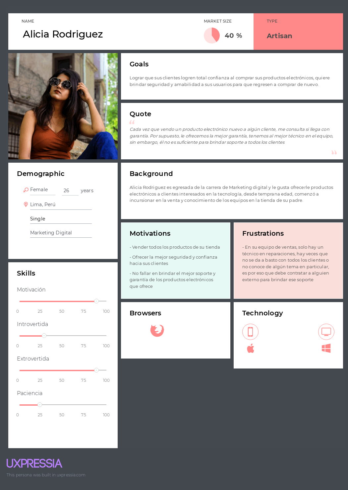

**Segmento 2:** Técnicos especializados en reparación, mantenimiento y soporte técnico de productos electrónicos.
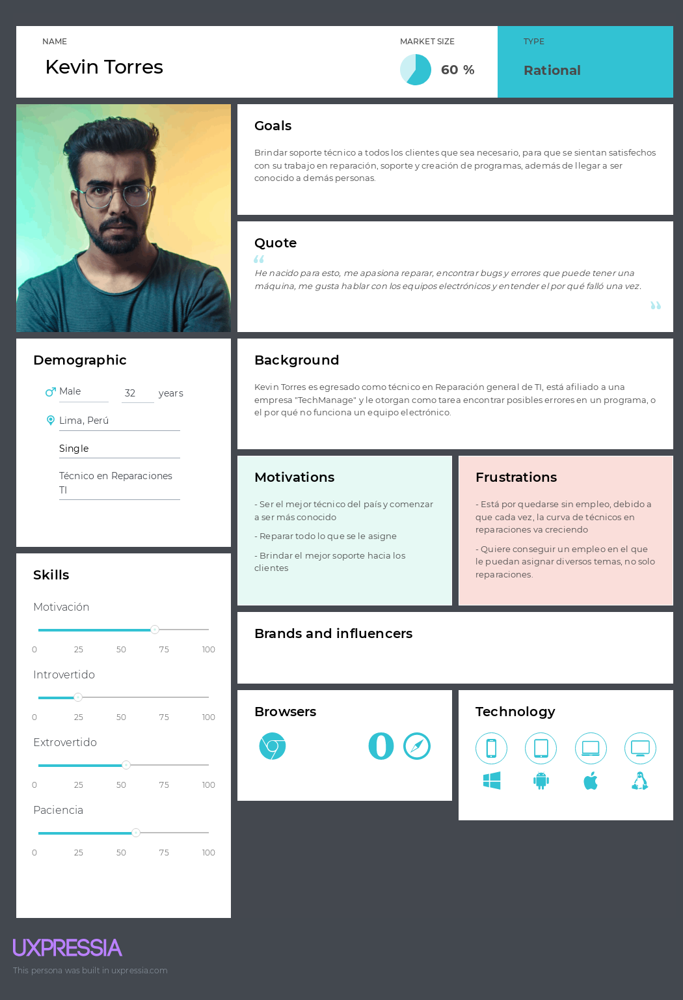

### 2.3.2. User Task Matrix.
**Segmento 1:** 

|  |  User 1  | User 2 | User 3  | User 4 |
| --- | ----------- | ------------ | ----------- | ---------- |
| Es dueño o vende productos electrónicos  | <span style="color:#90D26D; font-weight:bold">SI</span>   | <span style="color:#FFC700; font-weight:bold">POCO</span>| <span style="color:#90D26D; font-weight:bold">SI</span>   | <span style="color:#90D26D; font-weight:bold">SI</span> |
| Cuenta con un equipo de soporte técnico para brindar garantía | <span style="color:#FFC700; font-weight:bold">POCO</span> | <span style="color:#E72929; font-weight:bold">NO</span>        | <span style="color:#FFC700; font-weight:bold">POCO</span>         | <span style="color:#E72929; font-weight:bold">NO</span>       |
| Contrata a técnicos externos para temas en específico | <span style="color:#90D26D; font-weight:bold">SI</span> | <span style="color:#90D26D; font-weight:bold">SI</span>        | <span style="color:#FFC700; font-weight:bold">POCO</span>         | <span style="color:#90D26D; font-weight:bold">SI</span>       | 
| Brinda soporte técnico a sus clientes como parte de garantía a sus productos vendidos | <span style="color:#FFC700; font-weight:bold">POCO</span> | <span style="color:#FFC700; font-weight:bold">POCO</span>        | <span style="color:#FFC700; font-weight:bold">POCO</span>         | <span style="color:#E72929; font-weight:bold">NO</span>       |

**Segmento 2:** 

|  |  User 1  | User 2 | User 3  | User 4 |
| --- | ----------- | ------------ | ----------- | ---------- |
| Es técnico de especialidad  | <span style="color:#90D26D; font-weight:bold">SI</span>   | <span style="color:#90D26D; font-weight:bold">SI</span>| <span style="color:#90D26D; font-weight:bold">SI</span>   | <span style="color:#90D26D; font-weight:bold">SI</span> |
| Cuenta con un empleo seguro y rentable | <span style="color:#E72929; font-weight:bold">NO</span> | <span style="color:#E72929; font-weight:bold">NO</span>        | <span style="color:#FFC700; font-weight:bold">POCO</span>         | <span style="color:#E72929; font-weight:bold">NO</span>       |
| Conoce de todos los temas para reparar y dar soporte | <span style="color:#90D26D; font-weight:bold">SI</span> | <span style="color:#90D26D; font-weight:bold">SI</span>        | <span style="color:#FFC700; font-weight:bold">POCO</span>         | <span style="color:#90D26D; font-weight:bold">SI</span>       | 
| Le gusta brindar soporte técnico | <span style="color:#90D26D; font-weight:bold">SI</span> | <span style="color:#90D26D; font-weight:bold">SI</span>        | <span style="color:#90D26D; font-weight:bold">SI</span>         | <span style="color:#90D26D; font-weight:bold">SI</span>       |
### 2.3.3. User Journey Mapping.
**Cliente:**


**Técnico:**  


### 2.3.4. Empathy Mapping.
**Cliente:**


**Técnico:**  


### 2.3.5. As-is Scenario Mapping.

**Cliente:**  


| **Phases**    | Busco Servicio Técnico| Contacto con la persona que me hara el servicio | Contrato y pago el producto | Recibo mi producto reparado |
|----------|--------|--------|--------|--------|
| **Doing**    | -Navego en la web buscando soporte técnico. <br> -Consulto a amigos o familiares por algún técnico conocido. |  -Le explico el problema que presento. <br> -Llamo y pregunto si me puede realizar el trabajo. | -Llego a un acuerdo con el técnico y lo contrato. <br> -Cancelo el pago del servicio.| -Recibo mi producto ya reparado. <br> Reviso si mi producto se encuentra correctamente. |
| **Thinking** | -Espero poder encontrar un buen técnico. <br> -Pienso que ojalá el servicio no cueste mucho dinero. | Pienso que ojalá el servicio no cueste mucho dinero. | -Si realizo un buen trabajo, el costo valdrá la pena. <br> -Espero que no sea una estafa. | -Pienso que se hizo un buen trabajo. <br> -Espero que no presente más fallas. |
| **Feeling**  | -Siento estresado porque debo pasar mucho tiempo buscando soporte confiable por internet. | -Angustia porque no conozco a la persona y necesito que repare mi producto. | -Temor por ser estafado, ya que soy un vendedor nuevo. <br> -Esperanza porque el trabajo sea correcto. | -Alegre, ya que resolvieron mi problema. <br> -Felicidad porque todo salió bien. |

**Técnico:**  
            

| **Phase**     | Busca un cliente con problemas | Analiza el producto a realizar el servicio | Realizo el presupuesto | Realiza el servicio lo mejor posible |
|---------------|--------------------------------|-------------------------------------------|------------------------|------------------------------------|
| **Doing**     | Hablo con el cliente sobre su caso | Coordinamos un precio accesible          | Realizo el mantenimiento | Se realiza el pago del servicio    |
| **Thinking**  | Espero poder encontrar nuevos clientes | Espero que mis capacidades sean suficientes | Espero poder ser mas conocido por mi servicio | Espero que me valoren bien mis clientes |
| **Feeling**   | Siento que no soy muy popular   | Siento que no tengo muchos clientes       | Siento que no valoran mis capacidades | Siento que tengo mucho tiempo sin   clientes |


## 2.4. Ubiquitous Language.

| **Terms and Definitions** | **Términos y Definiciones** |
|---------------------------|-----------------------------|
| Technical Support         | Servicio ofrecido para solucionar problemas relacionados con el hardware o software de dispositivos electrónicos. |
| Service Request           | Petición realizada por un usuario o empresa para recibir asistencia técnica. |
| Technician                | Profesional especializado en el mantenimiento y reparación de dispositivos electrónicos. |
| User                      | Cualquier persona o entidad que utiliza la plataforma para solicitar o proveer servicios técnicos. |
| Device                    | Cualquier pieza de equipo electrónico que requiera mantenimiento o reparación. |
| Subscription Plan         | Modelo de pago que permite a los usuarios acceder a servicios específicos durante un periodo determinado. |
| Service History           | Registro de todas las solicitudes de servicio y asistencias técnicas realizadas a través de la plataforma. |
| Feedback                  | Opiniones o comentarios proporcionados por los usuarios sobre la calidad del servicio recibido. |
| Issue                     | Descripción de la falla o mal funcionamiento que un dispositivo está experimentando. |
| Warranty                  | Compromiso de reparar o reemplazar un dispositivo dentro de un período específico, sin costo adicional. |


---

# Capítulo III: Requirements Specification
## 3.1. To-Be Scenario Mapping.

**Cliente:** 

| Fases | Busco un servicio tecnico | Me pongo en contacto con el | Lo contrato y realizo pago  | Espero y su llega para la reparacion | El tecnico llega y soluciona mi problema|
|----------|-------------------------------------------------------|---------------------------------------------------|-------------------------------------------------|---------------------------------------------------|--------------------------------------------------|
| Doing    | Decirle al tecnico sobre la situacion | Consultar al técnico sobre mantenimiento o cuidados posteriores | Programar servicios futuros basados en necesidades recurrentes | Recomendar el técnico a otros usuarios dentro de la plataforma. | Compartir mi experiencia con el servicio en redes sociales o con amigos. |
| Thinking | Espero que el trabajo se realize con exito | Espero que phaber pagado demas por la subcripcion valga la pena  | Espero que el problema no sea nada grave | Pienso que el tecnico debe ser bueno e su trabajo | Pienso que es un alivo haber encontrado esta plataforma |
| Feeling  | Feliz de poder aver arreglado el problema | Confiado en que lo va a solucionar | Esperanzado de que el problema no sea grave | Aliviado de que la plataforma es confiable. | Contento de que todo haya salido bien.    |

**Técnico:** 

| Fases | Espero notificacion de servicio | Recibo un reporte de servicio tecnico y acepto| Realizo y resuelvo el problema del cliente  | El cleinte realiza el pago del servico por medio de un pago | El cliente valora mi servicio atraves de reseña |
|----------|-------------------------------------------------------|---------------------------------------------------|-------------------------------------------------|---------------------------------------------------|--------------------------------------------------|
| Doing    | Realizo el servicio adecuardo a las indicaciones del cliente | Responder a solicitudes de servicio, enviar cotizaciones. | Acordar detalles del servicio, comenzar el trabajo técnico. | Hago  un seguimiento post-servicio | Explorar nuevas áreas de servicio, actualizar el perfil con nuevos skills. |
| Thinking | Esto podría expandir mi alcance a más clientes.    | Dejo a clientes satisfechos  | Subi mi calificacion como tecnico. | Conocer la opinión del cliente para mejorar. | Puedo aumentar mi oferta de servicios para atraer a más clientes |
| Feeling  | Optimista y curioso por mi potencial crecimiento. | Motivado ante la posibilidad de nuevos trabajos. | Responsabilidad y compromiso con la calidad.   | Satisfecho por el trabajo bien hecho y deseo de mejorar . | Ambición y deseo de crecimiento profesional.    |


## 3.2. User Stories.
**Epics**

| Epic ID | Título | Descripción de Historias de Usuario Asociadas  |
|---------|--------|------------------------------------------------|
| EP01    | Registro y Gestión de Usuario          | Como usuario, quiero un proceso de registro y gestión de mi perfil simple y directo, para utilizar la plataforma sin complicaciones y mantener actualizada mi información. |
| EP02    | Planificación y Gestión de Servicios   | Como usuario, quiero poder acceder a planes, programar servicios de forma anticipada y revisar mi historial e informes de uso, para gestionar eficientemente mis actividades y recursos en la plataforma. |
| EP03    | Comunicación y Notificaciones          | Como usuario, quiero recibir notificaciones oportunas y comunicarme de manera segura, para estar al tanto de oportunidades relevantes y poder intercambiar información de forma confiable. |
| EP04    | Experiencia de Usuario en la Plataforma| Como usuario, quiero conocer las características y ventajas de OfficeTech mediante una guía introductoria y una presentación clara de la información, para sentirme confiado y entender rápidamente lo que ofrece la plataforma. |
| EP05    | Acceso y Contacto Móvil                | Como usuario, quiero poder acceder a la plataforma y contactar a la empresa fácilmente desde mi dispositivo móvil, para hacer uso de los servicios en cualquier lugar y momento. |
| EP06    | Fundamentos del Backend  | Como equipo de desarrollo, queremos establecer una base sólida para el backend, para asegurar la escalabilidad, seguridad, y eficiencia desde el principio. |
**Historias de Usuario**

| USER STORY ID | TITULO                                                                                | DESCRIPCION                                                                                                                                                                                                                                                                | CRITERIOS DE ACEPTACIÓN                                                                                                                                                                                                                                                                                                                                                                                                                                                                                                                                                                                                                                                                                                                                                                                                                                                                                                                                                                                                                                                                                                                                                                                                                                                                                                                                                                                                                                                                                                                                                                          | EPIC RELACIONADO |
|---------------|---------------------------------------------------------------------------------------|----------------------------------------------------------------------------------------------------------------------------------------------------------------------------------------------------------------------------------------------------------------------------|--------------------------------------------------------------------------------------------------------------------------------------------------------------------------------------------------------------------------------------------------------------------------------------------------------------------------------------------------------------------------------------------------------------------------------------------------------------------------------------------------------------------------------------------------------------------------------------------------------------------------------------------------------------------------------------------------------------------------------------------------------------------------------------------------------------------------------------------------------------------------------------------------------------------------------------------------------------------------------------------------------------------------------------------------------------------------------------------------------------------------------------------------------------------------------------------------------------------------------------------------------------------------------------------------------------------------------------------------------------------------------------------------------------------------------------------------------------------------------------------------------------------------------------------------------------------------------------------------|------------------|
| HU01          | Registro fácil en la plataforma                                                       | "Como usuario, deseo registrarme fácilmente en la plataforma para evitar procesos complicados y comenzar rápidamente."                                                                                                                                                     | **Escenario 1: Registro exitoso usando una dirección de correo electrónico** <br> Dado que un nuevo usuario accede a la página de registro, Cuando el usuario introduce su dirección de correo electrónico, contraseña y confirma la contraseña, Y eligue su categoria, Entonces el usuario debe ser registrado exitosamente, Y puede ingresar a su cuenta. <br> **Escenario 2: Intento de registro con correo electrónico ya registrado** <br> Dado que un nuevo usuario intenta registrarse, Cuando el usuario introduce un correo electrónico que ya está registrado en la plataforma, Entonces el sistema debe mostrar un mensaje de error indicando que el correo electrónico ya está en uso. <br> **Escenario 3: Intento de registro con información incompleta** <br> Dado que un nuevo usuario accede a la página de registro, Cuando el usuario omite ingresar uno de los campos requeridos (como correo electrónico o contraseña), Entonces el sistema debe mostrar un mensaje de error indicando que todos los campos son obligatorios.                                                                                                                                                                                                                                                                                                                                                                                                                                                                                                                                               | EP01             |
| HU02          | Destacar habilidades en el perfil                                                     | "Como usuario, deseo destacar mis habilidades en mi perfil para atraer a usuarios que busquen esos servicios específicos."                                                                                                                                                 | **Escenario 1: Añadir habilidades al perfil** <br> Dado que el usuario ha accedido a su perfil, Cuando añade habilidades, Entonces puede seleccionar hasta 5 y estas deben ser visibles claramente en su perfil. <br> **Escenario 2: Intento de agregar más de 5 habilidades** <br> Dado que el usuario ha accedido a su perfil, Cuando intenta añadir más de 5 habilidades, Entonces el sistema debe mostrar un mensaje de error que no se pueden añadir más de 10 habilidades. <br> **Escenario 3: Visualización clara de las habilidades en el perfil** <br> Dado que el usuario ha añadido habilidades a su perfil, Cuando otros usuarios o él mismo visualizan su perfil, Entonces las habilidades deben estar destacadas y visibles claramente. <br> **Escenario 4: Verificación de habilidades no repetidas al añadir** <br> Dado que el usuario está editando su perfil para añadir habilidades, Cuando selecciona habilidades que ya están listadas en su perfil, Entonces el sistema debe evitar la duplicación y no añadir la habilidad nuevamente. <br> **Escenario 5:  Edición de habilidades existentes en el perfil** <br> Dado que el usuario desea actualizar su perfil, Cuando decide editar las habilidades ya listadas, Entonces debe poder modificar o eliminar cualquiera de las habilidades existentes y estas actualizaciones deben reflejarse correctamente en el perfil.                                                                                                                                                                                               | EP01             |
| HU03          | Acceso a planes de servicios                                                          | "Como usuario, deseo suscribirme a un plan que se ajuste a mis necesidades para gestionar mejor mis gastos."                                                                                                                                                               | **Escenario 1:  Selección de plan de servicio** <br> Dado que el usuario desea controlar sus gastos, Cuando elige un plan,Entonces debe haber al menos tres opciones claras de lo que cada plan incluye.  <br> **Escenario 2: Visualización detallada de los planes de servicio** <br> Dado que el usuario accede a la sección de planes de servicios, Cuando navega entre las diferentes opciones, Entonces cada plan debe mostrar claramente los beneficios y costos. <br> **Escenario 3: Información insuficiente en la descripción del plan** <br> Dado que el usuario ya está suscrito a un plan, Cuando decide cambiar a otro plan, Entonces el proceso debe ser claro y permitir cambiar sin problemas, mostrando una confirmación del cambio. <br> **Escenario 4: Cambio de plan de servicios** <br> Dado que el usuario ya está suscrito a un plan, Cuando decide cambiar a otro plan, Entonces el proceso debe ser claro y permitir cambiar sin problemas, mostrando una confirmación del cambio. <br> **Escenario 5: Información insuficiente en la descripción del plan** <br> Dado que el usuario está revisando las opciones de planes, Cuando encuentra que la descripción de un plan es insuficiente o poco clara, Entonces debe haber una opción para contactar al servicio al cliente o obtener más información en línea. <br> **Escenario 6: Suscripción exitosa a un plan** <br> Dado que el usuario elige un plan que se ajusta a sus necesidades, Cuando completa el proceso de suscripción, Entonces podra entrar a su cuenta y verificar las caracteristicas de su plan. | EP02             |
| HU04          | Notificaciones de oportunidades                                                       | "Como usuario, deseo recibir notificaciones de nuevas oportunidades que coincidan con mis intereses."                                                                                                                                                                      | **Escenario 1: Configuración de intereses** <br> Dado que el usuario desea recibir notificaciones personalizadas.Cuando el usuario configura o actualiza sus intereses en su perfil.Entonces el sistema guarda estas preferencias para futuras notificaciones. <br> **Escenario 2: Recepción de notificaciones en tiempo real** <br> Dado que el usuario ha configurado sus intereses y hay nuevas oportunidades disponibles.Cuando estas oportunidades coinciden con los intereses del usuario.Entonces el usuario recibe notificaciones en tiempo real sobre estas oportunidades.<br>**Escenario 3: Personalización de la frecuencia de notificaciones** <br> Dado que el usuario desea controlar la cantidad de notificaciones recibidas.Cuando accede a la configuración de notificaciones.Entonces puede seleccionar la frecuencia con la que desea recibir actualizaciones.                                                                                                                                                                                                                                                                                                                                                                                                                                                                                                                                                                                                                                                                                                                | EP03             |
| HU05          | Comunicación segura con usuarios                                                      | "Como usuario, necesito comunicarme de manera segura con otros usuarios para intercambiar detalles de manera confiable."                                                                                                                                                   | **Escenario 1: Establecimiento de conexión segura**<br> Dado que la seguridad en la comunicación es prioritaria.Cuando dos usuarios inician un chat o intercambio de mensajes.Entonces la conexión entre ellos está cifrada de extremo a extremo para garantizar la confidencialidad.<br> **Escenario 2: Verificación de identidad** <br> Dado que los usuarios necesitan confirmar la identidad del otro para prevenir fraudes.Cuando un usuario inicia una comunicación con otro por primera vez.Entonces tienen la opción de verificar la identidad mediante un proceso seguro.<br> **Escenario 3: Acceso seguro a mensajes anteriores** <br> Dado que los usuarios quieren acceder a su historial de mensajes.Cuando un usuario consulta mensajes antiguos con otro usuario.Entonces el acceso a estos mensajes está protegido y solo es visible para los usuarios que participaron en la conversación.                                                                                                                                                                                                                                                                                                                                                                                                                                                                                                                                                                                                                                                                                      | EP03             |
| HU06          | Historial de servicios                                                                | "Como usuario, quiero tener acceso a un historial de mis servicios para rastrear garantías y trabajos anteriores."                                                                                                                                                         | **Escenario 1: Historial de servicios contratados** <br> Dado que el usuario es una compañía <br>Cuando el usuario ingresa al panel de servicios actuales <br> Entonces desplegará una lista de los servicios contratados a lo largo del tiempo<br> **Escenario 2: Historial de servicios brindados**<br> Dado que el usuario es un técnico <br> Cuando el usuario ingresa al panel de servicios actuales <br> Entonces desplegará una lista de los servicios brindados                                                                                                                                                                                                                                                                                                                                                                                                                                                                                                                                                                                                                                                                                                                                                                                                                                                                                                                                                                                                                                                                                                                          | EP02             |
| HU07          | Programación anticipada de servicios                                                  | "Como usuario, quiero programar servicios con anticipación para asegurar disponibilidad del técnico"                                                                                                                                                                       | **Escenario 1: Reserva de cita con el técnico**<br> Dado que el usuario de compañía ingresa al panel de servicios actuales <br> Cuando el usuario complete el formulario de nuevo Tech Requirement <br> Entonces el usuario registrará una nueva cita con el técnico<br> **Escenario 2: Cancelación de la cita con el técnico** <br>Dado que el usuario de compañía ingresa al panel de servicios actuales <br> Cuando el usuario seleccione un registro <br> Entonces aparecerá un menú en el que puede eliminar o cancelar esa cita.                                                                                                                                                                                                                                                                                                                                                                                                                                                                                                                                                                                                                                                                                                                                                                                                                                                                                                                                                                                                                                                           | EP02             |
| HU08          | Publicación de comentario sobre servicio consumido                                    | "Como usuario cliente, deseo poder realizar una retroalimentación al técnico que resuelva mi petición para dar a conocer de forma pública la calidad de servicio brindada."                                                                                                | **Escenario 1: Comentario de servicio recibido**<br>Dado que el usuario cliente desea realizar un comentario de forma pública en cuanto al servicio recibido<br>Cuando ingrese al apartado de historial de servicios contratados y seleccione el servicio a retroalimentar<br>Entonces le aparecerá una opción para añadir un comentario y seleccionar la cantidad de estrellas a otorgar.<br>**Escenario 2: Comentario de servicio brindado**<br>Dado que el técnico desea conocer el nivel de satisfacción de sus clientes<br>Cuando ingrese al apartado “servicios brindados” y seleccione el servicio que desea consultar<br>Entonces le aparecerá el comentario publicado por el cliente.                                                                                                                                                                                                                                                                                                                                                                                                                                                                                                                                                                                                                                                                                                                                                                                                                                                                                                   | EP02             |
| HU09          | Listado de características OfficeTech                                                 | "Como potencial cliente de OfficeTech, deseo conocer más sobre sus características y beneficios para poder decidir si optar por utilizar la aplicación."                                                                                                                   | **Escenario 1:  Mostrar beneficios que brinda OfficeTech para compañías**<br>Dado que una compañía visita por primera vez la landing page de Officetech y desea conocer los beneficios de esta<br>Cuando ingrese al apartado “Features”<br>Entonces podrá ver una lista de las características que ofrece la aplicación para las compañías.<br>**Escenario 2: Mostrar beneficios que brinda OfficeTech para técnicos**<br>Dado que un técnico en tecnología visita la landing page de Officetech y desea conocer los beneficios de esta.<br>Cuando ingrese al apartado “Features”<br>Entonces podrá ver una lista de las características que ofrece la aplicación para los técnicos.                                                                                                                                                                                                                                                                                                                                                                                                                                                                                                                                                                                                                                                                                                                                                                                                                                                                                                             | EP04             |
| HU10          | Introducción sencilla                                                                 | "Como usuario, deseo conocer el funcionamiento de la página a través de una pequeña guía para saber qué hacer al comenzar."                                                                                                                                                | **Escenario 1: Mostrar guía introductoria** Dado que el usuario visita la página principal. Entonces se muestra una guía introductoria breve y clara sobre cómo usar la plataforma. Y la guía contiene información sobre las principales funcionalidades y cómo acceder a ellas <br> **Escenario 2: Omitir guía introductoria** Dado que el usuario ya está familiarizado con la plataforma. Cuando se muestra la guía introductoria y el usuario haya decidido que no la necesita o ya conoce la información Entonces el usuario puede omitir la guía                                                                                                                                                                                                                                                                                                                                                                                                                                                                                                                                                                                                                                                                                                                                                                                                                                                                                                                                                                                                                                           | EP04             |
| HU11          | Vista móvil                                                                           | "Como usuario, deseo visualizar la landing page desde mi dispositivo móvil para visitar la página mientras uso mi teléfono."                                                                                                                                               | **Escenario 1: Visualización optimizada para dispositivos móviles:** Dado que el usuario accede a la plataforma desde un dispositivo móvil. Cuando se carga la landing page. Entonces el diseño y layout se adaptan automáticamente al tamaño de pantalla del dispositivo móvil. Y todos los elementos de la página, como texto, imágenes y botones, se muestran correctamente sin necesidad de hacer zoom o desplazamiento horizontal <br> **Escenario 2: Rendimiento óptimo en dispositivos móviles** Dado que el usuario está utilizando la plataforma desde un dispositivo móvil. Cuando el usuario navega por diferentes secciones de la plataforma. Entonces los tiempos de carga y respuesta son rápidos y optimizados para dispositivos móviles. Y no se experimentan retrasos o congelaciones significativas en el rendimiento de la plataforma                                                                                                                                                                                                                                                                                                                                                                                                                                                                                                                                                                                                                                                                                                                                         | EP05             |
| HU12          | Cliente interesado                                                                    | "Como usuario, quiero tener un formulario de contacto simple para enviar mis preguntas directamente a la empresa."                                                                                                                                                         | **Escenario 1: Acceso al formulario de contacto**. Dado que el usuario necesita contactar a la empresa. Cuando busca el formulario de contacto en la plataforma, el formulario de contacto es fácilmente accesible y visible. Entonces el usuario puede encontrarlo sin dificultad en un lugar intuitivo de la interfaz <br> **Escenario 2: Campos del formulario de contacto** Dado que el usuario ha encontrado el formulario de contacto. Cuando comienza a completar los campos del formulario. Entonces el usuario puede enviar su consulta completando los campos necesarios                                                                                                                                                                                                                                                                                                                                                                                                                                                                                                                                                                                                                                                                                                                                                                                                                                                                                                                                                                                                               | EP05             |
| HU13          | Facilidad de Información                                                              | "Como usuario, quiero ver una introducción clara y concisa de lo que ofrece la página para entender rápidamente si el servicio/producto es lo que busco."                                                                                                                  | **Escenario 1: Informacion Resumida en la Pagina Principal**, <br>Dado que el usario necesita conocer de manera rapida sobre el servicio, Cuando visite la pagina de inicio del sitio web y deslice hacia abajo entonces encontrara resumidos los servicios que se ofrecen de manera grafica y escrita.<br> **Escenario 2: Acceso directo desde el Menu de Navegacion**, <br>Dado que el usuario busca informacion especifica, Cuando interactue con la barra de navegacion y pueda ir directo al aparatado que quiere conocer, Entonces podrá desplazarse sin esfuerzo por las diferentes secciones del sitio web, optimizando así su tiempo y experiencia de navegación.                                                                                                                                                                                                                                                                                                                                                                                                                                                                                                                                                                                                                                                                                                                                                                                                                                                                                                                       | EP04             |
| HU14          | Informacion Esencial de la empresa y                                                  | "Como usuario interesado en conocer mas sobre la empresa y su reputacion, quiero poder acceder facilmente a la informacion acerca de la empresa y experiencias de otras personas con ella, para asi poder tomar una decision sobre si sus servicios son adecuados para mi" | **Escenario 1: Peril de la empresa** <br>Dado que el usuario desea conocer mas sobre la empresa, Cuando navegue por la seccion "About Us" en el sitio web, Entonces encotrara informacion detallada sobre la historia de la empresa, mision, vision, valores y el equipo de desarrollo <br> **Escenario 2: Reputacion de la empresa**<br>Dado que el usuario esta interesasdo en la experiencia de otros clientes, cuando acceda a la seccion de testimonios podra visualizar experiencias de otras personas con la empresa, Entonces tendra una vision mas realista sobre la calidad del servicio y podra tomar una decision mas informada                                                                                                                                                                                                                                                                                                                                                                                                                                                                                                                                                                                                                                                                                                                                                                                                                                                                                                                                                      | EP05             |
| HU15          | Editar Perfil                                                                         | "Como usuario, quiero poder modificar algunos datos de mi perfil para actualizar mis datos actuales en caso que cambie algo como mi número telefónico o correo."                                                                                                           | **Escenario 1: campos incompletos**, <br>Dado que el usuario intenta modificar su perfil dejando campos incompletos, Cuando de al boton guarda y el sistema le arrojara un mensaje de error, Entonces el usuario debera volver a introducir los datos con la correccion indicada<br> **Escenario 2: Cambio exitoso**, <br>Dado que el usuario ingreso correctamente los datos solicitados, Cuando presione el boton de guardar y aparezca el mensaje de cambios realizados, Entonces podra validar desde su perfil los cambios realizados <br> **Escenario 3: archivo no admitido**, Dado que el usuario intenta cambiar su foto de perfil, Cuando seleccione otro archivo que no sea el indicado y le salga el mensaje de error especifico, Entonces el usuario tendra que volver a subir su imagen con la correccion solicitada                                                                                                                                                                                                                                                                                                                                                                                                                                                                                                                                                                                                                                                                                                                                                                | EP01             |
| HU16          | Registro rápido para clientes potenciales                                             | "Como cliente potencial de OfficeTech, quiero registrarme rápidamente en la plataforma para acceder a los servicios y beneficios ofrecidos."                                                                                                                               | **Escenario 1: Cliente potencial accede a la página de registro**<br>Dado que: El cliente está en la página y no tiene una cuenta existente en OfficeTech<br>Cuando hace clic en el botón "Sign up"<br>Entonces debe ser redirigido a un formulario de registro.<br>**Escenario 2: Cliente potencial selecciona su tipo de usuario**<br>Dado que el cliente está en el formulario de registro y no ha completado el registro<br>Cuando selecciona si es una compañía que busca servicio técnico, un técnico o un usuario individual<br>Entonces debe poder continuar con el proceso de registro.                                                                                                                                                                                                                                                                                                                                                                                                                                                                                                                                                                                                                                                                                                                                                                                                                                                                                                                                                                                                 | EP01             |
| HU17          | Proceso de pago seguro y rápido para los clientes                                     | "Como cliente registrándose en OfficeTech, quiero rellenar un formulario sencillo para pagar la suscripción, para acceder rápidamente a los servicios."                                                                                                                    | **Escenario 1: Cliente realiza el pago de la suscripción**<br> Dado que el cliente está en el proceso de registro en OfficeTech y ha completado el formulario de registro<br>Cuando rellena los datos de su tarjeta de crédito<br>Entonces debe recibir una confirmación de pago exitoso y acceso a la plataforma.                                                                                                                                                                                                                                                                                                                                                                                                                                                                                                                                                                                                                                                                                                                                                                                                                                                                                                                                                                                                                                                                                                                                                                                                                                                                               | EP01             |
| HU18          | Acceso fácil para usuarios existentes                                                 | "Como gerente en una empresa quiero ingresar fácilmente a la plataforma de OfficeTech para acceder a los servicios y gestionar las solicitudes."                                                                                                                           | **Escenario1: Usuario existente accede a la página de inicio de sesión**<br>Dado que el usuario está en la página principal de OfficeTech y tiene una cuenta existente en OfficeTech<br>Cuando hace clic en el botón "Sign in"<br>Entonces debe ser redirigido al formulario de inicio de sesión.<br>**Escenario 2: Usuario existente olvida su contraseña**<br>Dado que el usuario está en el formulario de inicio de sesión y ha olvidado su contraseña<br>Cuando hace clic en el botón "¿Has olvidado tu contraseña?"<br>Entonces debe recibir instrucciones para restablecer su contraseña                                                                                                                                                                                                                                                                                                                                                                                                                                                                                                                                                                                                                                                                                                                                                                                                                                                                                                                                                                                                   | EP01             |
| HU19          | Visualización de servicios en uso para empresas                                       | “Como gerente en una empresa quiero ver los servicios en uso actualmente y detalles asociados para tener un registro de las operaciones en curso.”                                                                                                                         | **Escenario 1: Usuario accede a la sección de servicios en uso**<br>Dado que el usuario está en la página principal de OfficeTech y ha iniciado sesión en su cuenta<br>Cuando navega a la sección de servicios en uso<br>Entonces debe ver una lista de servicios activos con detalles como técnico encargado y fecha de finalización.<br>                                                                                                                                                                                                                                                                                                                                                                                                                                                                                                                                                                                                                                                                                                                                                                                                                                                                                                                                                                                                                                                                                                                                                                                                                                                       | EP02             |
| HU20          | Acceso rápido a consultas técnicas para empresas                                      | "Como gerente en una empresa quiero acceder a un foro para realizar consultas técnicas para obtener respuestas rápidas y confiables a preguntas de tecnología."                                                                                                            | 	**Escenario 1: Usuario accede al foro de consultas técnicas**<br>Dado que el usuario está en la página principal de OfficeTech y ha iniciado sesión en su cuenta<br>Cuando hace clic en el botón "Foro"<br>Entonces debe ser redirigido a una página donde pueda realizar consultas técnicas y recibir respuestas de la comunidad de técnicos.                                                                                                                                                                                                                                                                                                                                                                                                                                                                                                                                                                                                                                                                                                                                                                                                                                                                                                                                                                                                                                                                                                                                                                                                                                                  | EP03             |
| HU21          | Visualización de servicios anteriores y capacidad de añadir comentarios para empresas | "Como gerente en una empresa quiero ver servicios previos con detalles y añadir comentarios para Tener un registro completo y la capacidad de retroalimentar."                                                                                                             | **Escenario 1: Usuario accede a la sección de servicios anteriores**<br>Dado que el usuario está en la página principal de OfficeTech y ha iniciado sesión en su cuenta<br>Cuando navega a la sección de servicios anteriores<br> Entonces debe ver una lista de servicios anteriores con detalles y la capacidad de añadir comentarios.                                                                                                                                                                                                                                                                                                                                                                                                                                                                                                                                                                                                                                                                                                                                                                                                                                                                                                                                                                                                                                                                                                                                                                                                                                                         | EP02             |
| HU22          | Creación de nuevas solicitudes de servicio técnico para empresas                      | "Como gerente en una empresa quiero crear nuevas solicitudes de servicio técnico para recibir asistencia técnica de los profesionales de OfficeTech."                                                                                                                      | **Escenario 1: Usuario crea una nueva solicitud de servicio técnico**<br>Dado que el usuario está en la página principal de OfficeTech y ha iniciado sesión en su cuenta<br>Cuando hace clic en el botón "Request a new tech service"<br>Entonces debe ser dirigido a un formulario para crear una nueva solicitud de servicio técnico.                                                                                                                                                                                                                                                                                                                                                                                                                                                                                                                                                                                                                                                                                                                                                                                                                                                                                                                                                                                                                                                                                                                                                                                                                                                          | EP02             |
| HU23          | Gestión de perfil para la compañía                                                    | "Como gerente en una compañía quiero acceder y modificar mi perfil, para mantener actualizada mi información personal."                                                                                                                                                    | **Escenario 1: Usuario accede a la sección de perfil**<br>Dado que el usuario está en la página principal de OfficeTech y ha iniciado sesión en su cuenta<br>Cuando hace clic en el apartado "profile"<br>Entonces debe ver su información personal y un botón para editar el perfil.                                                                                                                                                                                                                                                                                                                                                                                                                                                                                                                                                                                                                                                                                                                                                                                                                                                                                                                                                                                                                                                                                                                                                                                                                                                                                                            | EP01             |
| HU24          | Visualización de servicios en curso para técnicos                                     | "Como técnico registrado en la aplicación quiero ver los servicios en los que estoy trabajando actualmente para mantener un registro de mis pendientes."                                                                                                                   | **Escenario 1: Técnico accede a la lista de servicios en curso**<br>Dado que el técnico está en la página principal de OfficeTech y ha iniciado sesión en su cuenta<br>Cuando navega a la sección de servicios en curso<br>Entonces debe ver una lista de servicios activos con detalles como empresa, servicio y fecha límite.                                                                                                                                                                                                                                                                                                                                                                                                                                                                                                                                                                                                                                                                                                                                                                                                                                                                                                                                                                                                                                                                                                                                                                                                                                                                  | EP02             |
| HU25          | Participación en el foro de consultas técnicas para técnicos                          | "Como técnico registrado en la comunidad de OfficeTech quiero responder preguntas en el foro de consultas técnicas para contribuir y darme a conocer en la comunidad."                                                                                                     | **Escenario 1: Técnico accede al foro de consultas técnicas**<br>Dado que el técnico está en la página principal de OfficeTech y ha iniciado sesión en su cuenta<br>Cuando hace clic en el botón "Foro"<br>Entonces debe ser redirigido a una página donde pueda responder preguntas y participar en la comunidad técnica.                                                                                                                                                                                                                                                                                                                                                                                                                                                                                                                                                                                                                                                                                                                                                                                                                                                                                                                                                                                                                                                                                                                                                                                                                                                                       | EP03             |
| HU26          | Registro de servicios brindados para técnicos                                         | "Como técnico registrado en la comunidad de OfficeTech quiero ver una lista de servicios brindados con detalles y calificaciones para mantener un registro y recibir retroalimentación."                                                                                   | **Escenario 1: Técnico accede a la sección de servicios brindados**<br>Dado que el técnico está en la página principal de OfficeTech y ha iniciado sesión en su cuenta<br>Cuando navega a la sección de servicios brindados<br>Entonces debe ver una lista de servicios anteriores con detalles y calificaciones recibidas.                                                                                                                                                                                                                                                                                                                                                                                                                                                                                                                                                                                                                                                                                                                                                                                                                                                                                                                                                                                                                                                                                                                                                                                                                                                                      | EP02             |
| HU27          | Gestión de perfil para técnicos                                                       | "Como técnico registrado en OfficeTech quiero acceder y modificar mi perfil para mantener actualizada mi información personal y profesional."                                                                                                                              | **Escenario 1: Técnico accede a la sección de perfil**<br>Dado que el técnico está en la página principal de OfficeTech y ha iniciado sesión en su cuenta<br>Cuando hace clic en el apartado "profile"<br>Entonces debe ver su información personal y un botón para editar el perfil                                                                                                                                                                                                                                                                                                                                                                                                                                                                                                                                                                                                                                                                                                                                                                                                                                                                                                                                                                                                                                                                                                                                                                                                                                                                                                             | EP01             |
| HU28          | Configuración Inicial del Servidor  | "Como desarrollador, quiero configurar el servidor backend para soportar todas las operaciones iniciales de la aplicación." | **Escenario 1:** Dado que el servidor backend es necesario para el inicio de operaciones, cuando el sistema es inicializado, entonces debe responder a solicitudes HTTP básicas sin errores. <br> **Escenario 2:** Dado que se requiere un servidor funcional, cuando el servidor falla en iniciar, entonces debe registrar el error adecuadamente y notificar al equipo de operaciones. | EP06             |
| HU29          | Definición de Endpoints de API Básicos | "Como desarrollador, necesito definir endpoints de API iniciales que permitan operaciones CRUD básicas para usuarios y técnicos." | **Escenario 1:** Dado que los endpoints de API son esenciales para interactuar con la base de datos, cuando un cliente envía una solicitud CRUD, entonces el servidor debe procesarla y responder adecuadamente según la operación solicitada. <br> **Escenario 2:** Dado que es importante manejar errores, cuando una solicitud a un endpoint resulta en un error, entonces el servidor debe devolver un mensaje de error claro y registrar el incidente. | EP06             |
| HU30          | Integración de Base de Datos        | "Como desarrollador, quiero integrar una base de datos con el backend para almacenar y recuperar datos de forma segura y eficiente." | **Escenario 1:** Dado que una base de datos operativa es crucial, cuando el backend intenta acceder a la base de datos para realizar una operación CRUD, entonces la operación debe completarse sin errores y los datos deben ser correctos y consistentes. <br> **Escenario 2:** Dado que la integridad de los datos es crítica, cuando hay una falla en la conexión con la base de datos, entonces el sistema debe intentar reconectar y alertar al administrador de la base de datos. | EP06             |
| HU31          | Autenticación y Seguridad Básica    | "Como desarrollador, necesito implementar medidas de seguridad básicas para proteger los datos y las operaciones del backend." | **Escenario 1:** Dado que la seguridad de los datos es prioritaria, cuando un usuario intenta acceder al sistema, entonces debe autenticarse usando credenciales válidas, y sus datos deben estar cifrados durante la transmisión. <br> **Escenario 2:** Dado que la validación de la seguridad es esencial, cuando un ataque potencial es detectado, entonces el sistema debe bloquear el acceso del usuario sospechoso y alertar al equipo de seguridad. | EP06             |
| HU32          | Configuración de Logging y Monitoreo | "Como desarrollador, quiero configurar sistemas de logging y monitoreo para el backend." | **Escenario 1:** Dado que la supervisión del sistema es esencial para su mantenimiento, cuando ocurre un evento significativo en el backend, entonces debe ser registrado adecuadamente y visible para el monitoreo en tiempo real. <br> **Escenario 2:** Dado que los problemas a menudo necesitan diagnósticos rápidos, cuando un problema de rendimiento es detectado, entonces el sistema debe ofrecer herramientas para identificar rápidamente la causa raíz y facilitar la resolución. | EP06             |

## 3.3. Product Backlog

| #Orden | User Story ID | Título | Descripción  | Story Points (1/2/3/5/8) |
|--------|---------------|--------|--------------|--------------------------|
| 1      | HU01          | Registro fácil en la plataforma | "Como usuario, deseo registrarme fácilmente en la plataforma para empezar a ofrecer o buscar servicios, para evitar procesos complicados y comenzar rápidamente." | 3 |
| 2      | HU02          | Destacar habilidades en el perfil | "Como usuario, deseo una forma de destacar mis habilidades especiales en mi perfil, para atraer a otros usuarios que busquen esos servicios específicos." | 5                       |
| 3      | HU03          | Acceso a planes de servicios    | "Como usuario, deseo suscribirme a un plan que se ajuste a mis necesidades de servicios técnicos, para gestionar mejor mis gastos mensuales en la plataforma." | 5                       |
| 4      | HU04          | Notificaciones de oportunidades | "Como usuario, deseo recibir notificaciones de oportunidades nuevas que coincidan con mis intereses, para poder responder rápidamente." | 2                       |
| 5      | HU05          | Comunicación segura con usuarios | "Como usuario, necesito una forma de comunicarme de manera segura y eficaz con otros usuarios, para intercambiar detalles sobre los servicios de manera confiable." | 3                       |
| 6      | HU06          | Historial de servicios          | "Como usuario, deseo tener acceso a un historial de mis servicios para poder rastrear garantías y trabajos anteriores, para una mejor gestión personal." | 2                       |
| 7      | HU07          | Programación anticipada de servicios | "Como usuario, deseo programar servicios con anticipación, para asegurar la disponibilidad cuando los necesite." | 3                       |
| 8      | HU08          | Informes de uso de servicios     | "Como usuario, deseo recibir informes detallados sobre mi uso de servicios en la plataforma, para optimizar mi selección y gastos en servicios futuros." | 5                       |
| 9      | HU09          | Conocer características principales de OfficeTech | "Como usuario, deseo conocer más sobre OfficeTech mostrando algunas de sus características y ventajas, para poder sentirme confiada del servicio que voy a adquirir." | 5    |
| 10     | HU10          | Introducción sencilla            | "Como usuario, deseo conocer el funcionamiento de la página a través de una pequeña guía, para poder saber bien qué hacer al momento de comenzar." | 5                       |
| 11     | HU11          | Vista móvil                      | "Como usuario, deseo visualizar la landing page desde mi dispositivo móvil, para visitar la página mientras uso mi teléfono." | 5                       |
| 12     | HU12          | Cliente interesado               | "Como usuario, quiero tener un formulario de contacto simple para enviar mis preguntas directamente a la empresa." | 5                       |
| 13     | HU13          | Facilidad de Información         | "Como usuario, quiero ver una introducción clara y concisa en la página de inicio para entender rápidamente si el servicio/producto es lo que estoy buscando" | 5 |
| 14     | HU14          | Informacion Esencial de la empresa | "Como usuario, quiero poder acceder a información esencial sobre la empresa, como su historia, valores y equipo de dirección, para tomar decisiones informadas." | 5  |
| 15     | HU15          | Editar Perfil                    | "Como usuario, quiero poder modificar ciertos datos de mi perfil, como número telefónico, correo electrónico y dirección, para mantener mi información actualizada." | 3  |
| 16     | HU16          | Registro rápido para clientes potenciales | "Como cliente potencial de OfficeTech, deseo registrarme rápidamente en la plataforma para acceder a los servicios y beneficios ofrecidos." | 3  |
| 17     | HU17          | Proceso de pago seguro y rápido para los clientes | "Como cliente registrándose en OfficeTech, quiero rellenar un formulario sencillo para pagar la suscripción, para acceder rápidamente a los servicios." | 3  |
| 18     | HU18          | Acceso fácil para usuarios existentes | "Como gerente en una empresa quiero ingresar fácilmente a la plataforma de OfficeTech para acceder a los servicios y gestionar las solicitudes." | 3  |
| 19     | HU19          | Visualización de servicios en uso para empresas | "Como gerente en una empresa quiero ver los servicios en uso actualmente y detalles asociados para tener un registro de las operaciones en curso." | 5  |
| 20     | HU20          | Acceso rápido a consultas técnicas para empresas | "Como gerente en una empresa quiero acceder a un foro para realizar consultas técnicas para obtener respuestas rápidas y confiables a preguntas de tecnología." | 5  |
| 21     | HU21          | Visualización de servicios anteriores y capacidad de añadir comentarios para empresas | "Como gerente en una empresa quiero ver servicios previos con detalles y añadir comentarios para tener un registro completo y la capacidad de retroalimentar." | 5  |
| 22     | HU22          | Creación de nuevas solicitudes de servicio técnico para empresas | "Como gerente en una empresa quiero crear nuevas solicitudes de servicio técnico para recibir asistencia técnica de los profesionales de OfficeTech." | 5  |
| 23     | HU23          | Gestión de perfil para la compañía | "Como gerente en una compañía quiero acceder y modificar mi perfil, para mantener actualizada mi información personal." | 3  |
| 24     | HU24          | Visualización de servicios en curso para técnicos | "Como técnico registrado en la aplicación quiero ver los servicios en los que estoy trabajando actualmente para mantener un registro de mis pendientes." | 5  |
| 25     | HU25          | Participación en el foro de consultas técnicas para técnicos | "Como técnico registrado en la comunidad de OfficeTech quiero responder preguntas en el foro de consultas técnicas para contribuir y darme a conocer en la comunidad." | 5  |
| 26     | HU26          | Registro de servicios brindados para técnicos | "Como técnico registrado en la comunidad de OfficeTech quiero ver una lista de servicios brindados con detalles y calificaciones para mantener un registro y recibir retroalimentación." | 5  |
| 27     | HU27          | Gestión de perfil para técnicos | "Como técnico registrado en OfficeTech quiero acceder y modificar mi perfil para mantener actualizada mi información personal y profesional." | 3  |
| 28     | HU28          | Configuración Inicial del Servidor | "Como desarrollador, quiero configurar el servidor backend para soportar todas las operaciones iniciales de la aplicación." | 3 |
| 29     | HU29          | Definición de Endpoints de API Básicos | "Como desarrollador, necesito definir endpoints de API iniciales que permitan operaciones CRUD básicas para usuarios y técnicos." | 5 |
| 30     | HU30          | Integración de Base de Datos | "Como desarrollador, quiero integrar una base de datos con el backend para almacenar y recuperar datos de forma segura y eficiente." | 8 |
| 31     | HU31          | Autenticación y Seguridad Básica | "Como desarrollador, necesito implementar medidas de seguridad básicas para proteger los datos y las operaciones del backend." | 5 |
| 32     | HU32          | Configuración de Logging y Monitoreo | "Como desarrollador, quiero configurar sistemas de logging y monitoreo para el backend." | 3 |

## 3.4 Impact Mapping


# Capítulo IV: Product Design
## 4.1. Style Guidelines.
### 4.1.1. General Style Guidelines.

#### LENGUAJE
El lenguaje que tratamos de expresar en nuestra aplicación es un lenguaje **Formal/Casual**. **Formal**, para transmitir confianza al usuario de que nuestra aplicación le ayudará a resolver su necesidad, y **casual**, ya que tenemos como meta que el usuario lo use en su día a día, dándole un entorno casual a la aplicación, el usuario no se saturará de usarla frecuentemente.

#### COLORES OFFICETECH
En el siguiente cuadro está la paleta de colores que se usará tanto en la Landing Page como para la Web Application. Escogimos el color `#2C3F84` que es una variedad de azul oscuro para dar una identidad de confianza y elegancia, ya que nuestra aplicación tiene que dar ese aspecto para que nuestros usuarios se sientan seguros y cómodos con su uso. También optamos por el color `#FBD864`, un color asociado a la abundancia, la prosperidad y el bienestar. Asimismo, usamos `#232F9B`, color ligeramente más vibrante a nuestro color principal para poder resaltar elementos importantes. Por último, el color `#FFFFFF` lo usamos para proporcionar contraste con los demás colores.


#### Tabla de la paleta de colores para la implementación del Landing page y Web Application de Officetech

| Color   | Descripción                              |
|---------|------------------------------------------|
| #2C3F84 | Azul oscuro: Resalta elementos importantes y crea un sentido de estabilidad y confianza.       |
| #FBD864 | Amarillo: Resalta llamadas a la acción, botones importantes o información relevante. |
| #232F9B | Azul vibrante: Proporciona sofisticación a la página y aporta profundidad.               |
| #FFFFFF | Blanco: Ayuda a crear un aspecto moderno y profesional, al mismo tiempo que mejora la legibilidad del texto y la visibilidad de los elementos clave. |

<center></center>
<br></br>

#### TYPOGRAPHY
La fuente que se utilizará para el texto, título y demás elementos para la aplicación móvil es "Lexend Deca" y sus derivados. El diseñador **Thomas Jocking** es la persona que desarrolló esta fuente, con el objetivo de mejorar la legibilidad en pantalla, lo que la hace ideal para el contenido web. Su diseño equilibrado y proporciones cuidadosamente ajustadas hacen que el texto sea fácil de leer, incluso en tamaños pequeños. Por estos motivos,  escogimos utilizar esta fuente para nuestra **Web Application & Landing Page**, ya que combina legibilidad, profesionalismo y versatilidad.
<br></br>
<center></center>
<br></br>

#### SPACING
Se definió usar un espaciado alto entre cada objeto, ya que con esto buscamos no saturar la vista del usuario y poder dar una aplicación más legible y amigable de usar.


<br></br>

#### BRANDING  
<center></center>
<br></br>

Se escogió este diseño para el logo de "OfficeTech" porque encapsula una estética minimalista y tecnológica que representa bien una compañía especializada en soluciones técnicas para oficinas.

El color azul es profesional y transmite confiabilidad y conocimiento técnico, mientras que el detalle amarillo agrega contraste y visibilidad. Además, el diseño es lo suficientemente simple y distintivo para ser reconocible a pequeñas escalas, lo cual es vital para diferentes aplicaciones, ya sea en línea, en impresiones o en mercancía.

La tipografía es clara y directa, facilitando la lectura y el reconocimiento de la marca. La composición general del logo es equilibrada y simétrica, lo cual es agradable a la vista y comunica estabilidad y precisión, cualidades deseables para una empresa de tecnología.


### 4.1.2. Web Style Guidelines.
Descripcion de los elementos que se utilizaran en el web app

#### Dimensiones
Para desarrollar tanto el landing page como la aplicación web tendremos en cuenta las dimensiones estándar.
- **Escritorio:** 1280 px (ancho)
- **Tablet:** 760 px (ancho)
- **Celular:** 480 px (ancho)

Las medidas en píxeles del alto son relativas, ya que depende del tamaño y el contenido a mostrar.

#### Navegación
La navegación a utilizar será implementada con un enfoque minimalista en donde, para resaltar la sección en la que se encurntra el usaurio, se usará el nombre de la sección se resaltará en **bold**.

<center></center>

#### Iconos
Estos son los iconos que usaremos para la sección de contacto del landing page.

<center></center>

Estos son los iconos que usaremos para facilitar y decorar la navegación en la aplicación web.


#### Formularios
Utilizaremos este diseño para lo que son los formularios y sus campos. También consideraremos sus posibles estados: deshabilitado, errado o correcto.


#### Avisos
Utilizaremos este diseño para los avisos.


- **Amarillo:** El diseño de color de fondo amarillo se usará para advertirle de algún detalle al usuario.
- **Rojo:** El diseño de color de fondo rojo se usará para notificarle al usuario de algún error que está cometiendo.
- **Gris:** El diseño de color de fondo gris se usará cuando requiramos de la decisión inmediata del usuario con respecto a alguna funcionalidad. Por ejemplo, cuando queremos consultar si es que el usuario acepta que utilicemos las cookies.

En todos estos mensajes de aviso le daremos la oportunidad al usuario a que pueda realizar algo. En este caso, dar click al botón indicado para recibir más información del evento.

#### Checkboxes, radio buttons, switch
Utilizaremos este diseño para todos los checkboxes, radio buttons o switches, ya que es un diseño bastante interactivo y agradable a la vista.


#### Background

- **Primary:** El color de fondo principal será un azul oscuro o un tono neutro para transmitir profesionalismo y centrar la atención en el contenido.
- **Secondary:** Será un tono más claro de azul o gris para áreas como barras laterales o para destacar secciones.
- **Tertiary:** Un color complementario o un acento visual más brillante para llamar la atención sobre llamados a la acción o características importantes.

#### Text Styles

- **H1:** Para los encabezados principales, se utilizará una fuente sans-serif audaz y de buen tamaño para llamar la atención.
- **H2:** Para los subencabezados, una versión ligeramente más pequeña y menos audaz que el H1 para crear jerarquía visual.
- **p (párrafo):** Una fuente sans-serif legible y de tamaño moderado para la copia del cuerpo.
- **a (enlace):** Color distintivo, posiblemente el color terciario, con un subrayado sutil para destacar los enlaces.

### 4.1.3. Mobile Style Guidelines.

#### 4.1.3.1. iOS Mobile Style Guidelines.
Para el diseño de la interfaz en dispositivos iOS, se mantendrá la misma línea gráfica definida en la versión web, pero optimizada para pantallas más pequeñas.

Resolución base: Se adaptará a un ancho de aproximadamente 480 px, asegurando una experiencia fluida en modelos desde el iPhone SE hasta los modelos Pro Max.

Elementos interactivos: Se priorizarán botones amplios, bien espaciados, con suficiente área táctil, siguiendo las recomendaciones de Apple.

Tipografía: Se utilizarán fuentes sans-serif consistentes con la versión web, pero con ajustes de tamaño y espaciado para garantizar la legibilidad en pantallas reducidas.

Estilo visual: Los colores primarios, secundarios y terciarios serán los mismos que en la web, garantizando una identidad visual homogénea.

Navegación: Se implementará un sistema de navegación inferior (tab bar) o lateral (slide menu), según convenga por sección.


#### 4.1.3.2. Android Mobile Style Guidelines
En la versión Android, el diseño también seguirá los principios visuales de la web, pero estará adaptado al ecosistema Material Design de Google.

Diseño adaptable: El contenido se ajustará dinámicamente a resoluciones desde 480 px de ancho, adaptándose tanto a smartphones pequeños como a pantallas más grandes.

Componentes UI: Se utilizarán componentes nativos de Android como BottomNavigationView, CardView y ConstraintLayout para optimizar la experiencia y rendimiento.

Estilo de interacción: Se integrarán animaciones suaves y respuestas visuales al tacto (ripple effects), brindando retroalimentación inmediata al usuario.

Fuentes y jerarquía tipográfica: Basado en el estilo de la web, con tamaños ajustados al sistema de escalado de Android.

Colores y fondo: Se respetarán los tonos azul oscuro (primary), gris claro (secondary) y los acentos brillantes (tertiary), adaptándolos al esquema de temas claro/oscuro si es necesario.


## 4.2. Information Architecture.
### 4.2.1. Organization Systems.

Para la organización visual utilizaremos la organización jerárquica para la aplicación y la
organización secuencial para el proceso de solicitud de servicios técnicos:

#### Organización jerárquica:
- Inicio:
  - Top: Barra de navegación que contiene: Inicio, Mi perfil, Cerrar sesión.
  - Lado lateral: Menú con opciones para las secciones secundarias de la aplicación.
  - Cuerpo de la página que contiene la opción de solicitar/proveer servicios técnicos y toda la información relacionada a ello.

#### Organización secuencial:
- Solicitud de servicios para las empresas clientes:
     - Solicitud de servicio.
     - Elección del tipo de servicio.
     - Elección del equipo electrónico con el que se requiera asistencia.
     - Descripción del problema.
     - Búsqueda de técnico experto.
     - Asistencia técnica.
     - Calificación del técnico.
- Solicitud de servicios para los técnicos afiliados:
     - Llegada de solicitud de servicio.
     - Aceptar/Rechazar solicitud (En caso de rechazar la solicitud el proceso termina en este punto).
     - Asistencia técnica
     - Calificación del cliente

Para los esquemas de organización utilizaremos los siguientes tipos:

- Organización por orden cronológico para el historial de servicios y las reseñas de los técnicos.
- Organización por segmentos (uso/tipo) para la sección de “Mis equipos” de las empresas clientes.
- Organización por orden alfabético para la sección de “Mis clientes” de los técnicos afiliados y para la sección de “Mis equipos” de las empresas clientes (los segmentos estarán ordenados por orden alfabético y también se seguirá esta organización dentro de cada segmento).
- Organización por audiencia:
  - Lado lateral:
     1. Para las empresas clientes:
        - Servicios
        - Mi plan
        - Mis equipos
     2. Para los técnicos afiliados:
        - Servicios
        - Ganancias
        - Mis clientes
        - Reseñas
  - Cuerpo de la página:
     1. Para las empresas clientes: Botón de solicitar servicios
     2. Para los técnicos afiliados: Botón de empezar servicios

### 4.2.2. Labeling Systems.
La aplicación web contará con un sistema de etiquetado simple y sencillo para captar el rápido entendimiento del usuario, evitando confusiones y facilitando la navegación.
Las siguientes etiquetas serán utilizadas para ambos contextos de los segmentos objetivos.

| Etiqueta | Descripción |
|----------|-------------|
| Inicio   | Página principal de la aplicación. |
| Planes | Sección donde se muestran los servicios disponibles a contratar para la adquisición de garantías en un servicio técnico |
| Perfil   | Sección donde se visualiza y edita la información personal del usuario. |

Para las empresas afiliadas a un servicio
| Etiqueta | Descripción |
|----------|-------------|
| Plan contratado | Apartado en el que se visualiza el servicio afiliado, detalles de lo que cubre, el equipo técnico. |
| Mis equipos | Sección donde se visualiza el historial de equipos electrónicos registrados para que se les brinde soporte técnico. Además de qué garantia fue asignada a cada uno |
| Contactar soporte | Sección donde se puede contactar al soporte técnico para solicitar asistencia del equipo electrónico requerido. |

Para los técnicos especializados
| Etiqueta | Descripción |
|----------|-------------|
| Mis servicios | Sección donde se visualizan los servicios o conocimientos que se ofrecen para brindar soporte técnico en la garantía. |
| Pagos y facturación | Sección donde se visualiza el historial de pagos y facturación de los servicios brindados, en el que podrá depositar y movilizar el dinero a su cuenta |
| Solicitudes disponibles | Aparatado en el que se visualizan las diferentes solicitudes de soporte técnico que se pueden aceptar para brindar asistencia. |

### 4.2.3. SEO Tags and Meta Tags
Se utilizarán meta tags estratégicos para ubicar la aplicación web entre una de las primeras opciones en los motores de búsqueda, facilitando la visibilidad y el acceso de los usuarios a la plataforma.
* Title tag: Titulo principal que será visualizado en la pestaña del navegador ```<title> OfficeTech | Soporte técnico a tu alcance </title>```
* Meta Description: Descripción que referenciará al usuario sobre de qué trata la página web ```<meta name = "description" content = "Somos una startup peruana que facilita y reduce los costos al contratar un servicio técnico al brindar garantías de tu dispositivo ofertado!"/>```
* Meta Keywords: Palabras clave para que los usuarios encuentren la aplicación web más rápido y sencillo ```<meta name = "keyword" content = "startup, officetech, servicio tecnico, garantias, equipos electronicos"/>```
* Meta character encoding: Indicará al navegador que se está trabajando con caracteres en formato UTF-8 para incluir teclas especiales ```<meta charset = "UTF-8"/>```
* Author and Copyright: Enmarcar derechos de autor para OfficeTech ```<meta name = "author" content = "OfficeTech"/>```
* Viewport: Sirve para indicar al navegador como ajustar el tamaño de la página en medida al dispositivo ```<meta name = "viewport" content = "width=device-width, initial-scale=1.0"/>```

### 4.2.4. Searching Systems.
En la aplicación web OfficeTech se busca implementar un sistema de búsqueda eficiente y efectivo para que los usuarios puedan encontrar rápidamente los servicios que necesitan. Se utilizará un sistema de búsqueda simple y directo, con la posibilidad de filtrar los resultados por categorías y palabras clave.

**Que se busca?:** Las empresas interesadas buscarán servicios técnicos
**Que resultados se mostrarán?:** Diferentes servicios que ofrecen los especialistas y técnicos, en diferentes rubros y categorías.  
**Interface de busqueda:** Una barra de búsqueda en la que los usuarios pueden ingresar sus consultas

**Que se busca?:** Las empresas interesadas filtrarán por categoría y palabras clave para encontrar el servicio técnico que necesitan.
**Que resultados se mostrarán?:** Diferentes servicios que ofrecen los especialistas y técnicos, en diferentes rubros y categorías.
**Interface de busqueda:** Filtro y opciones de búsqueda avanzada que ayudarán a los usuarios refinar y limitar lo que buscan.

**Que se busca?:** Los técnicos especializados buscarán solicitudes de soporte técnico disponibles.
**Que resultados se mostrarán?:** Diferentes solicitudes de soporte técnico que pueden aceptar y brindar asistencia.
**Interface de busqueda:** Una lista de solicitudes de soporte técnico disponibles que los técnicos pueden revisar y aceptar, además de la función del autocompletado, facilitandole la entrada de consulta.


### 4.2.5. Navigation Systems.
En el contexto de OfficeTech se requerirán de sistemas de navegación para que los usuarios puedan moverse de manera eficiente y efectiva por la aplicación web. Se implementarán sistemas de navegación jerárquicos, globales y locales para facilitar la interacción y la experiencia del usuario.

**Hierarchical Navigation System:** A nivel jerárquico se implementará la opción de búsqueda secuencial, donde los usuarios podrán buscar un plan para servicio técnico específico siguiendo un orden lógico y secuencial. Por ejemplo desde la página principal, a la sección de planes a contratar, a la categoría de servicios y finalmente a la página de detalles del servicioy garantía.
**Global Navigation Systems** Esta opción permitirá a los usuarios acceder a diferentes secciones de la aplicación web desde cualquier página. Por ejemplo, desde la página principal, los usuarios podrán acceder a la sección de planes, a la sección de perfil y a la sección de valoraciones, todas estas opciones se encontrarán en la barra de navegación.
**Local Navigation Systems** Dentro de esta opción, los usuarios podrán acceder a otras páginas web relacionadas con la página actual. Por ejemplo, desde la página de detalles del plan a contratar, los usuarios podrán acceder a la página de contacto y equipo que será asignado, a la página de valoraciones y a la página de otros planes relacionados.

## 4.3. Landing Page UI Design.
### 4.3.1. Landing Page Wireframe.

**HOME SECTION**  
La siguiente sección, es el wireframe de la vista del **Home** donde en primer vistazo podremos observar un mensaje claro a la presentación de nuestro producto.


**ABOUT SECTION**  
La siguiente sección, es el wireframe de la vista del **About** donde podremos observar dos descripciones explicando sobre lo que trata nuestro producto.


**FEATURES SECTION**  
La siguiente sección, es el wireframe de la vista **Feature** donde mencionamos las diversas características/funcionalidades que tendrá nuestra aplicación.


**APPLICATION**  
La siguiente sección, es el wireframe de la vista **Application** donde mencionamos el paso a paso de cómo iniciar el uso de nustra aplicación.


**CONTACT**  
La siguiente sección es el wireframe de la vista **Contact** donde podremos observar un formulario & datos de contacto para obtener más información.


**FOOTER**  
La siguiente parte del wireframe es el **Footer** o conocido como pie de página donde podremos obtener accesos rápidos a secciones previamente mencionadas.


### 4.3.2. Landing Page Mock-up.

**HOME SECTION** 
La siguiente sección, es el mockup de la vista del **Home** donde en primer vistazo podremos observar un mensaje claro a la presentación de nuestro producto.


**ABOUT SECTION**  
La siguiente sección, es el mockup de la vista del **About** donde podremos observar dos descripciones explicando sobre lo que trata nuestro producto.


**FEATURES SECTION**  
La siguiente sección, es el mockup de la vista **Feature** donde mencionamos las diversas características/funcionalidades que tendrá nuestra aplicación.


**APPLICATION**  
La siguiente sección, es el mockup de la vista **Application** donde mencionamos el paso a paso de cómo iniciar el uso de nustra aplicación.


**CONTACT**  
La siguiente sección es el mockup de la vista **Contact** donde podremos observar un formulario & datos de contacto para obtener más información.


**FOOTER**
La siguiente parte del mockup es el **Footer** o conocido como pie de página donde podremos obtener accesos rápidos a secciones previamente mencionadas.


## 4.4. Mobile Applications UX/UI Design.
<p align="justify">
En esta sección exploraremos cómo lograr que una app móvil no solo se vea bien, sino que también sea fácil y agradable de usar. Hablaremos sobre los principios básicos de diseño UX/UI, qué tener en cuenta al trabajar con pantallas pequeñas y cómo crear interfaces que realmente conecten con el usuario.
</p>

### 4.4.1. Mobile Applications Wireframes.

<div style="display: flex; flex-wrap: wrap; gap: 20px; justify-content: center;">

  <div style="width: 200px; text-align: center;">
    
    <div>
      <span><b>Home Screen</b></span>
      <p align="justify">Es la pantalla en wireframe que muestra la vista inicial de la aplicación donde se manejará el inicio de sesión o el registro de usuario</p>
    </div>
  </div>

  <div style="width: 200px; text-align: center;">
    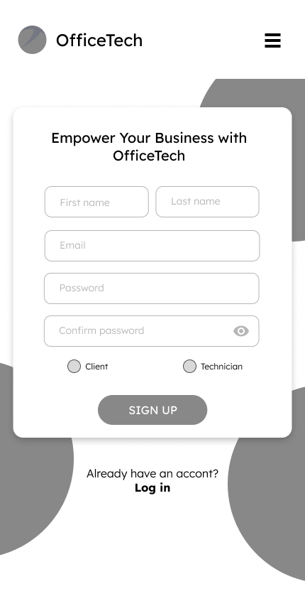
    <div>
      <span><b>Sign Up Screen</b></span>
      <p align="justify">Es la pantalla en wireframe que muestra la vista donde el usuario podrá hacer el registro de cuenta.</p>
    </div>
  </div>

  <div style="width: 200px; text-align: center;">
    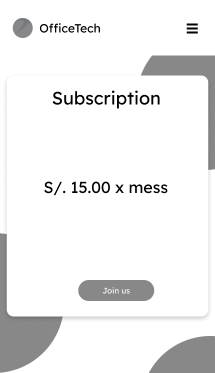
    <div>
      <span><b>Sign Up Screen</b></span>
      <p align="justify">Es la pantalla en wireframe que muestra la vista donde el usuario podrá hacer el registro de cuenta.</p>
    </div>
  </div>

  <div style="width: 200px; text-align: center;">
    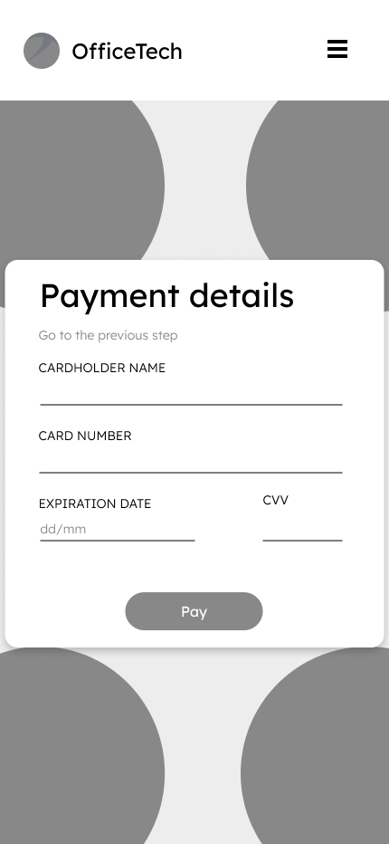
    <div>
      <span><b>Payment Screen</b></span>
      <p align="justify">Es la pantalla en wireframe que muestra la vista el usuario podrá realizar la suscripción de pago.</p>
    </div>
  </div>

  <div style="width: 200px; text-align: center;">
    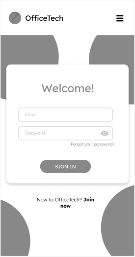
    <div>
      <span><b>Sign In Screen</b></span>
      <p align="justify">Es la pantalla en wireframe que muestra la vista donde el usuario podrá iniciar sesión luego del registro y suscripción realizada.</p>
    </div>
  </div>

  <div style="width: 200px; text-align: center;">
    
    <div>
      <span><b>Tech Services Screen</b></span>
      <p align="justify">Es la pantalla en wireframe que muestra la vista donde el usuario podrá ver el proceso del servicio solicitado.</p>
    </div>
  </div>

  <div style="width: 200px; text-align: center;">
    
    <div>
      <span><b>Forum Screen</b></span>
      <p align="justify">Es la pantalla en wireframe que muestra la vista donde el usuario podrá discutir en un foro experiencias de la aplicación y realizar consultas</p>
    </div>
  </div>

  <div style="width: 200px; text-align: center;">
    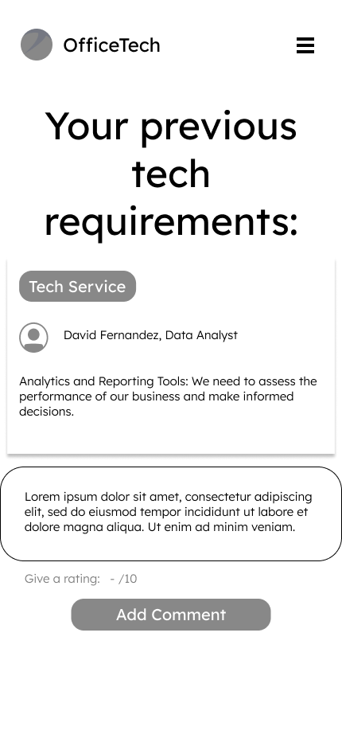
    <div>
      <span><b>PENDING...</b></span>
      <p align="justify">...</p>
    </div>
  </div>

  <div style="width: 200px; text-align: center;">
    
    <div>
      <span><b>Tech Service Request Screen</b></span>
      <p align="justify">Es la pantalla en wireframe que muestra la vista donde el usuario podrá solicitar un nuevo servicio.</p>
    </div>
  </div>

  <div style="width: 200px; text-align: center;">
    
    <div>
      <span><b>Previous Tech Requirements</b></span>
      <p align="justify">Es la pantalla en wireframe que muestra la vista donde el usuario podrá ver el historial de servicios solicitados.</p>
    </div>
  </div>

  <div style="width: 200px; text-align: center;">
    
    <div>
      <span><b>Profile Screen</b></span>
      <p align="justify">Es la pantalla en wireframe que muestra la vista donde el usuario podrá ver sus datos personales.</p>
    </div>
  </div>

  <div style="width: 200px; text-align: center;">
    
    <div>
      <span><b>Edit Profile Screen</b></span>
      <p align="justify">Es la pantalla en wireframe que muestra la vista donde el usuario podrá ver un formulario que le permite el cambio de datos personales.</p>
    </div>
  </div>

</div>


### 4.4.2. Mobile Applications Wireflow Diagrams.

**FLOW - SIGN-IN | SIGNUP** . 
<p align="justify">
Aquí presentamos el wireflow donde el usuario podrá hacer un <b>Inicio de Sesión</b> en caso de contar con una cuenta creada o un <b>Registro</b> en caso no tenga una cuenta creada.
</p>
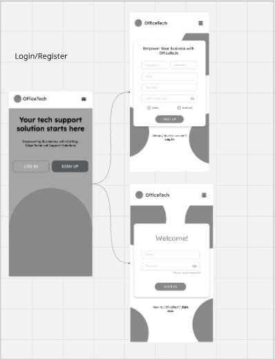  

**FLOW - SUBSCRIPTION**  
<p align="justify">
Aquí presentamos el wireflow donde el usuario podrá realizar su <b>suscripción</b> a la aplicación seleccionando un plan de pago y registrando los datos de pago para el cobro de la suscripción.
</p>
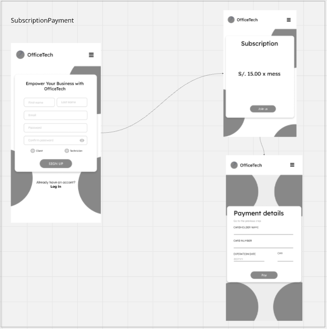

**FLOW - HOME**  
<p align="justify">
Aquí presentamos el wireflow donde el usuario iniciará observando los procesos que tiene la aplicación, empezando a mostrar los servicios actuales, los servicios previos, el foro y solicitud de un nuevo servicio.
</p>
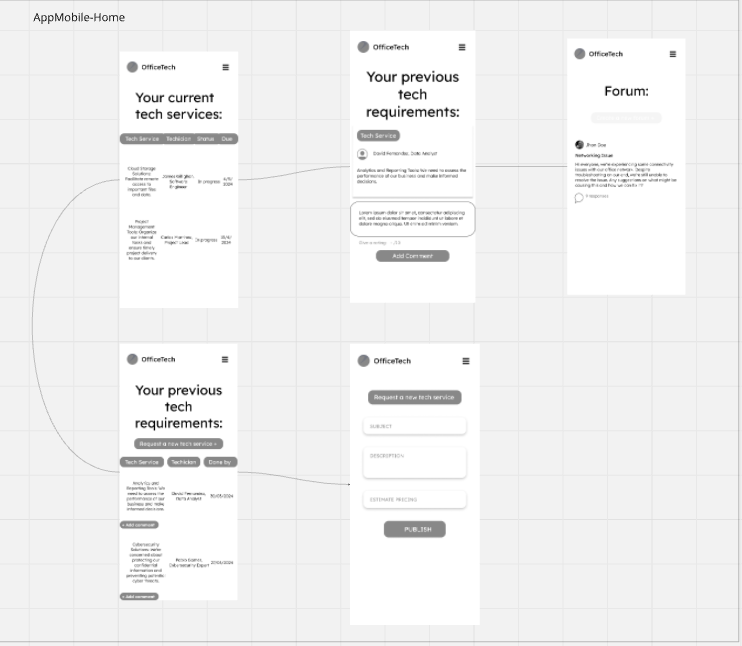

**FLOW - EDIT PROFILE**  
<p align="justify">
Aquí presentamos el wireflow donde el usuario podrá observar los datos de su perfil y al mismo tiempo poder realizar la edición de estos mismos.
</p>
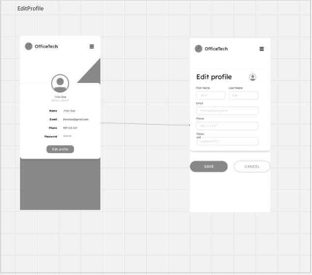

### 4.4.3. Mobile Applications Mock-ups.

<div style="display: flex; flex-wrap: wrap; gap: 20px; justify-content: center;">

  <div style="width: 200px; text-align: center;">
    
    <div>
      <span><b>Home Screen</b></span>
      <p align="justify">Es la pantalla en wireframe que muestra la vista inicial de la aplicación donde se manejará el inicio de sesión o el registro de usuario</p>
    </div>
  </div>

  <div style="width: 200px; text-align: center;">
    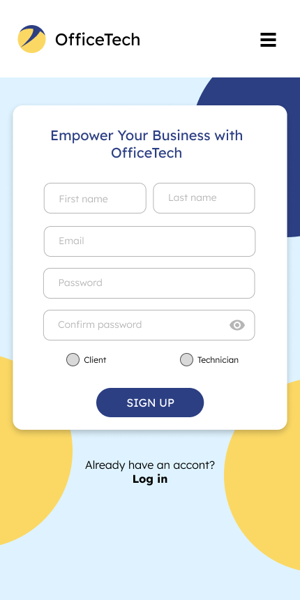
    <div>
      <span><b>Sign Up Screen</b></span>
      <p align="justify">Es la pantalla en wireframe que muestra la vista donde el usuario podrá hacer el registro de cuenta.</p>
    </div>
  </div>

  <div style="width: 200px; text-align: center;">
    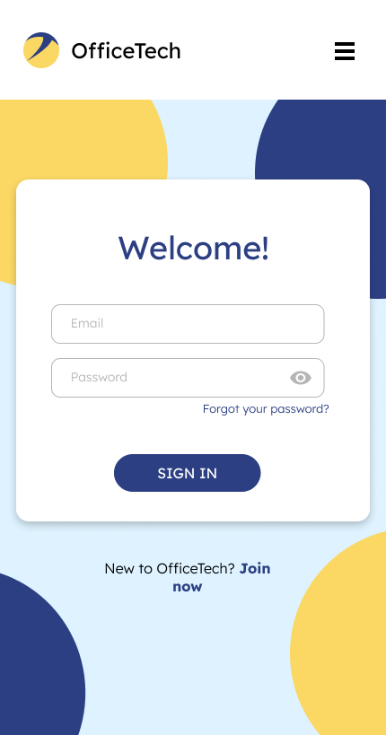
    <div>
      <span><b>Sign In Screen</b></span>
      <p align="justify">Es la pantalla en wireframe que muestra la vista donde el usuario podrá iniciar sesión luego del registro y suscripción realizada.</p>
    </div>
  </div>

  <div style="width: 200px; text-align: center;">
    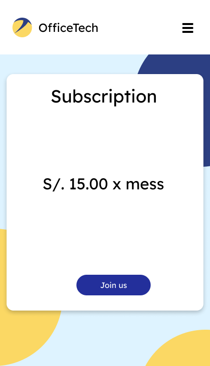
    <div>
      <span><b>Subscriptions Screen</b></span>
      <p align="justify">Es la pantalla en wireframe que muestra la vista el usuario podrá observar los diversos planes.</p>
    </div>
  </div>

  <div style="width: 200px; text-align: center;">
    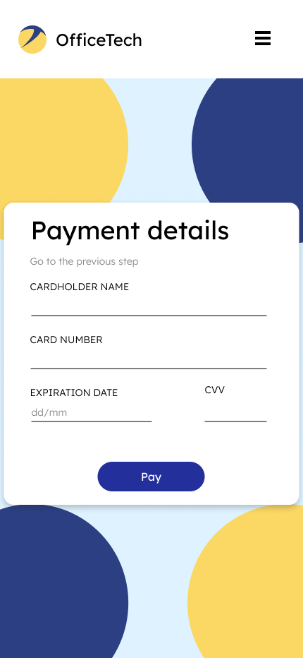
    <div>
      <span><b>Payment Screen</b></span>
      <p align="justify">Es la pantalla en wireframe que muestra la vista el usuario podrá realizar la suscripción de pago.</p>
    </div>
  </div>

  <div style="width: 200px; text-align: center;">
    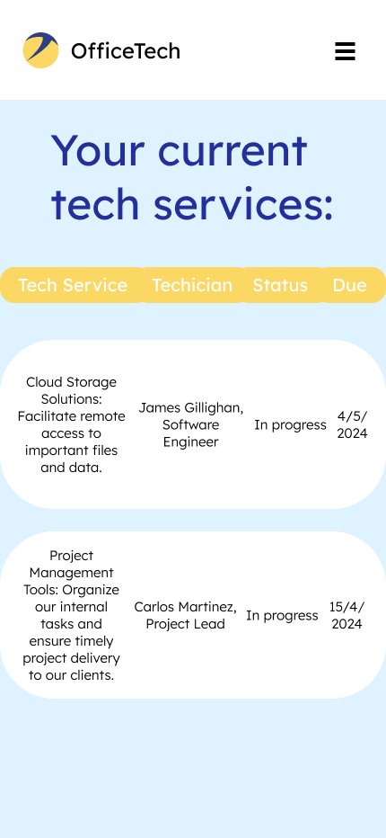
    <div>
      <span><b>Tech Services Screen</b></span>
      <p align="justify">Es la pantalla en wireframe que muestra la vista donde el usuario podrá ver el proceso del servicio solicitado.</p>
    </div>
  </div>

  <div style="width: 200px; text-align: center;">
    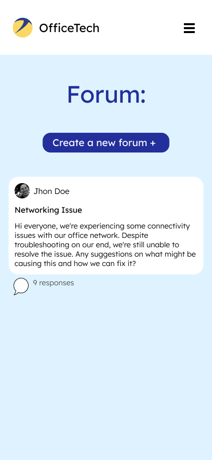
    <div>
      <span><b>Forum Screen</b></span>
      <p align="justify">Es la pantalla en wireframe que muestra la vista donde el usuario podrá discutir en un foro experiencias de la aplicación y realizar consultas</p>
    </div>
  </div>

  <div style="width: 200px; text-align: center;">
    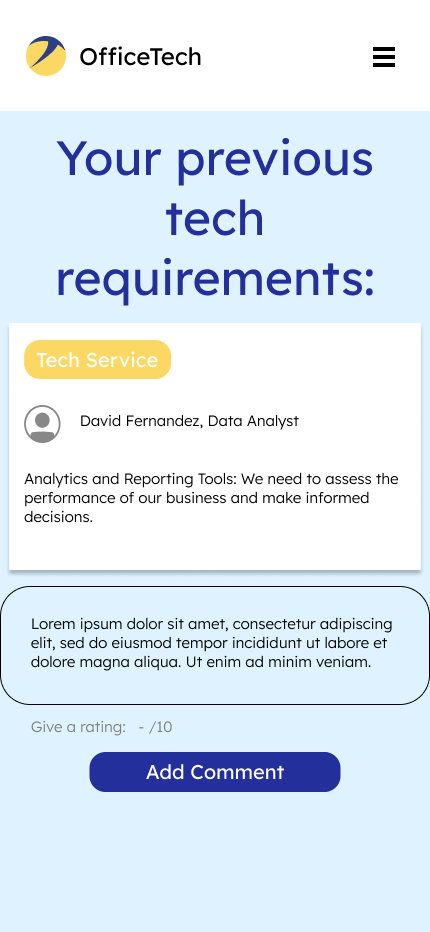
    <div>
      <span><b>PENDING...</b></span>
      <p align="justify">...</p>
    </div>
  </div>

  <div style="width: 200px; text-align: center;">
    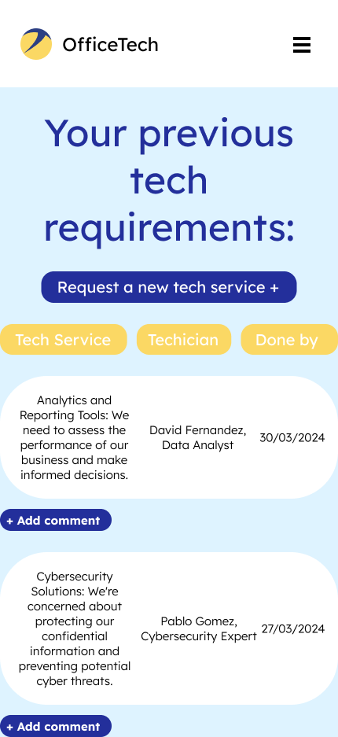
    <div>
      <span><b>Previous Tech Requirements</b></span>
      <p align="justify">Es la pantalla en wireframe que muestra la vista donde el usuario podrá ver el historial de servicios solicitados.</p>
    </div>
  </div>

  <div style="width: 200px; text-align: center;">
    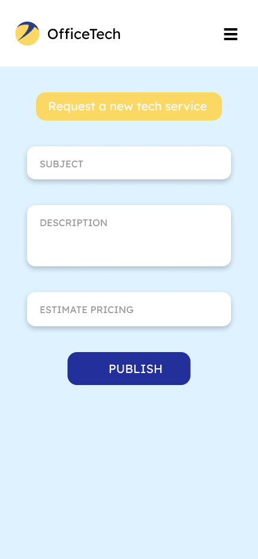
    <div>
      <span><b>Tech Service Request Screen</b></span>
      <p align="justify">Es la pantalla en wireframe que muestra la vista donde el usuario podrá solicitar un nuevo servicio.</p>
    </div>
  </div>

  <div style="width: 200px; text-align: center;">
    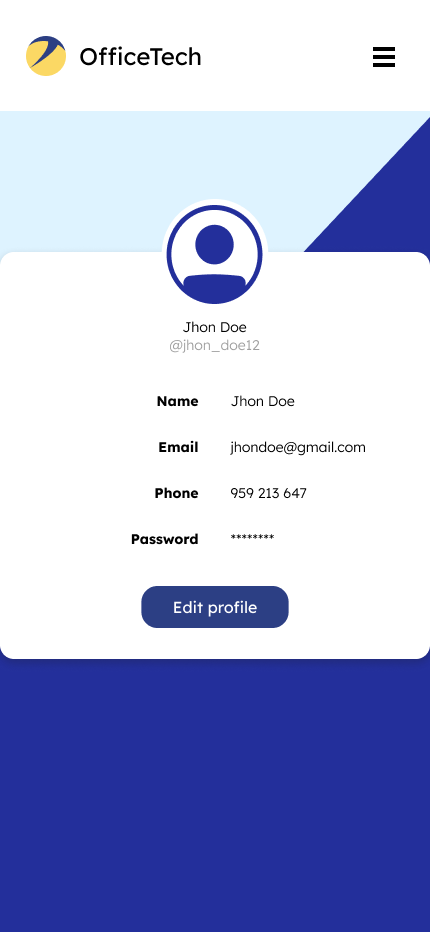
    <div>
      <span><b>Profile Screen</b></span>
      <p align="justify">Es la pantalla en wireframe que muestra la vista donde el usuario podrá ver sus datos personales.</p>
    </div>
  </div>

  <div style="width: 200px; text-align: center;">
    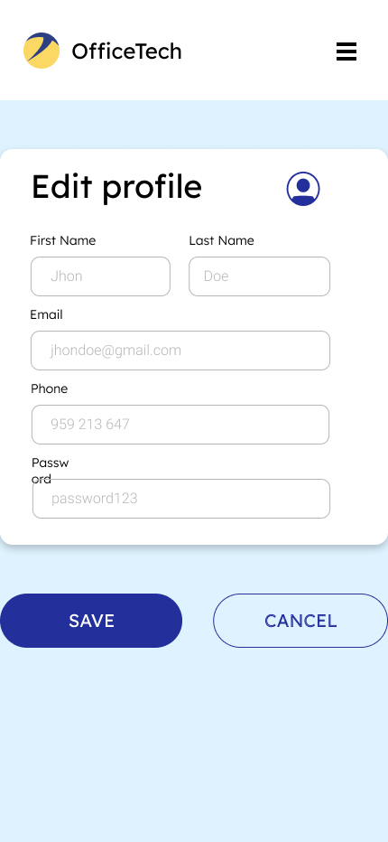
    <div>
      <span><b>Edit Profile Screen</b></span>
      <p align="justify">Es la pantalla en wireframe que muestra la vista donde el usuario podrá ver un formulario que le permite el cambio de datos personales.</p>
    </div>
  </div>

</div>


### 4.4.4. Mobile Applications User Flow Diagrams.

**FLOW - SIGN-IN | SIGNUP**  
<p align="justify">
Aquí presentamos el wireflow donde el usuario podrá hacer un <b>Inicio de Sesión</b> en caso de contar con una cuenta creada o un <b>Registro</b> en caso no tenga una cuenta creada.
</p> 
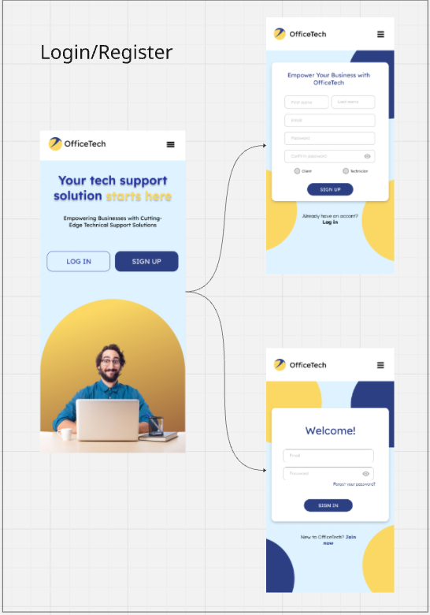

**FLOW - SUBSCRIPTION**  
<p align="justify">
Aquí presentamos el wireflow donde el usuario podrá realizar su <b>suscripción</b> a la aplicación seleccionando un plan de pago y registrando los datos de pago para el cobro de la suscripción.
</p>
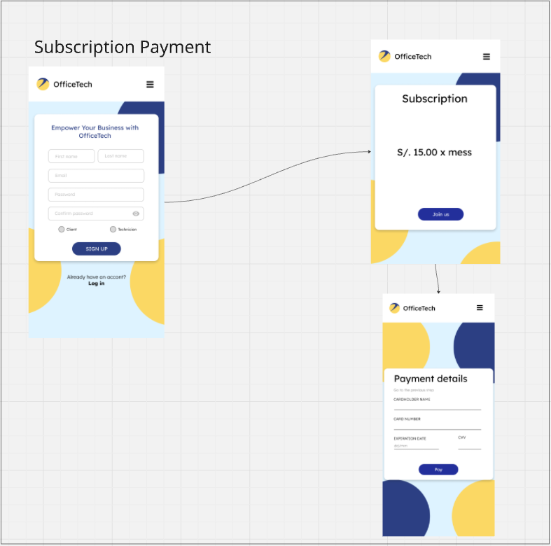  

**FLOW - HOME**  
<p align="justify">
Aquí presentamos el wireflow donde el usuario iniciará observando los procesos que tiene la aplicación, empezando a mostrar los servicios actuales, los servicios previos, el foro y solicitud de un nuevo servicio.
</p>
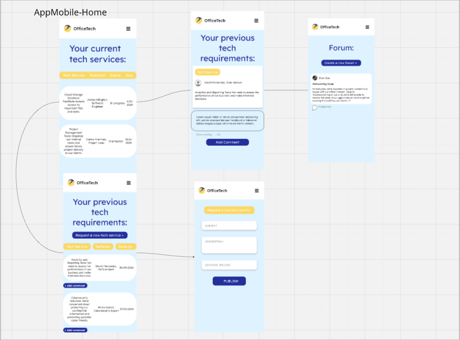

**FLOW - EDIT PROFILE**  
<p align="justify">
Aquí presentamos el wireflow donde el usuario podrá observar los datos de su perfil y al mismo tiempo poder realizar la edición de estos mismos.
</p>
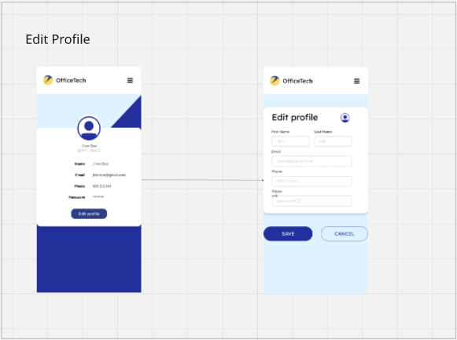


## 4.5. Mobile Applications Prototyping.

### 4.5.1. Android Mobile Applications Prototyping.

<p align="justify">
En la siguiente presentación podremos observar el flujo de nuestra aplicación móvil en prototipo hecho en figma para dispositivo <b>Android</b> el cuál nos dará una visión más clara del cómo va a funcionar y ser la interacción de nuestra aplicación.
</p>

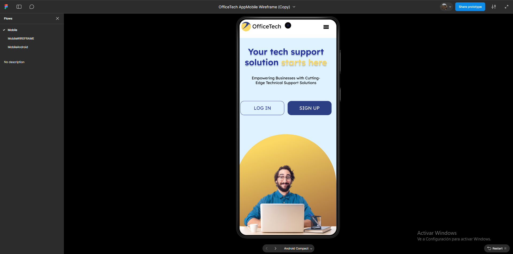

**URL del Prototipo (Hecho en figma):**  
https://www.figma.com/proto/hYRsusAMNKJQbDQH2dBjl4/OfficeTech-AppMobile-Wireframe--Copy-?node-id=271-40&p=f&t=0ZMnqtcsweNspO7O-0&scaling=scale-down&content-scaling=fixed&page-id=0%3A1&starting-point-node-id=271%3A40&show-proto-sidebar=1)
<br>

### 4.5.2. iOS Mobile Applications Prototyping.

<p align="justify">
En la siguiente presentación podremos observar el flujo de nuestra aplicación móvil en prototipo hecho en figma para dispositivo <b>iOS</b> el cuál nos dará una visión más clara del cómo va a funcionar y ser la interacción de nuestra aplicación.
</p>

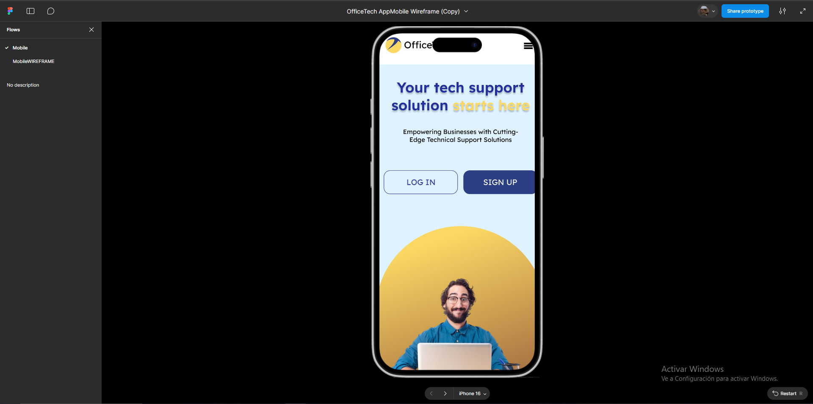

**URL del Prototipo (Hecho en figma):**  
https://www.figma.com/proto/hYRsusAMNKJQbDQH2dBjl4/OfficeTech-AppMobile-Wireframe--Copy-?node-id=271-40&p=f&t=0ZMnqtcsweNspO7O-0&scaling=scale-down&content-scaling=fixed&page-id=0%3A1&starting-point-node-id=271%3A40&show-proto-sidebar=1)

## 4.6. Web Applications UX/UI Design.
### 4.6.1. Web Applications Wireframes.


### 4.6.2. Web Applications Wireflow Diagrams.

Para esta sección describiremos los procesos en los cuales los usuarios van a poder cumplir sus user goals que impusimos en el lean ux process y en el impact mapping previamente. A continuación veremos los wireflow diagrams separados por segmento


**__Tecnico__**


- **User goal**: Como técnico deseo acceder al foro para poder resolver dudas a compañías


- **User goal**: Como tecnico deseo acceder y editar mi perfil


- **User goal**: Como técnico deseo acceder al historial de servicios realizados


 **__Empresa__**


- **User goal**: Como empresa quiero crear un foro 
  

- **User goal**: Como empresa quiero poder editar mi perfil
  
- **User goal**: Como empresa quiero solicitar servicios a tecnicos
  
### 4.6.3. Web Applications Mock-ups.
En la siguiente pantalla se muestra la página de inicio de la aplicación, donde el usuario puede escoger entre iniciar sesión o registrarse. El diseño presenta un encabezado con el logotipo de la aplicación y un menú de navegación con enlaces a secciones como “Home”, “About” y “Sign up”. En el centro de la pantalla se destaca un mensaje principal que resume el propósito del servicio, acompañado de dos botones bien visibles para registrarse o iniciar sesión. A la derecha se incluye una imagen ilustrativa.

En la siguiente pantalla se muestra la interfaz de inicio de sesión de la aplicación.En el centro se encuentra el formulario de acceso. El usuario puede ingresar su correo electrónico o número de teléfono, junto con su contraseña, y tiene la opción de iniciar sesión mediante cuentas de Google, LinkedIn o Facebook. Debajo del formulario,

En la siguiente pantalla se muestra la interfaz de creacion de una nueva cuenta, Donde se ven dos cards una formualrio de registro y el otro con un texto que muestra el precio de la suscripcion a la aplicacion web. 

En la siguiente pantalla se muestra la interfaz del pago de la suscripcion.Donde se ve una card centrada donde hay un formulario de pago,ademas de un boton que indica la accion a realizar al finalizar el llenado del formulario.

En la siguiente pantalla se muestra la interfaz de home, esta pantalla se muestra despues de iniciar su sesion en la aplicacion, donde mostramos  los ultimos proyectos en un listado.

En la siguiente pantalla se muestra la interfaz de Forum, donde se muestra diversoso temas a tratar en cards dando la opcion de responder esos mensajes.


En la siguiente pantalla se muestra la interfaz de Servicios, donde se muestra la opcion de hacer una peticion de un servicio con un formulario para la peticion y un boton que envia la informacion.


En la siguiente pantalla se muestra la interfaz del perfil, donde se muestra una card con la informacion del perfil y un boton que permite la opcion de editar la informacion.


En la siguiente pantalla se muestra la interfaz del perfil para editar la informacion del perfil del usuario, donde se muestra una card con los diferentes campos para editar la informacion.


En la siguiente pantalla se muestra la interfaz del home  para el otro segmento objetivo del Tecnicos que muestra el proyectos recientes de este mismo.


En la siguiente pantalla se muestra la vista del tecnico respecto a los foros, donde el tecnico podra responder consultas del foro.Siendo parecido a la vista del usuario.


En la siguiente pantalla se muestra la vista de las soluciones tecnologicas previas, donde tambien se muestra en vista de tabla.

En la siguiente pantalla se muestra la interfaz del perfil del tecnico para mostrar la informacion del perfil del usuario, donde se muestra una card con los diferentes campos .Ademas de mostrar las habilidades del tecnico

En la siguiente pantalla se muestra la interfaz del perfil del tecnico para editar la informacion del perfil del usuario, donde se muestra una card con los diferentes campos para editar la informacion.Ademas de editar las habilidades del tecnico


### 4.6.4. Web Applications User Flow Diagrams.


**URL de los diagramas (Hecho en Miro):**  
https://miro.com/app/board/uXjVKVhxM9w=/?share_link_id=794525784498

## 4.7. Web Applications Prototyping.

**Prototipo de Web Application**

Captura de pantalla del video de presentacion de nuestro prototipo desarrollado en figma y subido a stream para la visualizacion de su facil acceso.


**Url del video de presentacion del prototipo:** [link](https://upcedupe-my.sharepoint.com/:v:/g/personal/u20211f984_upc_edu_pe/ET3mKIBEcHJBvHFTmC0Db20BjYimZN4CFCCAb1supmTg9Q?e=mn3PaP)

**URL del Prototipo (Hecho en figma):**  [link](https://www.figma.com/proto/rtpz07xuso8nFqoG3itzcN/OfficeTech-AppWeb-Wireframe?type=design&node-id=16-436&t=NbzmHQa3hOCXZL3k-1&scaling=min-zoom&page-id=0%3A1&starting-point-node-id=16%3A436&mode=design)


## 4.8. Domain-Driven Software Architecture.

### 4.8.1. Software Architecture Context Diagram.
1. System Context Diagram: Diagrama que muestra la relacion del aplicativo con los usuarios
se incluyen servicios externos (si hay pocos bounded context se incluyen ahi)


### 4.8.2. Software Architecture Container Diagrams.
1. Bounded Context Deployable / Container Diagrams. Sirve para entender como funciona y el proceso, Se especifican DB's, indexers, Search engine, las Apis que usen los bounded context y se conectan por flechas, las cuales tienen como objetivo explicar la direcion y relacion junto a que se esta enviando/comunicando (TCP) 


### 4.8.3. Software Architecture Components Diagrams.
1. Component diagrams: Estos van a mostrar las ordenes, procesos, mensajes y componentes utilizados en el uso del aplicativo, claro se deben hacer diferentes de estos para cada bounded o USER GOALS


## 4.9. Software Object-Oriented Design.

### 4.9.1. Class Diagrams.
Debido a que estamos utilizando domain driven design necesitamos separar por bounded context la información que se transfiere a las clases, por ello en el diagrama de clases incluimos un AntiCorruption Layer, para que utilizando el patrón facade podamos enviar información sin vulnerar la seguridad. Además incluimos clases Enum para almacenar estados fijos en el sistema.


### 4.9.2. Class Dictionary.

## User
**Descripción**: Representa a un usuario del sistema (cliente o técnico).

- **Atributos**:
  - `userId: int` — Identificador único.
  - `userName: String` — Nombre de usuario.

- **Métodos**:
  - `getUserName(): String`
  - `setUserName(name: String): void`

---

## BusinessCustomer
**Descripción**: Representa a un cliente empresarial.

- **Atributos**:
  - `businessCustomerId: int` -> Identificador unico
  - `name: String` 
  - `email: String`

- **Métodos**:
  - `getName(): String`
  - `setName(name: String): void`
  - `getEmail(): String`
  - `setEmail(email: String): void`

---

## Technical
**Descripción**: Técnico que ofrece servicios de consultas en linea.

- **Atributos**:
  - `technicalId: int`
  - `name: String`
  - `lastName: String`
  - `description: String`
  - `experience: int`
  - `specialization: String`
  - `age: int`
  - `address: String`
  - `email: String`

- **Métodos**:
  - `getFirstName(): String`
  - `setFirstName(name: String): void`
  - `getLastName(): String`
  - `setLastName(lastName: String): void`
  - `getDescription(): String`
  - `setDescription(description: String): void`
  - `getExperience(): int`
  - `setExperience(exp: int): void`
  - `getSpecialization(): String`
  - `setSpecialization(spec: String): void`
  - `getAge(): int`
  - `setAge(age: int): void`
  - `getAddress(): String`
  - `setAddress(addr: String): void`
  - `getEmail(): String`
  - `setEmail(email: String): void`

---

## Request
**Descripción**: Solicitud de servicio hecha por un cliente.

- **Atributos**:
  - `requestId: int`
  - `description: String`
  - `productBrand: String`
  - `resume: String`
  - `day: Date`

- **Métodos**:
  - `getDescription(): String`
  - `setDescription(description: String): void`
  - `getProductBrand(): String`
  - `setProductBrand(brand: String): void`
  - `getResume(): String`
  - `setResume(resume: String): void`
  - `getDay(): Date`
  - `setDay(date: Date): void`

---

## Status
**Descripción**: Estado de una solicitud o proceso.

- **Atributos**:
  - `statusId: int`
  - `statusLabel: String`

- **Métodos**:
  - `getStatus(): String`
  - `setStatus(label: String): void`

---

## Subscription
**Descripción**: Suscripción adquirida por un cliente.

- **Atributos**:
  - `subscriptionId: int`
  - `benefits: String`
  - `price: float`

- **Métodos**:
  - `getBenefits(): String`
  - `setBenefits(benefits: String): void`
  - `getPrice(): float`
  - `setPrice(price: float): void`

---

## SubscriptionType
**Descripción**: Tipos de suscripción posibles.

- **Atributos**:
  - `subscriptionTypeId: int`
  - `subscriptionType: String`

- **Métodos**:
  - `getSubscriptionType(): String`
  - `setSubscriptionType(type: String): void`

---

## Payment
**Descripción**: Registro de un pago realizado.

- **Atributos**:
  - `paymentId: int`
  - `price: float`
  - `paymentMethod: String`

- **Métodos**:
  - `payToCustomerWithId(id: int): void`
  - `getPrice(): float`
  - `setPrice(price: float): void`
  - `getPaymentMethod(): String`
  - `setPaymentMethod(method: String): void`
  - `setDiscount(discount: float): void`

---

## PaymentType
**Descripción**: Tipos de métodos de pago.

- **Atributos**:
  - `paymentTypeId: int`
  - `paymentType: String`

- **Métodos**:
  - `getPaymentType(): String`
  - `setPaymentType(type: String): void`

---

## Contract
**Descripción**: Contrato entre cliente y técnico.

- **Atributos**:
  - `contractId: int`
  - `serviceType: String`

- **Métodos**:
  - `getServiceType(): String`
  - `setServiceType(type: String): void`
  - `generateContract(): String`

---

## Notification
**Descripción**: Notificaciones enviadas a los usuarios.

- **Atributos**:
  - `notificationId: int`
  - `message: String`
  - `title: String`
  - `notificationTypeId: int`

- **Métodos**:
  - `getMessage(): String`
  - `setMessage(message: String): void`
  - `getTitle(): String`
  - `setTitle(title: String): void`
  - `sendStatus(): void`

---

## NotificationType
**Descripción**: Categorías de notificaciones.

- **Atributos**:
  - `notificationTypeId: int`
  - `type: String`

- **Métodos**:
  - `getNotificationType(): String`
  - `setNotificationType(type: String): void`

---

## Portfolio
**Descripción**: Portafolio con proyectos previos del técnico.

- **Atributos**:
  - `portfolioId: int`
  - `description: String`
  - `images: String`

- **Métodos**:
  - `getDescription(): String`
  - `setDescription(description: String): void`
  - `getImages(): String`
  - `setImages(images: String): void`

---

## Review
**Descripción**: Opinión escrita por un cliente sobre un servicio.

- **Atributos**:
  - `description: String`
  - `contractId: int`
  - `customerId: int`
  - `title: String`

- **Métodos**:
  - `generateChain(): String`
  - `getDescription(): String`
  - `setDescription(description: String): void`
  - `getTitle(): String`
  - `setTitle(title: String): void`

---

## Valoration
**Descripción**: Valoración en estrellas para una reseña.

- **Atributos**:
  - `starPoints: int`
  - `reviewId: int`

- **Métodos**:
  - `getStarPoints(): int`
  - `setStarPoints(points: int): void`
  - `mergeValorationWithReview(): void`

## 4.10. Database Design.

### 4.10.1. Relational/Non-Relational Database Diagram.
<p align="justify">
El diagrama representa el modelo entidad-relación de una plataforma que conecta usuarios con técnicos a través de solicitudes de servicio, suscripciones y contratos. Los usuarios pueden recibir notificaciones y estar vinculados a técnicos o negocios, los cuales pueden hacer solicitudes de servicios (request) que se relacionan con un estado y se detallan en request_details junto con los contratos. Los contratos pueden tener reseñas (reviews) y estas a su vez pueden recibir calificaciones (ratings). Además, los negocios pueden tener una suscripción, que está asociada a un tipo (subscription_types) y puede tener un pago (payments) realizado mediante un tipo de pago (payment_types). Los técnicos pueden tener portafolios que describen su trabajo, mientras que todo el sistema está estructurado para permitir la gestión de servicios técnicos, control de suscripciones y evaluación de calidad mediante reseñas y puntuaciones.
</p>

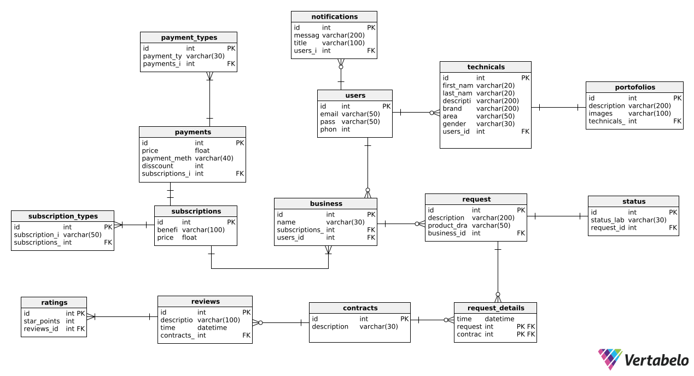

# Capítulo V: Product Implementation, Validation & Deployment

## 5.1. Software Configuration Management.
### 5.1.1. Software Development Environment Configuration.
#### Project Management
- Trello [https://trello.com](https://trello.com):
 Trello es una aplicación web de gestión de proyectos compatible con la mayoria de navegadores. Se utilizó Trello para la organización y registro de las tareas por hacer, las que están en proceso y las realizadas. De esta forma podemos tener control acerca del avance del proyecto y las actividades de cada uno de los miembros del equipo.

#### Product UX/UI Design
- Miro [https://miro.com](https://miro.com):
 Miro ha sido empleado en el desarrollo de los escenarios mapping y escenario mapping para ambos segmentos objetivos.

- Figma [https://figma.com](https://figma.com):
 Esta herramienta fue de vital importancia para la creación de los wireframes, mockups y mobile applications prototyping de manera colaborativa. Asimismo, su acceso es gratuito al contar con una cuenta registrada.

#### Software Developement
- Landing Page:
El desarrollo del landing page se llevó a cabo con las tecnologías básicas para esta misma: HTML5, CSS3 y JavaScript.
- Frontend Web Application:
La aplicación web implica tener claro los conceptos básicos de HTML5, CSS3 y JavaScript, ya que se utilizó Angular como framework de JavaScript.
- Aplicación Móvil Android:
Para la versión móvil, se desarrolló una aplicación nativa utilizando Kotlin en Android Studio. Esta solución permite aprovechar al máximo las capacidades del sistema operativo Android, ofreciendo una experiencia fluida, moderna y totalmente adaptada a dispositivos móviles.

#### IDE's de desarrollo
- IntelliJ IDEA [https://www.jetbrains.com/idea/](https://www.jetbrains.com/idea/):
IntelliJ IDEA es un entorno de desarrollo integrado (IDE) creado por JetBrains. Este entorno de desarrollo nos proporcionará distintas herramientas para agilizar el proceso de desarrollo

#### Software Testing
- Para las pruebas de testeo software, tanto de la landing page como de la aplicación web, se emplearon las herramientas de desarrollador de los principales navegadores web como Google Chrome [https://www.google.com/chrome/](https://www.google.com/chrome/), Microsoft Edge [https://www.microsoft.com/en-us/edge](https://www.microsoft.com/en-us/edge) y Mozilla Firefox [https://www.mozilla.org/en-US/firefox/browsers/](https://www.mozilla.org/en-US/firefox/browsers/). Estos navegadores cuentan con aplicaciones desktop y móviles las cuáles son totalmente gratuitas. En el caso de desktop podemos instalarlos desde sus sitios oficiales, en el caso de móvil, desde la tienda de aplicaciones del sistema operativo en cuestión.
En cuanto a la aplicación móvil para Android, las pruebas se llevaron a cabo utilizando el emulador de Android Studio y dispositivos físicos, lo que permitió verificar su comportamiento en diferentes versiones del sistema operativo y tamaños de pantalla. Además, se emplearon herramientas como Logcat y Android Profiler para el análisis de rendimiento, así como pruebas funcionales manuales para asegurar una experiencia de usuario fluida y sin errores.

#### Software Deployment
- **Vercel** [https://vercel.com](https://vercel.com):
es una plataforma en la nube que ofrece herramientas integrales para el desarrollo, implementación y alojamiento de aplicaciones web, permitiendo a los desarrolladores crear y lanzar sitios estáticos o dinámicos de manera eficiente y escalable.

#### Software Documentation
- Markdown [https://docs.github.com/es/get-started/writing-on-github/getting-started-with-writing-and-formatting-on-github/basic-writing-and-formatting-syntax](https://docs.github.com/es/get-started/writing-on-github/getting-started-with-writing-and-formatting-on-github/basic-writing-and-formatting-syntax):
Markdown es un lenguaje de marcado ligero que nos permite formatear texto de manera sencilla utilizando un formato de texto plano. De esta forma documentamos la información importante acerca del contexto, organización, producción y creacíon del proyecto.
- Structurizr [https://structurizr.com/](https://structurizr.com/):
Esta herramienta permite crear los diagramas C4 de manera rápida con una sintaxis similar a un lenguaje de programación. Para utilizar esta aplicación web hace falta tener una cuenta registrada.

- Vertabelo: [https://www.vertabelo.com/](https://www.vertabelo.com/)
Es una aplicación web colaborativa que facilita el diseño e implementación de bases de datos en una amplia variedad de motores. 

### 5.1.2. Source Code Management.
El manejo y organización del trabajo se llevaron a cabo mediante una organización en Github

Asimismo, para llevar a cabo un mejor control de cómo crear ramas y realizar cambios en el código fuente, se procedió a utilizar GitFlow.

De este modo, se tenían 2 ramas principales: main y development.
- Main: En esta rama almacenaremos las versiones oficiales de nuestro repositorio que ya deben pasar a producción.
- Development: Esta rama se utilizará como rama de integración para las “feature” branches. Una vez alcance un estado estable y el equipo lo considere listo para ser lanzado, se unirá a la rama main.
- Feature: En estas ramas estarán las funcionalidades necesarias para la aplicación. Estas ramas se crean a partir de la rama develop y se fusionan con la misma rama develop. Para la designación de los nombres en la rama feature se utilizará lo siguiente: palabra “feature” seguido de “/” y la funcionalidad designada.
- Hotfix: Esta rama se utilizará para solucionar cualquier problema que se pueda presentar en la rama Main, después solucionar el problema se realizará un merge con la rama main y developer, después de su uso se eliminará la rama.
- Release: En esta rama se realizan las diferentes pruebas para validar todas las funcionalidades desarrolladas. Una vez validado todo, esta rama pasará a la Main.

Metodología de trabajo Git Flow: 

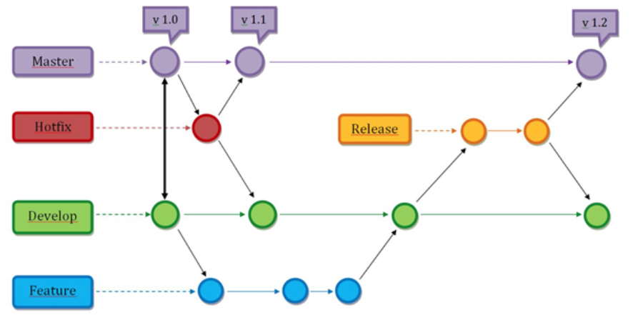

#### Commit Conventions:
El formato de nuestros commits sigue la estructura de los “Conventional Commits” en su versión 1.0.0 (https://www.conventionalcommits.org/en/v1.0.0/) con el objetivo de proporcionar una lectura sencilla de los mismos. Por ello seguimos el siguiente formato:
"< type>[optional scope]: < description>"
Donde:
- type: Especifica el tipo de cambio realizado, únicamente puede ser feat, fix, update, etc.
- scope: Es el alcance que tiene nuestro commit.
- description: Es un breve resumen de los cambios de código.

### 5.1.3. Source Code Style Guide & Conventions.
Para el desarrollo de futuros sprints se utilizarán las siguientes convenciones en el código:

**Idioma:** 
-	La documentación del código y la elaboración del informe serán realizados en español.
-	Para los archivos y variables en HTML, CSS, JavaScript, TypeScript y Java, se seguirá una nomenclatura en inglés. Esto incluye nombres de archivos, nombres de clases, funciones, variables, constantes, etc.

**Clases y funciones:**
-	Los nombres de las clases y funciones se escribirán en inglés y seguirán convenciones de camelCase o snake_case, según sea apropiado para el lenguaje en cuestión.

**Comentarios y documentación del código:**
-	Se fomentará el uso de comentarios claros y concisos en español para explicar el propósito y funcionamiento de partes importantes del código. Esto facilitará la comprensión del código para otros desarrolladores del equipo.

### 5.1.4. Software Deployment Configuration.

Realizamos el deploy de la página a través de GitHub Pages, una plataforma que permite alojar sitios web de forma gratuita siempre que sean estáticos. El proceso que seguimos fue el siguiente:
1.	Desde el repositorio de la landing, nos dirigimos a la pestaña 'Settings' y posteriormente a la sección de 'Pages'. Aquí seleccionamos la rama del repositorio que contiene el código fuente de nuestra página web.
2.	Guardamos los cambios para que GitHub Pages inicie el proceso de construcción y deploy de la página.
3.	Una vez completado el proceso, GitHub Pages nos proporciona una URL donde se alojará nuestra página.

## 5.2. Product Implementation & Deployment.
### 5.2.1. Sprint Backlogs.
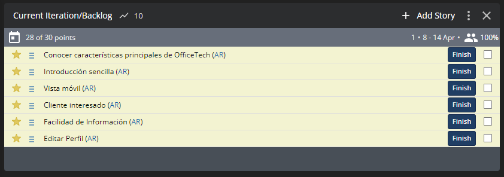

### 5.2.2. Implemented Landing Page Evidence
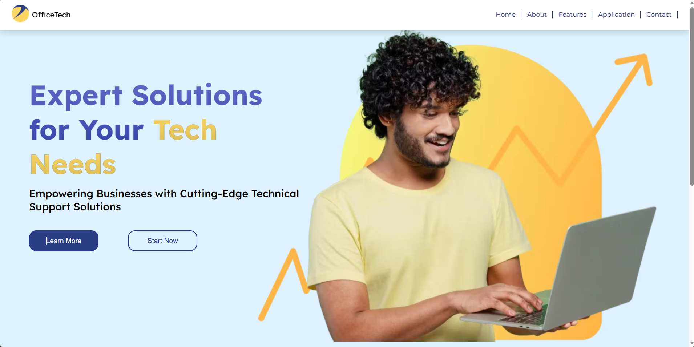
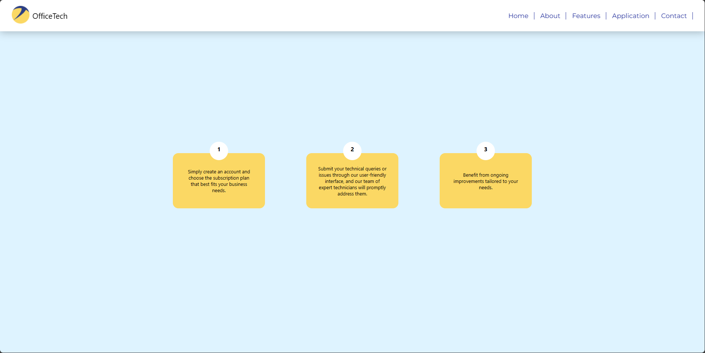
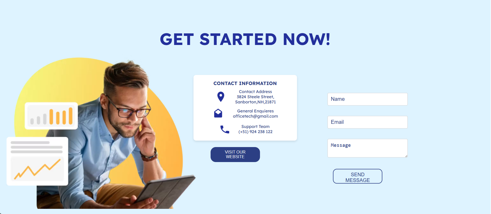

[https://officetech-landing-page.vercel.app/](https://officetech-landing-page.vercel.app/)

Para el sprint presentado de la landing page se optó por varias herramientas para su desarrollo y despliegue en la web de manera pública.
- *Git*: Se utilizó para el control de versiones del código fuente.
- *GitFlow*: Se utilizó para ver el avance de los integrantes del equipo.
- *GitHub*: Se utilizó para crear el repositorio de la landing page, donde se subió el código fuente.
- *Vercel*: Se utilizó esta herramienta ya que nos ofrece un despliegue sin costo de manera rápida y fácil, además que se puede vincular directamente con el repositorio de GitHub.

Evidencias de despliegue en Vercel App

Importamos el repository de GitHub alojado en la organización


Configuramos la ruta donde se encuentra el archivo de despliegue, la rama principal y el comando de construcción.


Después de configurar, se desplegó la landing page de manera exitosa.
[officetech-landing-page.vercel.app](https://officetech-landing-page.vercel.app/)

### 5.2.3. Implemented Frontend-Web Application Evidence
### Despliegue del proyecto Front-End
Para el se ha presentado el Front-end y se optó por varias herramientas para su desarrollo:

- *Git*: Se utilizó para el control de versiones del código fuente.
- *GitFlow*: Se utilizó para ver el avance de los integrantes del equipo.
- *GitHub*: Se utilizó para crear el repositorio del back-end, donde se subió el código fuente.
- *Angular*: Se utilizó para crear todo la Appweb.
<div style="display:flex;justify-content:center,align-items: center; width:100%">
  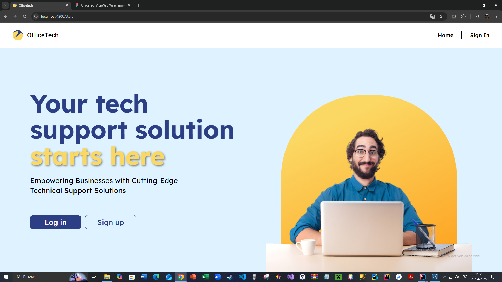
</div>
<div style="display:flex;justify-content:center,align-items: center; width:100%">
  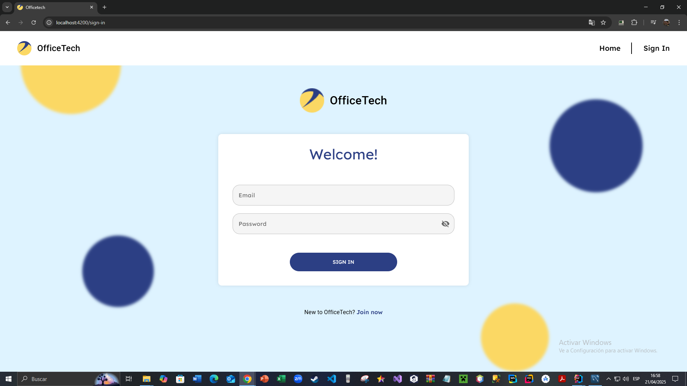
</div>
<div style="display:flex;justify-content:center,align-items: center; width:100%">
  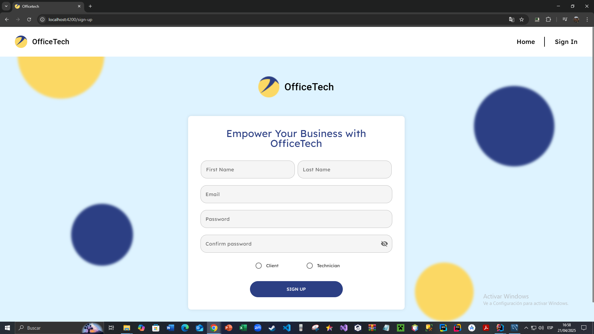
</div>
<div style="display:flex;justify-content:center,align-items: center; width:100%">
  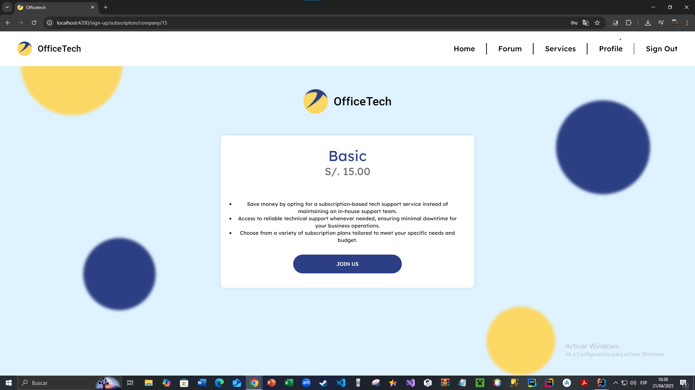
</div>
<div style="display:flex;justify-content:center,align-items: center; width:100%">
  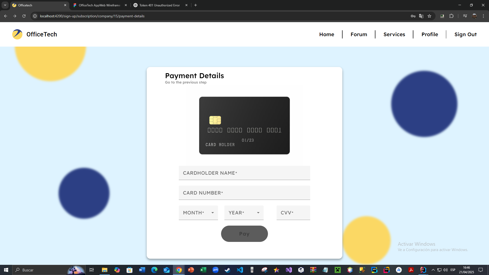
</div>
<div style="display:flex;justify-content:center,align-items: center; width:100%">
  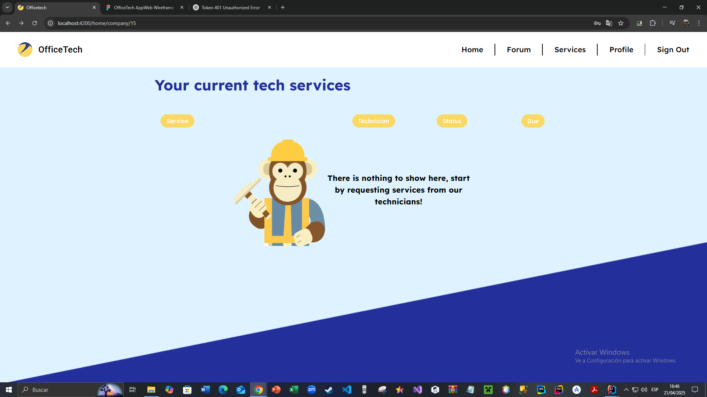
</div>
<div style="display:flex;justify-content:center,align-items: center; width:100%">
  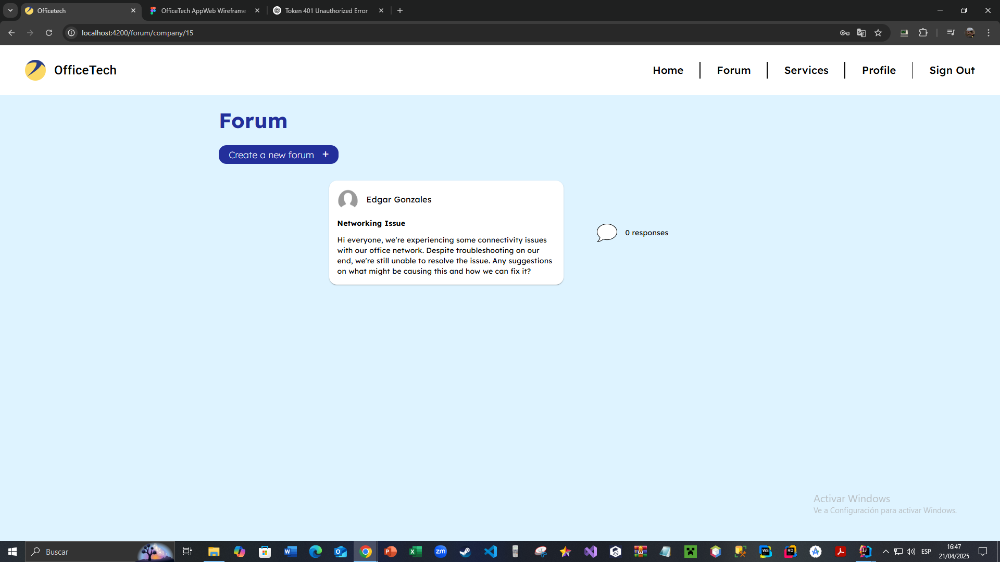
</div>
<div style="display:flex;justify-content:center,align-items: center; width:100%">
  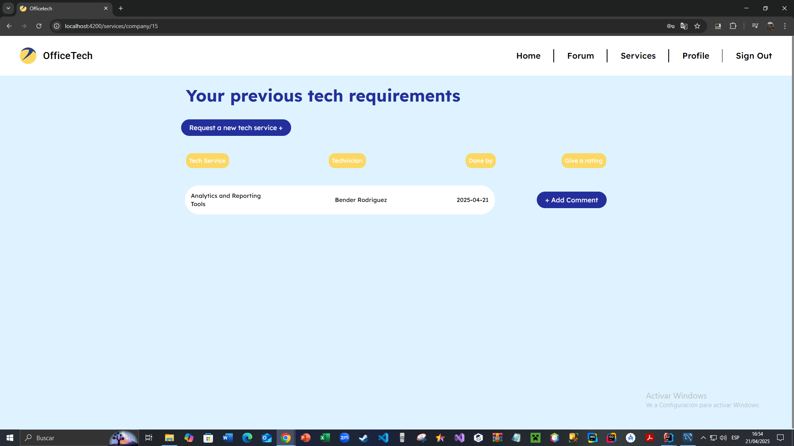
</div>
<div style="display:flex;justify-content:center,align-items: center; width:100%">
  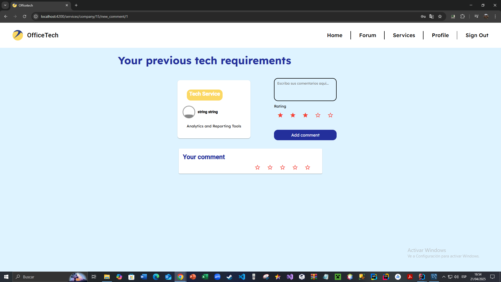
</div>
<div style="display:flex;justify-content:center,align-items: center; width:100%">
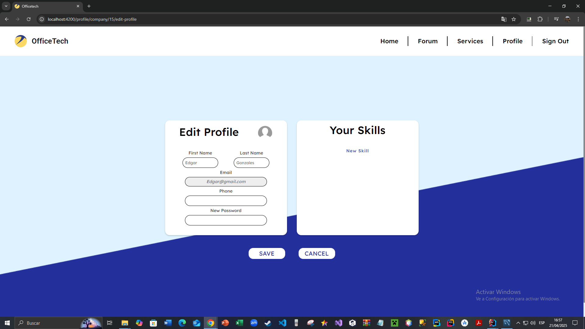
</div>

### 5.2.4. Acuerdo de Servicio - SaaA
Para la creación del Acuerdo de Servicio y los Términos y Condiciones de uso de la pagian web y movil, se optó por utilizar la plataforma en línea FreePrivacyPolicy. Esta herramienta facilita la generación de documentos legales personalizados para aplicaciones SaaS, garantizando que se cubran aspectos clave como el uso de datos personales, las responsabilidades del proveedor y los derechos del usuario.
El documento resultante fue adaptado a las características específicas de la aplicación, incluyendo el tratamiento de datos, las condiciones de uso del servicio, las limitaciones de responsabilidad y otros elementos legales esenciales. 

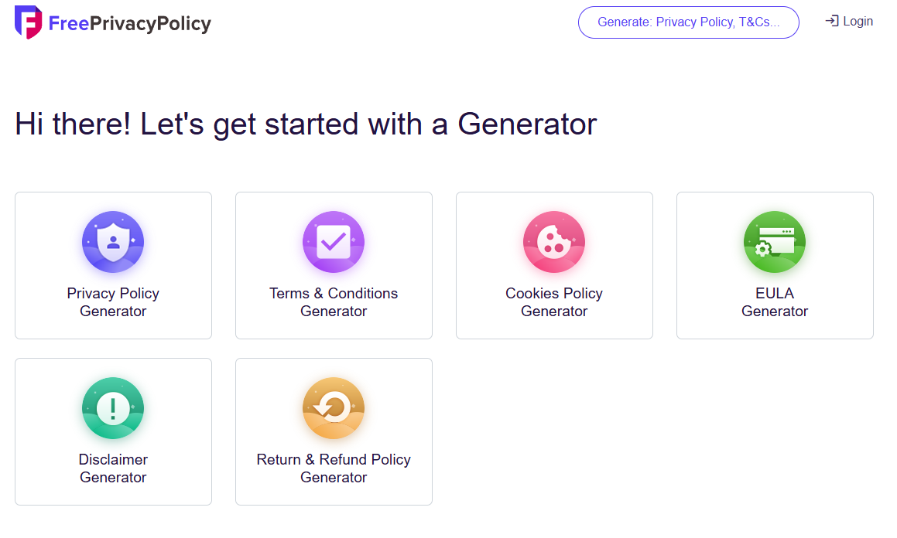

[https://www.freeprivacypolicy.com/live/5b4b095a-9577-43bc-897d-3d912140e82c](https://www.freeprivacypolicy.com/live/5b4b095a-9577-43bc-897d-3d912140e82c)

### 5.2.5. Implemented Native-Mobile Application Evidence
Para la app movil se ha presentado y se optó por varias herramientas para su desarrollo:

- *Git*: Se utilizó para el control de versiones del código fuente.
- *GitFlow*: Se utilizó para ver el avance de los integrantes del equipo.
- *GitHub*: Se utilizó para crear el repositorio del back-end, donde se subió el código fuente.
- *Android Studios*: Se utilizó para crear todo la appmovil.

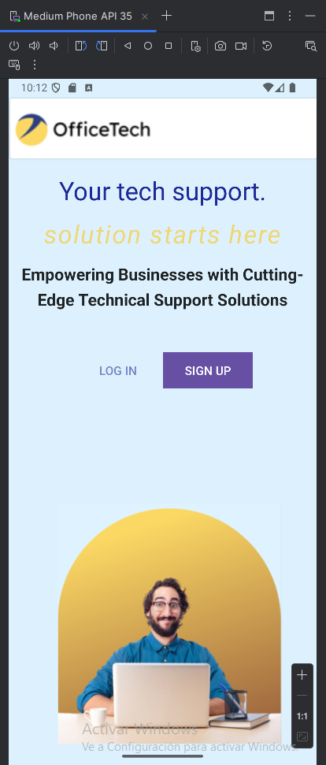
<br>
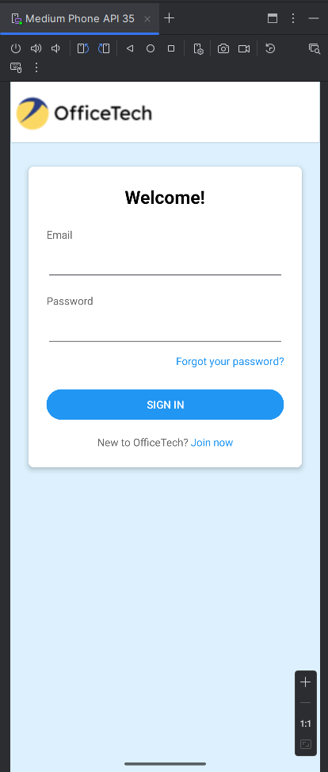
<br>
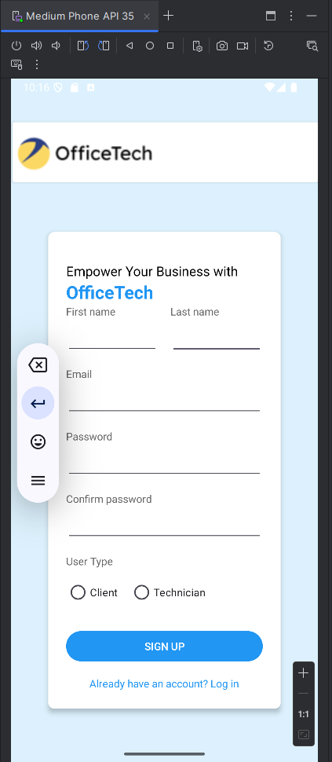
<br>
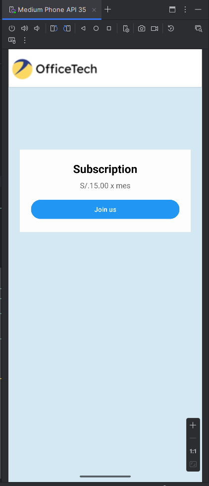
<br>

<br>

<br>

<br>

<br>

<br>

    
### 5.2.6. Implemented RESTful API and/or Serverless Backend Evidence
Para el se ha presentado el back-end y se optó por varias herramientas para su desarrollo:

- *Git*: Se utilizó para el control de versiones del código fuente.
- *GitFlow*: Se utilizó para ver el avance de los integrantes del equipo.
- *GitHub*: Se utilizó para crear el repositorio del back-end, donde se subió el código fuente.
- *Swagger*: Se utilizó para documentar la API RESTful.
- *MySQL*: Se utilizó para la base de datos.
<div style="display:flex;justify-content:center,align-items: center; width:100%">

</div>

<div style="display:flex;justify-content:center,align-items: center; width:100%">

</div>

### 5.2.7. RESTful API documentation
## Base URL

- [Versión Local (Swagger)](http://localhost:8080/swagger-ui/index.html#/)

---

### Authentication Endpoints

## Registro de Usuario
**POST** `/api/v1/authentication/sign-up`  
Crea un nuevo usuario.

**Request Body:**
json
    {
      "username": "string",
      "password": "string",
      "roles": [
        "string"
      ]
    }


## Sign In
**POST** ` /authentication/sign-in` 
Inicia sesión y devuelve un token.

Body (JSON):

json
    {
      "email": "usuario@ejemplo.com",
      "password": "secreta123"
    }

## Obtener habilidades
**GET** `/auth/skills`
Devuelve la lista de habilidades registradas.

## Agregar habilidades
**POST** `/auth/skills`
Agrega nuevas habilidades al usuario.

Body:

json
    {
      "userId": 1,
      "skills": ["Electricidad", "Fontanería"]
    }
## Registro de usuario
**POST**  `/auth/register`
Registra un nuevo usuario técnico o cliente.

## Obtener usuario por ID
**GET** `/auth/{userId}`
Devuelve los detalles de un usuario.

## Obtener habilidades de usuario
GET /auth/skills/{userId}
Lista las habilidades del usuario.

## Verifica login
**GET** `/auth/login`
Verifica si el token es válido.

## Eliminar habilidad
**DELETE** `/auth/skills/{skillId}`
Elimina una habilidad específica.


## Profile API
## Actualizar perfil
PUT /profiles/{id}
Actualiza la información del perfil.

Body:

json
    {
      "name": "Nuevo Nombre",
      "phone": "987654321"
    }

    
### Services Management Endpoints
## Actualizar servicio
**PUT** `/services/{serviceId}`
Actualiza los detalles del servicio.

## Cambiar estado de servicio
**PUT** `/services/change-status/{serviceId}`
Cambia el estado (activo, completado, etc.).

## Crear nuevo servicio
**POST** `/services`
Crea un nuevo servicio.

Body:

json
    {
      "title": "string",
      "description": "string",
      "estimatePricing": 0,
      "date": "string",
      "comment": "string",
      "companyId": 0,
      "technicianId": 0,
      "rating": 0
   }
   
## Obtener servicio por ID
**GET** `/services/{idService}`
Retorna los datos del servicio.

## Servicios por técnico (todos)
**GET** `/services/users/technician`
Devuelve todos los servicios por técnico autenticado.

## Servicios por usuario
**GET** `/services/user/{userId}`
Lista los servicios solicitados por un usuario.

## Servicios completados por técnico
**GET** `/services/technician/completed/{technicianId}`
Lista los servicios completados.

## Servicios activos por técnico
**GET** `/services/technician/active/{technicianId}`
Lista los servicios en curso.

## Servicios completados por empresa
**GET** `/services/company/completed/{companyId}`
Servicios completados por una empresa.

## Servicios activos por empresa
**GET** `/services/company/active/{companyId}`
Servicios en proceso.

### Payment Details API
## Registrar método de pago
**POST** `/payment-details`
Agrega detalles de tarjeta/crédito.

## Verificar si expiró
**GET** `/payment-details/{user_id}/isExpired`
Verifica si la tarjeta está vencida.

### Forum
## Crear nueva publicación
**POST** `/forum/new-post`
Crea una publicación en el foro.

Body:
json
    {
        "postId": 0,
        "title": "string",
        "description": "string",
        "companyId": 0
   }
## Listar publicaciones
**GET** `/forum/posts`
Devuelve todas las publicaciones.

## Obtener publicación específica
**GET** `/forum/posts/{postId}`
Retorna los datos de una publicación.

### Forum Answers
## Publicar respuesta
**POST** `/answers`
Agrega una respuesta a una publicación.

Body:

json
    {
      "description": "string",
      "idTechnician": 0,
      "idPost": 0
    }

## Listar respuestas de un post
**GET** `/answers/post/{idPost}`
Muestra todas las respuestas del post.

### 5.2.8. Team Collaboration Insights
A continuación se muestra la cantidad de commits realizadas por cada uno de los colaboradores conformado por nuestra Startup:


    

## 5.3. Video About-the-Product
Orientación promocional, resumiendo el modelo de negocio, las características y beneficios del producto
   

**Enlace al vídeo About The Product:** https://youtu.be/vyGsg9_Y_ZA

# Capítulo VI: Product Verification & Validation
## 6.1. Testing Suites & Validation
### 6.1.1. Core Entities Unit Tests.

<div>
  <p align="justify">
  Durante el desarrollo del backend de OfficeTech, se diseñaron y ejecutaron pruebas unitarias dirigidas a las entidades núcleo del dominio, como Usuario, ServicioTécnico, Evaluación, y PlanSuscripción. Estas pruebas se implementaron utilizando JUnit para servicios en Java. Cada clase fue evaluada en aislamiento, verificando:
  </p>
</div>

<table style="text-align: center; font-weight: 700;">
  <tr>
    <th colspan="2" style="font-size: 20px;"><b>Unit Tests</b></th>
  </tr>
  <tr>
    <td>Should Call Handle With Seed Roles Command</td>
    <td></td>
  </tr>
  <tr>
    <td>Should Delete Skill When Skill Exists</td>
    <td></td>
  </tr>
  <tr>
    <td>Should Save Skill When User Exists</td>
    <td></td>
  </tr>
  <tr>
    <td>Should Throw Exception When Skill Not Found</td>
    <td></td>
  </tr>
  <tr>
    <td>Should Throw Exeption When User Not Found</td>
    <td></td>
  </tr>
  <tr>
    <td>Should Not Save Roles That Already Exists</td>
    <td></td>
  </tr>
  <tr>
    <td>Should Save All Non Existing Roles</td>
    <td></td>
  </tr>
  <tr>
    <td>When Payment Does Not Exists Saves Payment Detail</td>
    <td></td>
  </tr>
  <tr>
    <td>When User Exists Updates User Profile</td>
    <td></td>
  </tr>
  <tr>
    <td>When User Not Found Throws Exception</td>
    <td></td>
  </tr>
  <tr>
    <td>When Payment Exists Throws Exception</td>
    <td></td>
  </tr>
</table>

Se realizo otras dos pruebas respecto a la aplicacion movil enfocadas en el registro que se mostrara en la tabla.

<table style="text-align: center; font-weight: 700;">
  <tr>
    <th colspan="2" style="font-size: 20px;"><b>Unit Tests</b></th>
  </tr>
  <tr>
    <td>Verificacion del guardado del token</td>
    <td></td>
  </tr>
  <tr>
    <td>Verificacion del guardado deel id del usuario</td>
    <td></td>
  </tr>
</table>
 
### 6.1.2. Core Integration Tests.
<div align="justify">
  <div>
    <p>
    Se diseñaron pruebas de integración para asegurar la correcta comunicación entre los distintos módulos del sistema, principalmente entre el backend (Springboot) y el frontend web (Angular) y móvil (Kotlin). 
  </p>

  <span style="font-weight: 700;">Se utilizaron herramientas como Postman, Swagger para verificar que:</span>

  <ul>
    <li>Las respuestas incluyan datos completos y estructuras correctas.</li>
    <li>Los endpoints RESTful funcionen correctamente con la lógica de negocio.</li>
    <li>Los servicios externos como autenticación y manejo de suscripciones se integren sin errores.</li>
  </ul>
  </div>

  <div>
    <span style="font-weight: 700;">Casos clave validados incluyen:</span>
    <ul>
      <li>Flujo de registro y login..</li>
      <li>Consulta y contratación de servicios técnicos.</li>
      <li>Gestión de perfiles de usuario técnico y cliente</li>
    </ul>
  </div>
</div>


### 6.1.3. Core Behavior-Driven Development
<div align="justify">
  <p>
    Aplicamos BDD para validar que los escenarios más importantes del usuario fueran cubiertos de extremo a extremo. Los criterios de aceptación definidos en las historias de usuario se tradujeron en escenarios Gherkin usando Cucumber.
  </p>

  <div>
    <span style="font-weight: 700;">Casos clave validados incluyen:</span>
      <div>
        <span style="font-weight: 300;">
          Feature: Registro de usuario nuevo<br>
          Scenario: Usuario se registra exitosamente<br>
          Given el usuario accede a la página de registro<br>
          When ingresa su correo, contraseña y categoría<br>
          Then el sistema lo registra y muestra su perfil de bienvenida
        </span>
    </div>
  </div>
</div>  


### 6.1.4. Core System Tests.
<div align="justify">
  <p>
    Las pruebas de sistema fueron ejecutadas sobre las versiones integradas de las plataformas Web y Móvil, en distintos navegadores y dispositivos (Android/iOS). Se validaron las funcionalidades principales como:
  </p>

  <ul>
    <li>Registro y login desde móvil y web.</li>
    <li>Contratación de un plan técnico por parte de empresas.</li>
    <li>Evaluación de servicios y gestión de historial técnico.</li>
  </ul>

  <p>
    Se utilizó Selenium para pruebas web y Appium para dispositivos móviles. Se evaluaron además tiempos de carga y respuesta del sistema ante distintos perfiles de usuarios.
  </p>
</div> 

<table>
  <tr>
    <th colspan="3">Testing with Selenium</th>
  </tr>
  <tr>
    <td style="width: 10%"><b>SignUp Test</b></td>
    <td style="width: 55%">
      
    </td>
    <td style="width: 35%">
      Verifica que un usuario pueda completar el formulario de registro y crear una cuenta correctamente en la plataforma, comprobando la aparición de mensajes de éxito o redirección esperada.
    </td>
  </tr>
  <tr>
    <td style="width: 10%"><b>SignIn Test</b></td>
    <td style="width: 55%">
      
    </td>
    <td style="width: 35%">
      Valida que un usuario registrado pueda iniciar sesión ingresando sus credenciales y acceda correctamente al sistema, mostrando la pantalla principal o dashboard correspondiente.
    </td>
  </tr>
  <tr>
    <td style="width: 35%"><b>Request Tech Service Test</b></td>
    <td style="width: 30%">
      
      </td>
    <td style="width: 35%">
      Valida que una empresa pueda solicitar correctamente un servicio técnico desde la plataforma, llenando el formulario de requerimiento y verificando que la solicitud se registre y muestre en el historial de servicios.
    </td>
  </tr>
</table>

## 6.2. Static testing & Verification
### 6.2.1. Static Code Analysis
#### 6.2.1.1. Coding standard & Code conventions.

#### 6.2.1.2. Code Quality & Code Security.

### 6.2.2. Reviews


## 6.3. Validation Interviews.
### 6.3.1. Diseño de Entrevistas.

### 6.3.2. Registro de Entrevistas.

### 6.3.3. Evaluaciones según heurísticas.


## 6.4. Auditoría de Experiencias de Usuario.
### 6.4.1. Auditoría realizada.
#### 6.4.1.1. Información del grupo auditado.

#### 6.4.1.2. Cronograma de auditoría realizada.

#### 6.4.1.3. Contenido de auditoría realizada.

### 6.4.2. Auditoría recibida.
#### 6.4.2.1. Información del grupo auditor.

#### 6.4.2.2. Cronograma de auditoría recibida.

#### 6.4.2.3. Contenido de auditoría recibida.

#### 6.4.2.4. Resumen de modificaciones para subsanar hallazgos

# Capítulo VII: DevOps Practices
## 7.1. Continuous Integration
### 7.1.1. Tools and Practices.
Se utiliza GitHub Actions como plataforma de integración continua. Cada vez que se hace un push o pull request, se ejecuta automáticamente un workflow que:

- Verifica la compilación del proyecto.

- Ejecuta todas las pruebas unitarias, de integración, BDD y de sistema.

- Informa en tiempo real si el código es seguro para integrarse al repositorio principal.

### 7.1.2. Build & Test Suite Pipeline Components.


## 7.2. Continuous Delivery

### 7.2.1. Tools and Practices.
Para esta entrega necesitamos entregar confiablemente los cambios entregados, esto lo haremos a través de las siguientes herramientas.
<table>
  <tr>
    <th colspan="2">Tools</th>
  </tr>
  <tr align="center">
    <td>Jenkins</td>
    <td>Docker</td>
  </tr>
  <tr align="justify">
    <td width="50%">
      Herramienta de automatización de construcción y despliegue ampliamente utilizada. Permite la rápida creación de pipelines de CD(entregas contiunas) personalizadas.
    </td>
    <td width="50%">
      Plataforma de contenedores que simplifica el empaquetado y distribución de aplicaciones.
    </td>
  </tr>
  <tr align=center>
    <td>
      
    </td>
    <td>
      
    </td>
  </tr>
</table>

### 7.2.2. Stages Deployment Pipeline Components.
En las siguientes capturas mostraremos la configuración del pipeline de jenkins.

Primero configuramos el jenkinsfile, utilizando la tecnología escogida para este proyecto, tanto el sdk como la versión de maven<br>

<br>
Luego debemmos añadirla al repositorio mediante un commit.
<br>
Luego vamos a ir a la instancia de jenkins que corre en segundo plano y crearemos el proyecto<br>

<br>
Luego de eso, debemos seleccionar en pipeline la opción que es script scm, un enlace a nuestro repositorio y jenkins hará el resto.<br>

## 7.3. Continuous deployment
### 7.3.1. Tools and Practices.
El despliegue continuo permite que los cambios pasen automáticamente de staging a producción una vez validados. Esto puede configurarse para ambientes productivos reales donde se requiere disponibilidad inmediata.

Render, junto con GitHub Actions, permite automatizar este proceso y configurar condiciones como:

- Deploy solo si todas las pruebas pasan.
- Deploy desde la rama main exclusivamente.

### 7.3.2. Production Deployment Pipeline Components.
<div style="display:flex;justify-content:center,align-items: center; width:100%">

</div>

## 7.4. Continuous Monitoring
### 7.4.1. Tools and Practices
- **Herramientas de Monitoreo**: Se consideró el uso de `Jenkins` para reportes automáticos de builds y test, además de logs personalizados desde el backend y consola del navegador.
- **Métricas clave**:
  - Tiempo de respuesta de endpoints (ej. POST /contratar-tecnico)
  - Tasa de errores (por endpoint)
  - Disponibilidad general del backend y frontend
- **Logging**: Se utilizan logs detallados desde el backend (Spring Boot + Logback) y desde la consola del navegador para registrar errores de UI.
- **Monitoreo de Infraestructura**: Se monitorea el estado del servidor donde se desplegó el backend (Render).
- **Automatización**: GitHub Actions ejecuta pipelines de testeo y build automáticamente con cada `push`, permitiendo identificar problemas antes del despliegue.

### 7.4.2. Monitoring Pipeline Components
- **Recopilación de Datos**: Logs generados por los servicios backend y consola del navegador.
- **Almacenamiento de Datos**: Logs se conservan en archivos del servidor y en logs de Jenkins.
- **Procesamiento y Análisis**: Análisis manual en etapas tempranas del proyecto, enfocado en errores HTTP y trazas de excepciones.
- **Visualización**: Reportes desde Jenkins y outputs estructurados desde la consola del backend.
  
### 7.4.3. Alerting Pipeline Components
- **Definición de Reglas**:
  - Falla consecutiva en endpoints clave como login o contratación.
  - Errores 500 en endpoints sensibles.
- **Generación de Alertas**: Se generan como issues en GitHub automáticamente al detectar errores en CI.
- **Notificación al Equipo**: Los miembros reciben notificaciones por correo desde GitHub o Slack (en pruebas locales).

### 7.4.4. Notification Pipeline Components
- **Canales de Comunicación**: GitHub Issues, correo y Slack.
- **Priorización de Alertas**:
  - Alta: errores que bloquean funcionalidades principales.
  - Media: errores de UI o inconsistencias en formularios.
  - Baja: sugerencias de mejora y mensajes de consola.
- **Registro de Acciones**: Se lleva registro en los issues del repositorio y en el changelog de versiones.

# Capítulo VIII: Experiment-Driven Development
## 8.1. Experiment Planning
### 8.1.1. As-Is Summary.
### 8.1.2. Raw Material: Assumptions, Knowledge Gaps, Ideas, Claims.
### 8.1.3. Experiment-Ready Questions.
### 8.1.4. Question Backlog.
### 8.1.5. Experiment Cards.

## 8.2. Experiment Design
### 8.2.1. Hypotheses.
### 8.2.2. Measures.
### 8.2.3. Conditions.
### 8.2.4. Scale Calculations and Decisions.
### 8.2.5. Methods Selection.
### 8.2.6. Data Analytics: Goals, KPIs and Metrics Selection.
### 8.2.7. Web and Mobile Tracking Plan.

## 8.3. Experimentation
### 8.3.1. To-Be User Stories.
### 8.3.2. To-Be Product Backlog

# Conclusiones
# Conclusiones y recomendaciones.
**Conclusiones:**
- Nuestro enfoque en dos grupos principales, empresas que requieren soporte técnico y los técnicos que proporcionan estos servicios, fue crucial. Este conocimiento profundo de las necesidades específicas de cada audiencia guió todas las decisiones relacionadas con el diseño y las funcionalidades de la plataforma.

- Optamos por un diseño intuitivo y fácil de usar para garantizar una experiencia de usuario satisfactoria. La selección de colores que inspiran confianza y profesionalismo, junto con una tipografía clara, ha sido esencial para la acogida de los usuarios. La estructura de la página facilita la navegación, permitiendo que los usuarios encuentren lo que necesitan de manera rápida y efectiva.

- Nos enfrentamos a varios retos técnicos y de diseño durante el desarrollo, que superamos a través de pruebas constantes y retroalimentación directa de los usuarios. Estos desafíos nos enseñaron valiosas lecciones sobre adaptabilidad y resolución de problemas, mejorando significativamente la calidad de nuestra plataforma. Además, la optimización constante basada en análisis de datos y comentarios de usuarios es clave para mantener y mejorar la experiencia en la plataforma.

- La colaboración y comunicación efectiva entre los miembros del equipo fueron fundamentales para el éxito del proyecto. La distribución clara de roles y responsabilidades, así como la implementación de metodologías ágiles, permitieron una gestión eficiente del tiempo y los recursos, asegurando la entrega oportuna de los objetivos establecidos.

- La implementación de un sistema de control de versiones y un flujo de trabajo estructurado con GitFlow facilitó la colaboración y el seguimiento del progreso del proyecto. La organización y documentación adecuadas del código fuente permitieron una gestión eficiente de los cambios y una mayor transparencia en el desarrollo.

- La elección de herramientas como Figma, Trello y Vercel fue fundamental para la planificación, diseño y despliegue del proyecto. Estas herramientas proporcionaron un entorno colaborativo y eficiente que facilitó la comunicación y la coordinación entre los miembros del equipo, permitiendo un desarrollo ágil y efectivo del producto.

**Recomendaciones:**
- Antes de iniciar el desarrollo web, es crucial tener un sólido conocimiento de HTML para estructurar correctamente el contenido y de CSS para el diseño visual. Esto asegura que la base de cualquier página web sea robusta y funcional.

- Fomentar la participación activa de todos los miembros del equipo es esencial. Una comunicación clara y constante ayuda a evitar retrasos y asegura que todos los integrantes estén alineados con los objetivos del proyecto.

- Implementar ciclos de retroalimentación y pruebas de usabilidad durante el desarrollo para recoger impresiones y mejorar iterativamente el producto. Esto ayuda a ajustar la interfaz y la funcionalidad según las necesidades reales de los usuarios.

- Emplear metodologías ágiles como Scrum o Kanban para gestionar el proyecto puede incrementar la eficiencia del equipo, permitiendo entregas más rápidas y adaptativas frente a los cambios o requerimientos emergentes.

- Utilizar herramientas como Figma para diseñar prototipos antes de desarrollar las páginas permite visualizar y realizar ajustes en el diseño de manera eficiente, mejorando la experiencia del usuario final.

- Realizar pruebas de rendimiento y optimización del código para garantizar una carga rápida de la página y una experiencia fluida para los usuarios. La optimización del código y de los recursos es esencial para mejorar la eficiencia y la usabilidad de la plataforma.

# Bibliografía
``` 

Gothelf, J., & Seiden, J. (2013). 
  Lean UX: Applying lean principles to improve user experience. O'Reilly Media. 
  https://books.google.es/books?hl=es&lr=&id=wLw6EAAAQBAJ&oi=fnd&pg=PT37&dq=Lean+ux&ots=QuMNDmvouC&sig=36AUu53YuLt_4OXBjwdg9RSLr_4#v=onepage&q=Lean%20ux&f=false
```
```
Cohn, M. (2004). User stories applied: For agile software development. Addison-Wesley. 
  https://books.google.es/books?hl=es&lr=&id=SvIwuX4SVigC&oi=fnd&pg=PR13&dq=Cohn,+M.+(2004).+User+stories+applied:+For+agile+software+development.+Addison-Wesley.&ots=VsSb68rUSO&sig=zVJsoYVopnqITrtBXPAIzePb96w#v=onepage&q=Cohn%2C%20M.%20(2004).%20User%20stories%20applied%3A%20For%20agile%20software%20development.%20Addison-Wesley.&f=false
```

```
Duckett, J. (2014). 
  HTML and CSS: Design and build websites. John Wiley & Sons. https://wtf.tw/ref/duckett.pdf
```

```
Ambler, S. W. (2004). The object primer: Agile model-driven development with UML 2.0. 
  Cambridge University Press. 
  https://www.researchgate.net/publication/235616285_The_object_primer_agile_modeling-driven_development_with_UML_20
```

```
Teorey, T. J., Lightstone, S. S., & Nadeau, T. (2011). 
  Database modeling and design: Logical design (5th ed.). Morgan Kaufmann. 
  https://eketab2.wordpress.com/wp-content/uploads/2007/09/databasemodelinganddesignlogical-design.pdf
```

```
Sommerville, I. (2011). Software engineering (9th ed.). Addison-Wesley. 
  https://www.researchgate.net/publication/220682582_Software_Engineering_9th_Edition
```

```
Pressman, R. S. (2014). Software engineering: A practitioner's approach (8th ed.). 
  McGraw-Hill Education. 
  https://www.researchgate.net/publication/220682582_Software_Engineering_9th_Edition
```

```
Bass, L., Clements, P., & Kazman, R. (2012). Software architecture in practice (3rd ed.). 
  Addison-Wesley. 
  https://www.researchgate.net/publication/220682582_Software_Engineering_9th_Edition
```

```
Lean UX: Applying lean principles to improve user experience. (2013). 
  O'Reilly Media. 
  https://books.google.es/books?hl=es&lr=&id=wLw6EAAAQBAJ&oi=fnd&pg=PT37&dq=Lean+ux&ots=QuMNDmvouC&sig=36AUu53YuLt_4OXBjwdg9RSLr_4#v=onepage&q=Lean%20ux&f=false
```

```
Cohn, M. (2004). User stories applied: For agile software development. 
  Addison-Wesley. 
  https://books.google.es/books?hl=es&lr=&id=SvIwuX4SVigC&oi=fnd&pg=PR13&dq=Cohn,+M.+(2004).+User+stories+applied:+For+agile+software+development.+Addison-Wesley.&ots=VsSb68rUSO&sig=zVJsoYVopnqITrtBXPAIzePb96w#v=onepage&q=Cohn%2C%20M.%20(2004).%20User%20stories%20applied%3A%20For%20agile%20software%20development.%20Addison-Wesley.&f=false
```

```
Duckett, J. (2014). HTML and CSS: Design and build websites. 
  John Wiley & Sons. 
  https://wtf.tw/ref/duckett.pdf
```

```
Ambler, S. W. (2004). The object primer: Agile model-driven development with UML 2.0. 
  Cambridge University Press. 
  https://www.researchgate.net/publication/235616285_The_object_primer_agile_modeling-driven_development_with_UML_20
```

```
Teorey, T. J., Lightstone, S. S., & Nadeau, T. (2011). Database modeling and design: Logical design (5th ed.). 
  Morgan Kaufmann. 
  https://eketab2.wordpress.com/wp-content/uploads/2007/09/databasemodelinganddesignlogical-design.pdf
```

```
Sommerville, I. (2011). Software engineering (9th ed.). 
  Addison-Wesley. 
  https://www.researchgate.net/publication/220682582_Software_Engineering_9th_Edition
```

```
Pressman, R. S. (2014). Software engineering: A practitioner's approach (8th ed.). 
  McGraw-Hill Education. 
  https://www.researchgate.net/publication/220682582_Software_Engineering_9th_Edition
```


# Anexos
**Video TB1**: Presentación del equipo y explicación del proyecto
 <BR>
[https://upcedupe-my.sharepoint.com/:v:/g/personal/u202210582_upc_edu_pe/ETjhyx_ACSRFiu0nzKceE8AB9lGhQRtjtb2WNo7fL-Hgng?e=WO6fZs&nav=eyJyZWZlcnJhbEluZm8iOnsicmVmZXJyYWxBcHAiOiJTdHJlYW1XZWJBcHAiLCJyZWZlcnJhbFZpZXciOiJTaGFyZURpYWxvZy1MaW5rIiwicmVmZXJyYWxBcHBQbGF0Zm9ybSI6IldlYiIsInJlZmVycmFsTW9kZSI6InZpZXcifX0%3D](https://upcedupe-my.sharepoint.com/:v:/g/personal/u202210582_upc_edu_pe/ETjhyx_ACSRFiu0nzKceE8AB9lGhQRtjtb2WNo7fL-Hgng?e=WO6fZs&nav=eyJyZWZlcnJhbEluZm8iOnsicmVmZXJyYWxBcHAiOiJTdHJlYW1XZWJBcHAiLCJyZWZlcnJhbFZpZXciOiJTaGFyZURpYWxvZy1MaW5rIiwicmVmZXJyYWxBcHBQbGF0Zm9ybSI6IldlYiIsInJlZmVycmFsTW9kZSI6InZpZXcifX0%3D)
<br>
**About team**: About team tp1
[https://upcedupe-my.sharepoint.com/:v:/g/personal/u202210582_upc_edu_pe/EWMNbh3r9ExNkI5FnDg5ED0BXUxPyl3_jUXmcqBpjAYxTg?e=qAIDbU&nav=eyJyZWZlcnJhbEluZm8iOnsicmVmZXJyYWxBcHAiOiJTdHJlYW1XZWJBcHAiLCJyZWZlcnJhbFZpZXciOiJTaGFyZURpYWxvZy1MaW5rIiwicmVmZXJyYWxBcHBQbGF0Zm9ybSI6IldlYiIsInJlZmVycmFsTW9kZSI6InZpZXcifX0%3D](https://upcedupe-my.sharepoint.com/:v:/g/personal/u202210582_upc_edu_pe/EWMNbh3r9ExNkI5FnDg5ED0BXUxPyl3_jUXmcqBpjAYxTg?e=qAIDbU&nav=eyJyZWZlcnJhbEluZm8iOnsicmVmZXJyYWxBcHAiOiJTdHJlYW1XZWJBcHAiLCJyZWZlcnJhbFZpZXciOiJTaGFyZURpYWxvZy1MaW5rIiwicmVmZXJyYWxBcHBQbGF0Zm9ybSI6IldlYiIsInJlZmVycmFsTW9kZSI6InZpZXcifX0%3D)


